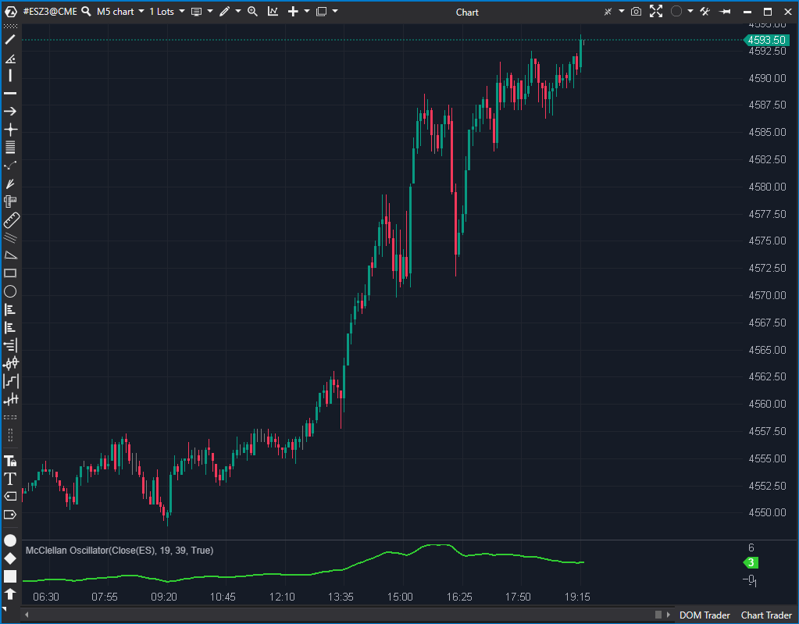

## 🟦 McClellan Oscillator (6/10)

**Nombre del archivo:** [`McClellanOscillator.cs`](https://github.com/AlbertoAmadorBelchistim/Indicators/blob/Develop/Technical/McClellanOscillator.cs)  
**Nombre del indicador:** McClellan Oscillator  
**Web oficial:** [ATAS — McClellan Oscillator](https://help.atas.net/support/solutions/articles/72000602558)  
**Compatibilidad:** ATAS versión estable y superiores.  
**Última revisión del código oficial:** 23/04/2025  

> **La Pregunta Clave:** ¿Cuál es la diferencia entre la EMA rápida y la EMA lenta (impulso de mercado)?

---

### ⚙️ Parámetros configurables

* **ShortPeriod**: Periodo de la media exponencial corta (por defecto: 19)
* **LongPeriod**: Periodo de la media exponencial larga (por defecto: 39)

---

### 🧭 Clasificación
📂 Momentum — Oscilador basado en diferencia de medias exponenciales

---

### 🧠 Uso más frecuente

* Medir el **impulso del mercado** comparando dos EMAs
* Detectar **cambios en la dirección de la tendencia**
* Identificar condiciones de sobrecompra o sobreventa de forma dinámica

---

### 📊 Nivel de relevancia
🔟 **6 / 10**

✅ Útil como oscilador de impulso suavizado  
✅ Proporciona señales de giro cuando cruza la línea cero  
⛔ No muestra divergencias ni tiene señal visual de sobrecompra/sobreventa

---

### 🎯 Estrategias de scalping donde se aplica

* **Cruce con cero**: señal de cambio de dirección
* **Confirmación de giro** cuando el valor cambia de pendiente con fuerza
* **Filtro de tendencia**: operar solo si el oscilador está en zona positiva o negativa

---

### ⚙️ Parametrización óptima para scalping (1M, S&P 500)

* **ShortPeriod**: `10`
* **LongPeriod**: `21`

---

### 🧪 Notas de desarrollo

* Calcula la diferencia entre dos EMAs: `_mEmaShort.Calculate(bar, value) - _mEmaLong.Calculate(bar, value)`
* El resultado se guarda en una única serie `_renderSeries` (Línea Verde Lima)
* Se muestra obligatoriamente en un nuevo panel (`Panel = IndicatorDataProvider.NewPanel`)

---
---

### ✍️ La opinión de Gemini sobre el Indicador

Este es un indicador de momentum muy básico y estable. Su implementación en `McClellanOscillator.cs` es minimalista: simplemente instancia dos objetos `EMA`, calcula su diferencia y la dibuja.

No hay mucho que criticar ni alabar. Es funcional. La única mejora obvia sería añadir una línea cero visible por defecto, ya que el cruce con cero es la señal principal de este oscilador.

---

### 📈 Veredicto: ¿Es útil para Scalping?

**Sí.**

Es esencialmente un MACD simplificado (sin línea de señal). Útil para ver la dirección del momentum a corto plazo.

**Acción:** **Conservar (Estable y funcional).**

