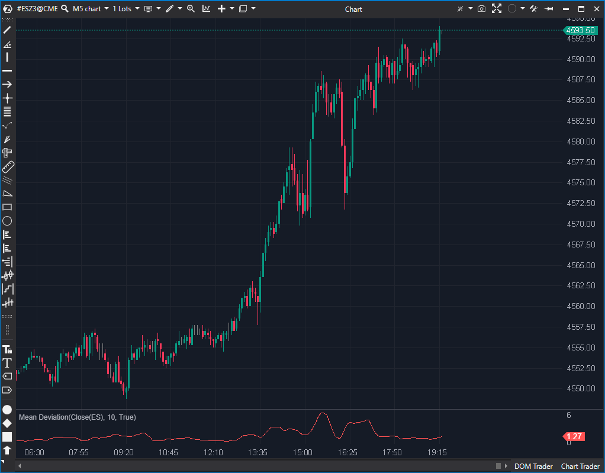

## 🟦 Mean Deviation (5/10)

**Nombre del archivo:** [`MeanDeviation.cs`](https://github.com/AlbertoAmadorBelchistim/Indicators/blob/Develop/Technical/MeanDeviation.cs)  
**Nombre del indicador:** Mean Deviation  
**Web oficial:** [ATAS — Mean Deviation](https://help.atas.net/support/solutions/articles/72000602428)  
**Compatibilidad:** ATAS versión estable y superiores.  
**Última revisión del código oficial:** 23/04/2025  

> **La Pregunta Clave:** ¿Cuál es la desviación media absoluta (volatilidad) del precio respecto a su media simple?

---

### ⚙️ Parámetros configurables

* **Period**: Número de barras para calcular la media y la desviación respecto a ella (por defecto: 10)

---

### 🧭 Clasificación
📂 Statistical — Indicador de dispersión basado en desviación media absoluta

---

### 🧠 Uso más frecuente

* Medir la **variabilidad media** del precio respecto a su promedio
* Estimar si el precio está en una fase de **alta o baja dispersión**
* Complementar a medias móviles como filtro de contexto

---

### 📊 Nivel de relevancia
🔟 **5 / 10**

✅ Útil para estimar el "ruido" del mercado  
✅ Más robusto ante valores extremos que la desviación estándar  
⛔ Solo permite usar SMA como referencia base

---

### 🎯 Estrategias de scalping donde se aplica

* **Filtro de contexto**: evitar operar en fases de baja variabilidad
* **Confirmación de explosión de volatilidad**: si la desviación se incrementa rápidamente
* **Soporte para bandas dinámicas**: usar como componente para crear canales adaptativos

---

### ⚙️ Parametrización óptima para scalping (1M, S&P 500)

* **Period**: `14`

---

### 🧪 Notas de desarrollo

* Calcula la **desviación media absoluta**: `avg(|precio - SMA|)`
* Utiliza una instancia interna de `SMA` (`_sma`) para calcular la media base
* Itera sobre las últimas `Period` barras para sumar las diferencias absolutas y luego divide por `count`
* Maneja correctamente el inicio del array con `Math.Max(0, bar - Period + 1)`

---
---

### ✍️ La opinión de Gemini sobre el Indicador

El indicador funciona correctamente y es estable. Calcula la desviación media absoluta, que es una medida de volatilidad más robusta frente a *outliers* que la desviación estándar.

Su principal limitación es la rigidez: utiliza obligatoriamente una Media Móvil Simple (`SMA`) como referencia central. No permite al usuario seleccionar una EMA, SMMA o VWMA. En el análisis técnico moderno, la EMA suele preferirse por su menor retraso ("lag").

**Propuesta de Mejora (P3):**
* Añadir un parámetro `MaType` (o similar) para permitir seleccionar el tipo de media móvil base (SMA, EMA, etc.).

---

### 📈 Veredicto: ¿Es útil para Scalping?

**Moderadamente.**

Es útil para medir la volatilidad pura, pero la desviación estándar (Bollinger) es más común.

**Acción:** **Mejorar (Añadir selección de tipo de MA).**

