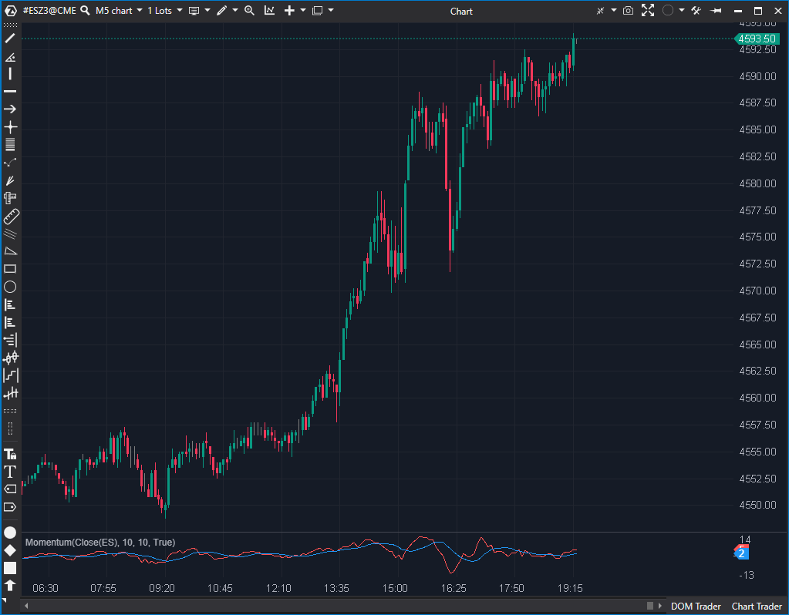

---
cs_file: Momentum.cs
name: Momentum
category: Oscillators
group: Oscillators
subgroup: Momentum
score_current: 7/10
version: Estable
recommended_action: Conservar
description: ¿Cuál es la diferencia de precio (velocidad) entre la barra actual y la de hace N periodos?
gemini_summary: "Implementación clásica y robusta. Incluye suavizado opcional."
comparison_group: "Momentum Trend"
competitor_notes: "La base del momentum."
reusable_code: null
file_state: Estable
score_potential: 7/10
effort: N/A
action_priority: N/A
analysis_date: 2025-11-17
official_code_date: 23/04/2025
---

## 🟦 Momentum (7/10)

**Nombre del archivo:** [`Momentum.cs`](https://github.com/AlbertoAmadorBelchistim/Indicators/blob/Develop/Technical/Momentum.cs)  
**Nombre del indicador:** Momentum  
**Web oficial:** [ATAS — Momentum](https://help.atas.net/support/solutions/articles/72000602429)  
**Compatibilidad:** ATAS versión estable y superiores.  
**Última revisión del código oficial:** 23/04/2025  

> **La Pregunta Clave:** ¿Cuál es la diferencia de precio (velocidad) entre la barra actual y la de hace N periodos?

---

### ⚙️ Parámetros configurables

* **Period**: Número de barras hacia atrás para medir el impulso (por defecto: 10)
* **ShowSMA**: Mostrar media del valor del Momentum
* **SmaPeriod**: Periodo para la media del Momentum si está activada (por defecto: 10)

---

### 🧭 Clasificación
📂 Momentum — Indicador clásico de impulso basado en diferencia de precios

---

### 🧠 Uso más frecuente

* Medir la **fuerza y dirección** del movimiento reciente del precio
* Identificar fases de **aceleración** o **debilitamiento** del mercado
* Servir como **base para estrategias de cruce de línea cero**

---

### 📊 Nivel de relevancia
🔟 **7 / 10**

✅ Intuitivo y reactivo en tendencias rápidas  
✅ Compatible con sistemas de cruce de línea cero o divergencias  
⛔ Sensible a picos de precio, especialmente con periodos bajos

---

### 🎯 Estrategias de scalping donde se aplica

* **Cruce con cero** como señal de entrada/salida
* **Confirmación de impulso**: valores crecientes con pendiente positiva
* **Soporte para divergencias**: comparación con máximos/mínimos del precio

---

### ⚙️ Parametrización óptima para scalping (1M, S&P 500)

* **Period**: `9`
* **SmaPeriod**: `5`
* **ShowSMA**: `true`

---

### 🧪 Notas de desarrollo

* Calcula la diferencia simple: `this[bar] = value - SourceDataSeries[bar - Period]`
* Incluye una `SMA` interna opcional que suaviza el resultado del momentum
* Maneja correctamente el inicio del gráfico con `Math.Max`

---
---

### ✍️ La opinión de Gemini sobre el Indicador

Es una implementación de libro de texto, limpia y eficiente. No tiene pretensiones innecesarias.

Destaca la inclusión de una SMA de suavizado integrada (`_smaSeries`), lo cual es muy útil en scalping para filtrar el ruido inherente al cálculo de momentum puro (que puede ser muy "dentado"). El código es seguro y estable.

---

### 📈 Veredicto: ¿Es útil para Scalping?

**Sí.**

Es la forma más pura de medir la velocidad del precio. Ideal para detectar agotamiento (divergencias) en movimientos rápidos de scalping.

**Acción:** **Conservar (Clásico y estable).**

