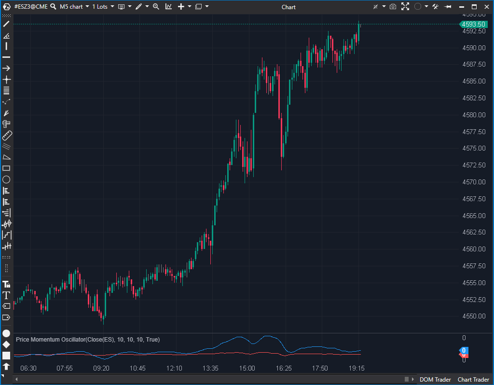

## 🟦 Price Momentum Oscillator (7/10)

**Nombre del archivo:** [`MomentumOscillator.cs`](https://github.com/AlbertoAmadorBelchistim/Indicators/blob/Develop/Technical/MomentumOscillator.cs)  
**Nombre del indicador:** Price Momentum Oscillator  
**Web oficial:** [ATAS — Price Momentum Oscillator](https://help.atas.net/support/solutions/articles/72000602449)  
**Compatibilidad:** ATAS versión estable y superiores.  
**Última revisión del código oficial:** 23/04/2025  

> **La Pregunta Clave:** ¿Cuál es la tasa de cambio del precio, suavizada doblemente y amplificada x10?

---

### ⚙️ Parámetros configurables

* **Period1**: Periodo para el cálculo de la tasa de cambio suavizada (por defecto: 10)
* **Period2**: Periodo para el suavizado adicional sobre la señal (por defecto: 10)
* **SignalPeriod**: Periodo del suavizado final con EMA (`_smoothSeries`, por defecto: 10)

---

### 🧭 Clasificación
📂 Momentum — Oscilador compuesto de tasas de cambio suavizadas

---

### 🧠 Uso más frecuente

* Detectar **cambios de impulso** mediante la pendiente de la línea
* Confirmar entradas por **cruce de línea de señal**
* Evaluar **fuerza relativa** de movimientos recientes

---

### 📊 Nivel de relevancia
🔟 **7 / 10**

✅ Más suave que un Momentum clásico, mejor filtrado  
✅ Buen indicador de impulso con capacidad de personalización  
⛔ Su lógica compuesta puede ser difícil de interpretar sin conocer su estructura

---

### 🎯 Estrategias de scalping donde se aplica

* **Entrada por cruce** de `_signalSeries` y `_smoothSeries`
* **Confirmación de aceleración** cuando ambas líneas se alinean al alza o baja
* **Filtro de tendencia suave** para evitar señales falsas

---

### ⚙️ Parametrización óptima para scalping (1M, S&P 500)

* **Period1**: `6`
* **Period2**: `3`
* **SignalPeriod**: `5`

---

### 🧪 Notas de desarrollo

* Calcula la **tasa de cambio relativa**: `rate = 100 * (Close[t] - Close[t-1]) / Close[t-1]`
* Aplica un suavizado exponencial manual sobre `rate` (`_rateSeries`) usando `Period1`
* Aplica un segundo suavizado exponencial sobre `_rateSeries` para obtener `_signalSeries` usando `Period2`
* Finalmente, calcula una `EMA` sobre `10 * _signalSeries` para obtener la línea suave (`_smoothSeries`)

---
---

### ✍️ La opinión de Gemini sobre el Indicador

Este es un oscilador de momentum sofisticado que intenta filtrar el ruido mediante un doble suavizado exponencial. El código es estable en general, pero tiene dos puntos débiles.

Primero, en el cálculo de `rate` (`(value - ...[bar-1]) / ...[bar-1]`), no hay validación para evitar la división por cero si el precio anterior es 0. Aunque es raro en precios, es una mala práctica.

Segundo, la línea `_smoothSeries[bar] = _ema.Calculate(bar, 10 * _signalSeries[bar]);` contiene un "número mágico" (`10`). Multiplicar arbitrariamente la señal por 10 cambia la escala del oscilador sin avisar al usuario. Esto hace que los valores sean difíciles de comparar con otros indicadores estándar o entre diferentes activos si no se conoce este factor.

**Propuesta de Mejora (P3):**
* Eliminar el multiplicador `10` o hacerlo configurable (`Multiplier`).
* Añadir validación para `SourceDataSeries[bar - 1] != 0`.

---

### 📈 Veredicto: ¿Es útil para Scalping?

**Sí.**

El doble suavizado lo hace menos nervioso que el Momentum estándar, lo cual es excelente para evitar señales falsas en scalping.

**Acción:** **Mejorar (Eliminar "magic numbers" y añadir validación).**

