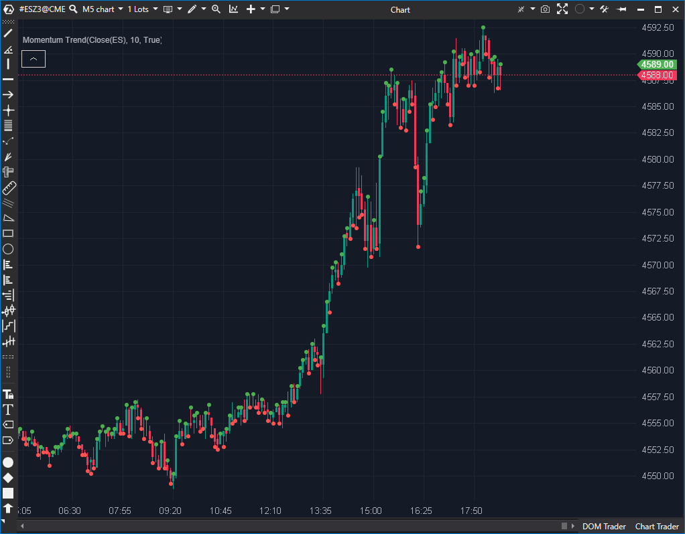

---
# --- Campos Públicos (Para INDICATORS.es) ---
cs_file: MomentumTrend.cs
name: Momentum Trend
category: Momentum
score_current: 3/10
version: ATAS Official
recommended_action: 'Mejorar'
description: >-
  ¿Está el momentum aumentando o disminuyendo vela a vela (visualizado como puntos)?
# --- Campos de Triaje (Para ROADMAP.md) ---
gemini_summary: >-
  Indicador visual muy básico. Tiene un defecto lógico: si el momentum es igual al anterior, no dibuja nada, creando huecos visuales.
file_state: Mejorable
score_potential: 5/10
effort: Bajo
action_priority: P3
# --- Control de Versiones ---
analysis_date: 2025-11-17
official_code_date: 2025-04-23
user_modification_date: null
---

## 🟦 Momentum Trend (3/10)

**Nombre del archivo:** [`MomentumTrend.cs`](https://github.com/AlbertoAmadorBelchistim/Indicators/blob/Develop/Technical/MomentumTrend.cs)  
**Nombre del indicador:** Momentum Trend  
**Web oficial:** [ATAS — Momentum Trend](https://help.atas.net/support/solutions/articles/72000602636)  
**Compatibilidad:** ATAS versión estable y superiores.  
**Última revisión del código oficial:** 23/04/2025  

> **La Pregunta Clave:** ¿Está el momentum aumentando o disminuyendo vela a vela (visualizado como puntos)?

---

### ⚙️ Parámetros configurables

* **Period**: Número de barras para calcular el impulso base (`Momentum`) (por defecto: 10)

---

### 🧭 Clasificación
📂 Momentum — Visualización del cambio en impulso con puntos sobre máximos y mínimos

---

### 🧠 Uso más frecuente

* Detectar **aceleración o desaceleración** del impulso
* Confirmar movimientos direccionales cuando el impulso se incrementa
* Señal visual clara sin necesidad de panel adicional

---

### 📊 Nivel de relevancia
🔟 **3 / 10**

✅ Visualmente limpio y útil como complemento de contexto  
✅ Permite identificar momentos de aceleración con alta claridad  
⛔ No ofrece valor cuantitativo ni dirección del movimiento (solo crecimiento/disminución)

---

### 🎯 Estrategias de scalping donde se aplica

* **Confirmación visual de tendencia**: puntos verdes en máximos indican impulso creciente
* **Evitar entradas contrarias** si hay aceleración en contra
* **Soporte para overlays**: superposición sobre otros indicadores o velas

---

### ⚙️ Parametrización óptima para scalping (1M, S&P 500)

* **Period**: `9`

---

### 🧪 Notas de desarrollo

* Utiliza internamente una instancia de `Momentum` para calcular el valor
* Compara `momentum[bar]` con `momentum[bar-1]`
* Si sube, dibuja un punto verde (`_upSeries`) en el `High`
* Si baja, dibuja un punto rojo (`_downSeries`) en el `Low`
* **Defecto:** Si el momentum es igual, no dibuja nada

---
---

### ✍️ La opinión de Gemini sobre el Indicador

Es un indicador extremadamente simple que traduce la pendiente del momentum en puntos de colores sobre el precio.

El código tiene un defecto lógico menor pero molesto:
`if (_momentum[bar] > _momentum[bar - 1]) ... else ...`
Si el momentum es exactamente igual al anterior (raro, pero posible en mercados lentos o con pocos decimales), el código entra en el `else` y dibuja un punto rojo ("Down"), lo cual es técnicamente incorrecto (debería ser neutro o mantener el color anterior). O peor, dependiendo de la implementación exacta del `else` (en este caso, cubre todo lo que no sea `>`), asume que igualdad es bajada.

Es una herramienta visual auxiliar de baja relevancia.

**Propuesta de Mejora (P3):**
* Manejar el caso de igualdad explícitamente (ej. mantener el color anterior).

---

### 📈 Veredicto: ¿Es útil para Scalping?

**Ocasionalmente.**

Sirve como una ayuda visual rápida ("semáforo") para ver si la velocidad del precio está aumentando o disminuyendo sin mirar un oscilador separado.

**Acción:** **Mejorar (Corregir lógica de igualdad).**
