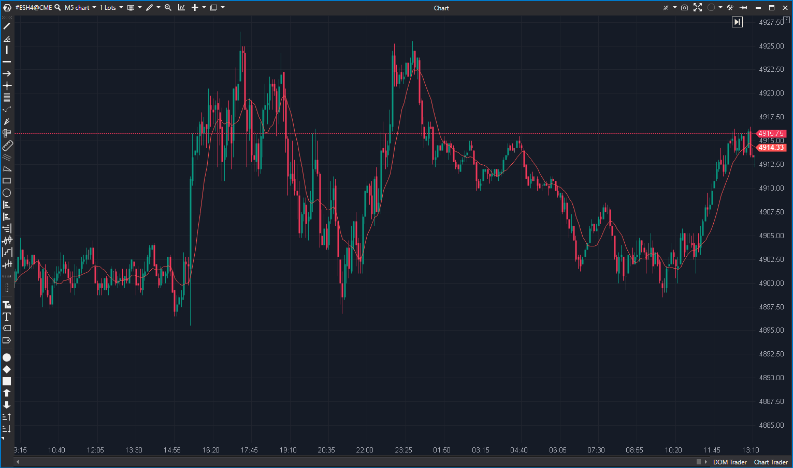

---
# --- Campos Públicos (Para INDICATORS.es) ---
cs_file: MovingAverage.cs
name: Moving Average
category: Trend
score_current: 9/10
version: ATAS Official
recommended_action: 'Conservar'
description: >-
  ¿Cuál es la tendencia suavizada del precio usando uno de los 11 tipos de medias disponibles?
# --- Campos de Triaje (Para ROADMAP.md) ---
gemini_summary: >-
  Indicador "navaja suiza" de medias móviles. Soporta 11 tipos (SMA, EMA, ZLEMA...). Código robusto, salvo por una falta de validación de TickSize en alertas.
file_state: Estable
score_potential: 9/10
effort: N/A
action_priority: N/A
# --- Control de Versiones ---
analysis_date: 2025-11-17
official_code_date: 2025-04-23
user_modification_date: null
---

## 🟦 Moving Average (9/10)

**Nombre del archivo:** [`MovingAverage.cs`](https://github.com/AlbertoAmadorBelchistim/Indicators/blob/Develop/Technical/MovingAverage.cs)  
**Nombre del indicador:** Moving Average  
**Web oficial:** [ATAS — Moving Average](https://help.atas.net/support/solutions/articles/72000618959)  
**Compatibilidad:** ATAS versión estable y superiores.  
**Última revisión del código oficial:** 23/04/2025  

> **La Pregunta Clave:** ¿Cuál es la tendencia suavizada del precio usando uno de los 11 tipos de medias disponibles?

---

### ⚙️ Parámetros configurables

* **Period**: Número de barras para calcular la media móvil (por defecto: 10)
* **MovType**: Tipo de media móvil (`SMA`, `EMA`, `TMA`, `WMA`, `ZLEMA`, etc.)
* **ColoredDirection**: Activar color según pendiente de la media
* **UseAlerts**: Activar alertas si el precio se aproxima a la media
* **AlertSensitivity**: Distancia en ticks para activar la alerta

---

### 🧭 Clasificación
📂 Trend — Media móvil configurable con soporte para múltiples tipos

---

### 🧠 Uso más frecuente

* Suavizar la serie de precios para **detectar tendencias**
* Actuar como **soporte o resistencia dinámica**
* Activar **alertas si el precio se aproxima** a la media

---

### 📊 Nivel de relevancia
🔟 **9 / 10**

✅ Altamente flexible (11 tipos de medias disponibles)  
✅ Incluye sistema de alertas completo y codificación por pendiente  
⛔ Su comportamiento varía drásticamente según el tipo de media elegido

---

### 🎯 Estrategias de scalping donde se aplica

* **Entrada por rebote** sobre una media relevante (ej. EMA 21)
* **Ruptura con fuerza** de la media → señal de entrada
* **Filtro direccional**: operar solo a favor de la pendiente de la media

---

### ⚙️ Parametrización óptima para scalping (1M, S&P 500)

* **Period**: `21`
* **MovType**: `EMA` (o `ZLEMA` para menos lag)
* **ColoredDirection**: `true`
* **UseAlerts**: `true`

---

### 🧪 Notas de desarrollo

* Implementa un patrón de estrategia para seleccionar entre 11 tipos de medias (`SMA`, `EMA`, `WMA`, `TMA`, `ZLEMA`, `DEMA`, `TEMA`, `SMMA`, `BWMA`, `SZMA`, `WWMA`)
* Usa instancias dedicadas para cada tipo de media (`_ema`, `_sma`, etc.)
* La alerta de aproximación normaliza la distancia usando `InstrumentInfo.TickSize`
* Permite colorear la línea según su pendiente (`ColoredDirection`)

---
---

### ✍️ La opinión de Gemini sobre el Indicador

Este es uno de los indicadores más esenciales y bien construidos de la plataforma. La flexibilidad de poder elegir entre 11 tipos de medias (incluyendo avanzadas como `ZLEMA` o `TEMA`) en un solo indicador es excelente.

El código es limpio y eficiente. La única vulnerabilidad menor está en la lógica de alertas: `Math.Abs(...) / InstrumentInfo.TickSize`. Si `TickSize` es 0, esto fallará.

Aparte de ese detalle de borde, es un indicador de 9/10 indispensable.

**Propuesta de Mejora (P3):**
* Añadir validación `if (InstrumentInfo.TickSize > 0)` antes de calcular la alerta.

---

### 📈 Veredicto: ¿Es útil para Scalping?

**Sí, fundamental.**

Todo scalper usa algún tipo de media móvil (EMA, VWMA, etc.) como referencia dinámica de tendencia o soporte.

**Acción:** **Conservar (Herramienta esencial).**

