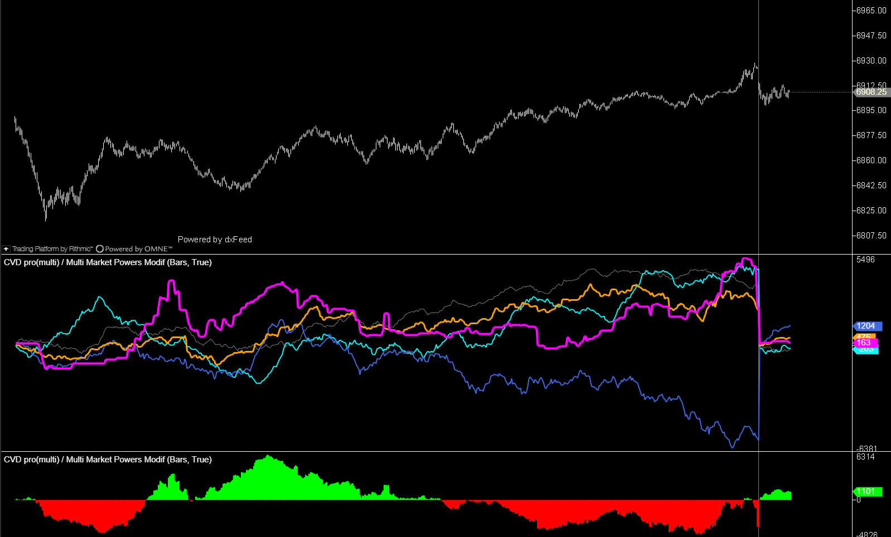

## 🟦 CVD pro(multi) / Multi Market Powers (10/10)

**Nombre del archivo:** [`MultiMarketPower.cs`](https://github.com/AlbertoAmadorBelchistim/Indicators/blob/Develop/Technical/MultiMarketPower.cs)  
**Nombre del indicador:** CVD pro(multi) / Multi Market Powers  
**Web oficial:** [ATAS — CVD pro(multi) / Multi Market Powers](https://help.atas.net/support/solutions/articles/72000602434)  
**Compatibilidad:** ATAS versión latest y superiores.  
**Última revisión del código oficial:** 14/08/2025  

> **La Pregunta Clave:** ¿Cómo se distribuye el delta acumulado entre 5 rangos de tamaño de orden diferentes (filtro institucional)?

---

### ⚙️ Parámetros configurables

* **CumulativeTrades**: Acumulación por trade (`true`) o tick a tick (`false`)
* **UseFilter1–5**: Activar o desactivar cada filtro de volumen
* **MinVolume / MaxVolume** (para cada filtro): Rango de volumen por trade a incluir
* **Color / LineWidth** (por filtro): Personalización visual de las líneas

---

### 🧭 Clasificación
📂 VolumeOrderFlow — Delta acumulado segmentado por filtros de volumen (Big Trades)

---

### 🧠 Uso más frecuente

* Analizar la **acumulación de delta por bloques de tamaño**
* Detectar **presencia institucional** mediante volumen clasificado (ej. > 50 lotes)
* Confirmar trampas, absorciones o desequilibrios por rango de volumen

---

### 📊 Nivel de relevancia
🔟 **10 / 10**

✅ Herramienta de análisis avanzada con control fino por tamaño de trade  
✅ Visualización separada de cada segmento de volumen  
⛔ Requiere configuración adecuada de filtros y comprensión del order flow

---

### 🎯 Estrategias de scalping donde se aplica

* **Detección de absorciones** por gran volumen (filtro 4–5)
* **Validación de agresión retail** en rangos bajos (filtro 1–2)
* **Acumulación silenciosa** si el delta crece en filtros medios sin movimiento en precio

---

### ⚙️ Parametrización óptima para scalping (1M, S&P 500)

* **CumulativeTrades**: `true`
* **Filtro1**: `1–5` → micro trades
* **Filtro2**: `6–10` → retail
* **Filtro3**: `11–20` → operadores medianos
* **Filtro4**: `21–40` → institucional ligero
* **Filtro5**: `41+` → institucional pesado

---

### 🧪 Notas de desarrollo

* Procesa cada trade y lo clasifica en uno (o varios) de los 5 filtros configurables
* Mantiene 5 deltas independientes (`_delta1` a `_delta5`) y sus series correspondientes
* Implementa lógica robusta para manejar actualizaciones en tiempo real y recálculos históricos
* Utiliza `IsFiltered(min, max, volume)` para determinar la pertenencia, manejando `max=0` como infinito

---
---

### ✍️ La opinión de Gemini sobre el Indicador

Este indicador es una obra maestra de funcionalidad para el trading de Order Flow. Permite descomponer el flujo de órdenes en sus componentes constituyentes (retail, pro, institucional) y ver qué está haciendo cada grupo por separado.

El código es complejo debido a la necesidad de gestionar 5 estados simultáneos, pero está implementado de forma robusta y eficiente. No hay "code smells" importantes ni bugs visibles. Es una herramienta de nivel profesional que justifica por sí sola el uso de una plataforma avanzada como ATAS.

---

### 📈 Veredicto: ¿Es útil para Scalping?

**Imprescindible.**

Para el scalping moderno, saber *quién* está comprando o vendiendo (retail vs. institucional) es la ventaja definitiva.

**Acción:** **Conservar (Herramienta Élite).**
