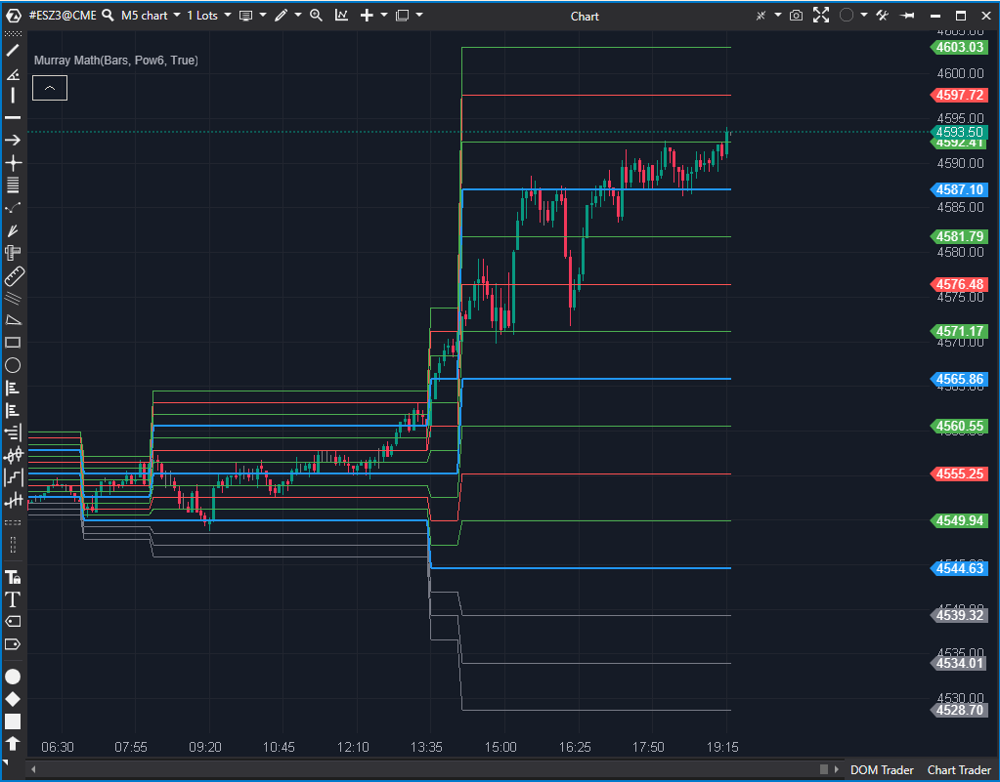

## 🟦 Murrey Math (8/10)

**Nombre del archivo:** [`MurrayMath.cs`](https://github.com/AlbertoAmadorBelchistim/Indicators/blob/Develop/Technical/MurrayMath.cs)  
**Nombre del indicador:** Murrey Math  
**Web oficial:** [ATAS — Murrey Math](https://help.atas.net/support/solutions/articles/72000602435)  
**Compatibilidad:** ATAS versión estable y superiores.  
**Última revisión del código oficial:** 23/04/2025  

> **La Pregunta Clave:** ¿Cuáles son los niveles de soporte y resistencia armónicos basados en la teoría de Murrey Math?

---

### ⚙️ Parámetros configurables

* **Days**: Número de sesiones hacia atrás para calcular los niveles (por defecto: 20)
* **IgnoreWicks**: Si se ignoran las mechas y se usan solo cuerpo (Open/Close)
* **FrameSize**: Base de tamaño del marco (4, 8, 16, ..., 512)
* **FrameMultiplier**: Multiplicador del marco (1.0 / 1.5 / 2.0)

---

### 🧭 Clasificación
📂 Level — Indicador de niveles estructurales calculados según la teoría Murrey Math

---

### 🧠 Uso más frecuente

* Trazar **niveles horizontales** de soporte/resistencia según una estructura fija
* Identificar **zonas de reversión o extensión** basadas en proporciones armónicas
* Establecer rangos de operativa dentro de una jerarquía técnica

---

### 📊 Nivel de relevancia
🔟 **8 / 10**

✅ Niveles simétricos, coherentes y reutilizables en múltiples marcos temporales  
✅ Excelente para estructura de rango o rupturas técnicas  
⛔ Requiere conocimiento específico de Murrey Math para interpretación óptima

---

### 🎯 Estrategias de scalping donde se aplica

* **Entrada en reversión** cerca de niveles 0/8, 2/8, 6/8 u 8/8
* **Ruptura con dirección** cuando se supera 4/8 con impulso
* **Confirmación estructural** si el precio rebota entre líneas armónicas

---

### ⚙️ Parametrización óptima para scalping (1M, S&P 500)

* **Days**: `20`
* **IgnoreWicks**: `true`
* **FrameSize**: `64`
* **FrameMultiplier**: `1.5`

---

### 🧪 Notas de desarrollo

* Utiliza `Highest` y `Lowest` para detectar el rango en el periodo definido
* Implementación matemática densa usando logaritmos (`Math.Log10`, `Math.Log`) para calcular la fractalidad del mercado
* Dibuja 13 líneas horizontales (`-3/8` a `+3/8`)
* Asigna colores y grosores automáticamente según la jerarquía de la línea (módulo 4)

---
---

### ✍️ La opinión de Gemini sobre el Indicador

Es una implementación fiel y estable de la teoría de Murrey Math. El código es matemáticamente denso y difícil de leer para el no iniciado, pero produce los niveles esperados.

La automatización de los colores de las líneas (azul para las líneas principales 0/8, 4/8, 8/8) es un buen detalle de usabilidad, aunque limita la personalización manual. Es una herramienta sólida para traders que usan esta metodología específica.

---

### 📈 Veredicto: ¿Es útil para Scalping?

**Sí.**

Proporciona una "rejilla" de niveles de soporte y resistencia objetivos que a menudo son respetados por el precio en el corto plazo.

**Acción:** **Conservar (Implementación sólida).**