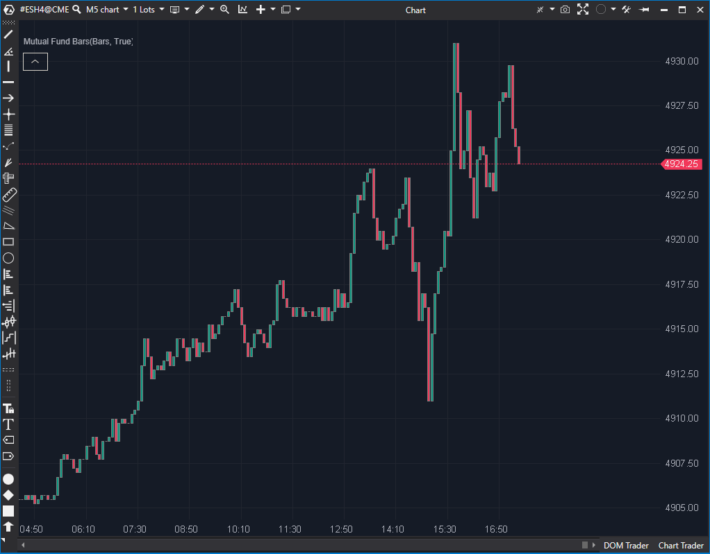

## 🟦 Mutual Fund Bars (4/10)

**Nombre del archivo:** [`MutualFundBars.cs`](https://github.com/AlbertoAmadorBelchistim/Indicators/blob/Develop/Technical/MutualFundBars.cs)  
**Nombre del indicador:** Mutual Fund Bars  
**Web oficial:** [ATAS — Mutual Fund Bars](https://help.atas.net/support/solutions/articles/72000619006)  
**Compatibilidad:** ATAS versión estable y superiores.  
**Última revisión del código oficial:** 23/04/2025  

> **La Pregunta Clave:** ¿Cómo se vería el gráfico si cada vela abriera exactamente al cierre de la anterior (estilo fondo mutuo)?

---

### ⚙️ Parámetros configurables

* **No tiene parámetros configurables.**

---

### 🧭 Clasificación
📂 Visualization — Reconstrucción visual tipo barras para replicar comportamiento de fondos mutuos

---

### 🧠 Uso más frecuente

* Mostrar **barras suavizadas** en las que el precio abre donde cerró la vela anterior
* Reproducir comportamiento de activos o fondos que solo muestran el valor al cierre
* Visualizar movimientos eliminando el ruido intradía

---

### 📊 Nivel de relevancia
🔟 **4 / 10**

✅ Claridad visual mejorada para ciertos activos o estilos analíticos  
✅ Ideal para replicar fondos o activos sin oscilaciones intradía  
⛔ No aporta señal de entrada ni contexto operativo

---

### 🎯 Estrategias de scalping donde se aplica

* No aplicable directamente a scalping.

---

### ⚙️ Parametrización óptima para scalping (1M, S&P 500)

* No aplicable.

---

### 🧪 Notas de desarrollo

* Genera una **nueva serie de velas artificiales** (`_renderSeries`)
* Lógica: `Open[t] = Close[t-1]`
* Ajusta `High` y `Low` para incluir este nuevo `Open` artificial
* Oculta las velas originales (`_bars`) pintándolas de transparente

---
---

### ✍️ La opinión de Gemini sobre el Indicador

El indicador es muy simple y estable. Su única función es alterar la visualización de las velas para que no haya saltos entre el cierre de una y la apertura de la siguiente. Esto simula el estilo de gráfico de línea o de fondos mutuos diarios.

El código es correcto. Su utilidad es puramente visual y específica para ciertos tipos de análisis de largo plazo o backtesting simplificado. No tiene aplicación real en trading intradía o scalping.

---

### 📈 Veredicto: ¿Es útil para Scalping?

**No.**

Elimina información vital (gaps de apertura, volatilidad intradía) que un scalper necesita.

**Acción:** **Conservar (Utilidad de nicho).**

