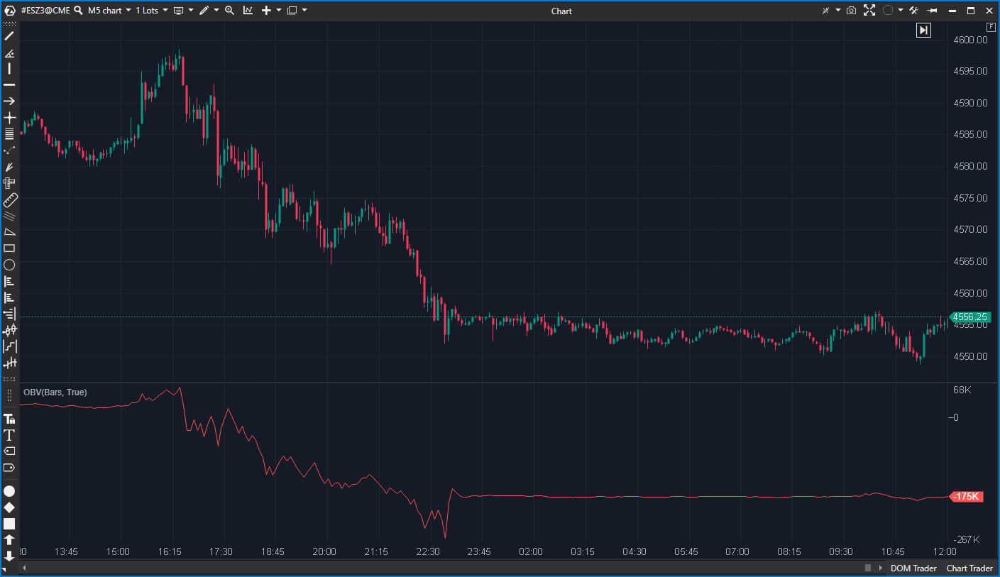

## 🟦 OBV (On Balance Volume) (7/10)

**Nombre del archivo:** [`OBV.cs`](https://github.com/AlbertoAmadorBelchistim/Indicators/blob/Develop/Technical/OBV.cs)  
**Nombre del indicador:** OBV  
**Web oficial:** [ATAS — OBV](https://help.atas.net/support/solutions/articles/72000602436)  
**Compatibilidad:** ATAS versión estable y superiores.  
**Última revisión del código oficial:** 23/04/2025  

> **La Pregunta Clave:** ¿Cuál es el flujo de volumen acumulado (presión de compra/venta) basado en el cierre de velas?

---

### ⚙️ Parámetros configurables

* **MinimizedMode (Enabled / Period)**: Activar modo de ventana móvil (por defecto: desactivado, periodo 10)

---

### 🧭 Clasificación
📂 Volume — Indicador clásico de volumen acumulado según dirección del precio

---

### 🧠 Uso más frecuente

* Detectar **acumulación o distribución** según el volumen que acompaña al movimiento
* Identificar **divergencias** entre precio y volumen
* Medir la **presión compradora o vendedora acumulada**

---

### 📊 Nivel de relevancia
🔟 **7 / 10**

✅ Simple y eficaz como indicador de volumen tendencial  
✅ Compatible con múltiples marcos temporales y estrategias  
⛔ Puede ser redundante si ya se usa delta acumulado o CVD

---

### 🎯 Estrategias de scalping donde se aplica

* **Confirmación de ruptura** si el OBV acompaña con fuerza
* **Divergencia**: precio hace nuevo mínimo pero OBV no → posible giro
* **Filtro de dirección**: operar solo a favor del sesgo acumulado del OBV

---

### ⚙️ Parametrización óptima para scalping (1M, S&P 500)

* **MinimizedMode**: `Enabled = true`, `Period = 10`

---

### 🧪 Notas de desarrollo

* Calcula la diferencia de cierres: si `Close > PrevClose`, suma volumen; si es menor, resta.
* **Bug Menor:** `if (bar is 0) return;` al inicio impide la ejecución de `if (bar == 0) { this[bar] = 0; ... }` más abajo.
* Implementa un `MinimizedMode` que calcula el OBV en una ventana móvil (`Period`), útil para osciladores de corto plazo.

---
---

### ✍️ La opinión de Gemini sobre el Indicador

El indicador funciona correctamente para la mayoría de las barras, pero tiene un error de codificación de novato en la gestión de la barra 0.

El código empieza con:
`if (bar is 0) return;`
Y unas líneas más abajo tiene:
`if (bar == 0) { this[bar] = 0; return; }`

La segunda condición es código inalcanzable ("dead code"). Esto significa que la barra 0 nunca se inicializa explícitamente a 0. Aunque ATAS suele inicializar arrays numéricos a 0 por defecto, confiar en comportamiento implícito es una mala práctica.

El modo `MinimizedMode` es una característica excelente y poco común que lo hace mucho más útil para scalping que el OBV estándar.

**Propuesta de Mejora (P3):**
* Eliminar el primer `if (bar is 0) return;` para permitir la inicialización correcta.

---

### 📈 Veredicto: ¿Es útil para Scalping?

**Sí, especialmente en MinimizedMode.**

El modo minimizado lo convierte en un oscilador de flujo de volumen a corto plazo, muy útil para detectar divergencias rápidas.

**Acción:** **Mejorar (Corregir bug de inicialización).**

