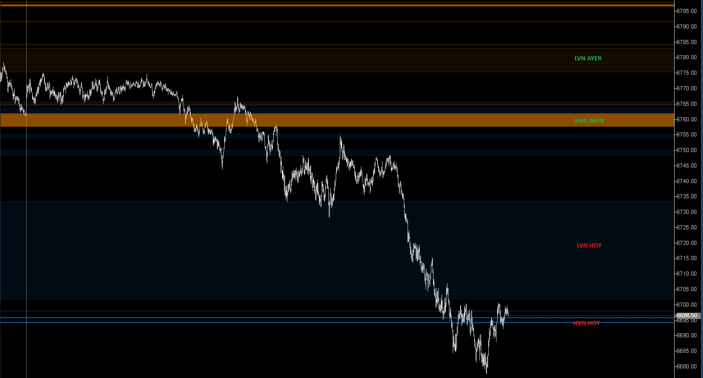
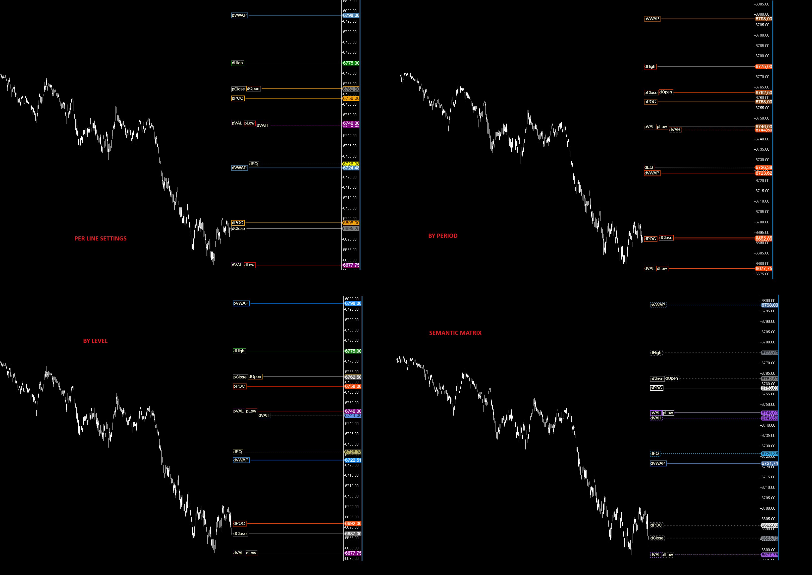

-----

## 🟦 OHLC Plus Modif (10/10)

**Nombre del archivo:** `OHLCPlusmodif.cs`  
**Nombre del indicador:** OHLC Plus Modif  
**Web oficial (Base):** No disponible aún (indicador en fase beta)  
**Compatibilidad:** ATAS beta / estable según el archivo compilado  
**Versión:** 1.0 (Modificación basada en la beta de ATAS)

> **La Pregunta Clave:** ¿Puedo tener TODOS los niveles de contexto clave (Diario, Semanal, Mensual, Contrato) en un solo indicador, con estilos profesionales y un sistema de etiquetas que no se solapen y sean 100% legibles?

-----

### ✨ Mejoras de esta Modificación

Esta versión no es solo un indicador, es un **entorno de análisis de contexto profesional**. Toma el `OHLCPlus` original de ATAS y lo reconstruye con características avanzadas, solucionando sus mayores problemas (como el solapamiento de etiquetas) e incorporando nuevas herramientas de nivel institucional.

#### 1\. Motor de Etiquetas Inteligente (Anti-colisión)

El problema principal del `OHLCPlus` original es que cuando varios niveles están juntos (ej. POC y VWAP), las etiquetas se solapan, volviéndose ilegibles. Esta versión lo soluciona:

  * **Prioridad de Etiquetas:** Las etiquetas más importantes (ej. `PrevDayPOC`) tienen prioridad y se dibujan primero.
  * **Anti-Solapamiento:** El indicador detecta si una etiqueta va a solaparse con otra. Si es así, la mueve inteligentemente en el eje X (horizontal) o Y (vertical) para encontrar un espacio libre.
  * **Recorte de Líneas:** Las líneas (ej. `LineType.Full`) se recortan automáticamente para no solaparse con la etiqueta, creando un aspecto limpio y profesional.

#### 2\. Nodos de Volumen (HVN / LVN)

Ahora puedes activar y dibujar **Nodos de Alto Volumen (HVN)** y **Nodos de Bajo Volumen (LVN)** para cada período de tiempo (Diario, Semanal, etc.).

  * **HVN (High Volume Nodes):** Zonas de alta aceptación (equilibrio, "imanes" de precio).
  * **LVN (Low Volume Nodes / Voids):** Zonas de bajo volumen (desequilibrio, "vacíos") donde el precio tiende a moverse rápido.

  

#### 3\. Esquemas de Color (Color Modes)

Se ha añadido un parámetro `ColorMode` que te permite colorear todas las líneas de forma centralizada, ahorrando docenas de clics.

  * **`PerLineSettings`:** El modo clásico. Cada línea tiene su propio color.
  * **`ByPeriod`:** Todas las líneas *Diarias* de un color, todas las *Semanales* de otro, etc.
  * **`ByLevel`:** Todos los *POCs* de un color, todos los *VWAPs* de otro, etc.
  * **`SemanticMatrix`:** (Recomendado) Un esquema de color profesional predefinido (ver imagen y parametrización) que da más importancia (color, grosor, estilo) a los niveles clave (`PrevDayPOC`, `PrevDayVAH/VAL`) y menos a los niveles secundarios.

  
   
  

#### 4\. Personalización Total de Etiquetas

Puedes controlar exactamente cómo se ven las etiquetas:

  * **`Prefixes`:** Define el prefijo de cada período (ej. "d" para Día, "p" para Día Previo).
  * **`Labels`:** Define el texto de cada nivel (ej. "POC", "VWAP", "VAH").
  * **`Label Template`:** Define la plantilla (por defecto: `{prefix}{level}`, ej. "pPOC").
  * **`OverrideLabel`:** Puedes sobrescribir cualquier etiqueta individual (ej. ponerle "Naked POC Semanal" a una línea específica).

#### 5\. Opciones de Anulación (Override)

Para cada línea individual, ahora tienes 3 checkboxes: `OverrideColor`, `OverrideWidth`, `OverrideStyle`. Esto te permite usar un `ColorMode` (como `SemanticMatrix`) pero forzar que una línea específica (ej. `ContractHigh`) tenga un color o grosor diferente al del esquema.

-----

### ⚙️ Parámetros configurables

Este indicador tiene una configuración extensa, agrupada por funcionalidad:

#### Grupos de Período (Current Day, Previous Day, Current Week, etc.)

Para cada uno de los 7 períodos de tiempo (Día, Día Previo, Semana, Semana Previa, Mes, Mes Previo, Contrato), encontrarás:

  * **Activación de Niveles:** Un `LevelSettings` para cada nivel (Open, High, Low, Close, EQ, POC, VWAP, VAH, VAL) donde puedes activar/desactivar el nivel y configurar sus propiedades visuales (color, ancho, estilo, posición de etiqueta, etc.).
  * **`Enable HVN` / `Enable LVN`:** Checkboxes para activar los Nodos de Volumen de ese período.
  * **`VN Color`:** El color para los nodos de ese período.

#### HVN Settings (Configuración de Nodos de Alto Volumen)

Define *cómo* se calcula un HVN:

  * **`Threshold (% of POC volume)`:** (Por defecto: 80%) Un nivel de precio se considera "Alto Volumen" si su volumen es \>= 80% del volumen del POC de ese período.
  * **`Gap tolerance (ticks)`:** (Por defecto: 1) Cuántos ticks de "no-HVN" se permiten antes de dividir un HVN en dos.
  * **`Occlusion tolerance (ticks)`:** (Por defecto: 1) Si dos HVNs de *diferentes períodos* (ej. dHVN y wHVN) están a 1 tick de distancia, solo se dibuja el de mayor prioridad.

#### LVN Settings (Configuración de Nodos de Bajo Volumen)

Define *cómo* se calcula un LVN (vacío):

  * **`Threshold (% of POC volume)`:** (Por defecto: 20%) Un nivel se considera "Bajo Volumen" si su volumen es \<= 20% del volumen del POC.
  * **`Gap tolerance (ticks)`:** (Por defecto: 2) Cuántos ticks de "no-LVN" se permiten dentro de un vacío antes de dividirlo.
  * **`LVN Border Style / Width`:** Estilo visual del borde del vacío.
  * **`Min POC Vol for LVN`:** (Por defecto: 500) No calcula LVNs hasta que el POC del período tenga al menos 500 de volumen (evita ruido al inicio del día/semana).
  * **`Tail Filter (Min Ticks / Pct)`:** (Por defecto: 3 ticks / 10%) Filtro para ignorar los extremos (colas) del perfil, que siempre tienen bajo volumen pero no son "vacíos" negociables.

#### Prefixes / Labels Settings

Permite personalizar el texto de las etiquetas, como se describió en la sección de Mejoras.

#### Color scheme (Esquemas de Color)

  * **`Mode`:** El selector principal (`PerLineSettings`, `ByPeriod`, `ByLevel`, `SemanticMatrix`).
  * **Paletas `Colors - By Period` y `Colors - By Level`:** Define los colores a usar si activas esos modos. (El modo `SemanticMatrix` está codificado internamente).

-----

### 🧭 Clasificación

📂 **VolumeOrderFlow / ChartingTools** — Es un indicador híbrido: una herramienta de dibujo (ChartingTool) que extrae todos sus datos del Flujo de Órdenes y Perfil de Volumen.

-----

### 🧠 Uso más frecuente

  * **Dashboard de Contexto "Todo en Uno":** Reemplaza 10-15 indicadores separados (POCs diarios, VWAPs, Altos/Bajos semanales, etc.) en un solo indicador optimizado.
  * **Identificación de Soportes/Resistencias Clave:** Muestra todos los niveles institucionales relevantes (POCs, VAH/VAL, Altos/Bajos previos) en el gráfico.
  * **Análisis de Aceptación/Rechazo:** Visualiza dónde el precio interactúa con zonas de alto volumen (HVN) o es repelido por ellas.
  * **Identificación de Vacíos (Voids):** Muestra zonas de baja liquidez (LVN) donde se esperan movimientos de precio rápidos.

-----

### 📊 Nivel de relevancia

🔟 **10 / 10**

✅ **El indicador de contexto definitivo.** La modificación del motor de etiquetas (anti-colisión) y la adición de HVN/LVN lo convierten en una herramienta de nivel profesional.  
✅ **Limpio y Eficiente:** El modo `SemanticMatrix` y el recorte de líneas crean un gráfico limpio y legible, a pesar de la cantidad de información.  
✅ **Altamente Personalizable:** Permite al trader definir su propio "mapa" del mercado.  
⛔ **Requiere Configuración:** Dada su potencia, un usuario nuevo puede sentirse abrumado por la cantidad de opciones (aunque el modo `SemanticMatrix` lo simplifica).  

-----

### 🎯 Estrategias de scalping donde se aplica

Este indicador *define* las zonas donde se aplican las estrategias:

  * **Reversión (Fade) en Extremos:** Buscar ventas en `PrevDayHigh`, `PrevWeekHigh`, `PrevDayVAH`. Buscar compras en `PrevDayLow`, `PrevWeekLow`, `PrevDayVAL`.
  * **Imán de Precio (Reversión a la Media):** Buscar que el precio regrese al `PrevDayPOC` o al `CurrentDayVWAP` después de una extensión.
  * **Trading de Vacíos (LVN):** Si el precio entra en un LVN (vacío), esperar un movimiento rápido hasta el siguiente HVN. No operar contra-tendencia dentro de un vacío.
  * **Trading de Equilibrio (HVN):** Esperar "chop" (rango) dentro de zonas HVN.

-----

### ⚙️ Parametrización Recomendada (Modo "Pro")

El objetivo es tener un gráfico limpio que solo muestre los niveles más importantes, usando el esquema de color semántico.

| Parámetro | Valor Recomendado | Comentario |
| :--- | :--- | :--- |
| **ColorMode** | `SemanticMatrix` | **Activa el esquema de color pro.** |
| **Current Day** | `VWAP` (Activado) | El nivel intradía más importante. |
| **Previous Day** | `High`, `Low`, `POC`, `VAH`, `VAL` | **El "mapa" principal para el día.** |
| | `Enable HVN`: `true` | Mostrar las "zonas pegajosas" de ayer. |
| | `Enable LVN`: `true` | Mostrar los "vacíos" de ayer. |
| **Previous Week** | `High`, `Low`, `POC` | Niveles de referencia semanales. |
| **Contract** | `High`, `Low` | Referencias de largo plazo. |
| **HVN/LVN Settings** | (Valores por defecto) | Los defaults (80%/20%) son un buen punto de partida. |
| **Labels Settings**| (Valores por defecto) | Los prefijos "d, p, w, pw" son claros y cortos. |

-----

### 🧪 Notas de desarrollo

  * **Fuente de Datos:** El indicador se basa en los datos de Perfil de Volumen y TPO (`IndicatorCandle`), solicitados a ATAS mediante `RequestProfiles()`.
  * **Recepción de Datos:** Los datos no están disponibles de inmediato. Llegan de forma asíncrona a través de `OnFixedProfileOriginScaleResponse`, que luego actualiza los niveles (`UpdateLevels`) y los nodos (`UpdateVolumeNodes`).
  * **Cálculo de HVN/LVN:** `UpdateVolumeNodes` itera por *todos* los niveles de precio del perfil (`candle.GetAllPriceLevels()`), calcula los umbrales (ej. 80% del `poc.Volume`), y usa una máquina de estados para agrupar los niveles de precio contiguos que cumplen la condición, respetando la `GapTolerance`.
  * **Lógica de Renderizado:** `OnRender` ahora gestiona un proceso de dos pasadas:
    1.  **Pasada 1 (Enqueue):** `RenderLevel` calcula la prioridad, estilo y texto de cada etiqueta y la añade a `_labelQueue`.
    2.  **Pasada 2 (Draw):** `OnRender` ordena la cola por prioridad y llama a `TryPlaceLabelHorizontal` para cada etiqueta. Esta función encuentra un slot sin solapamiento (moviendo la etiqueta si es necesario) y la añade a `_occupiedLabelRects`. *Solo entonces* se dibuja la etiqueta y la línea (recortada) correspondiente.