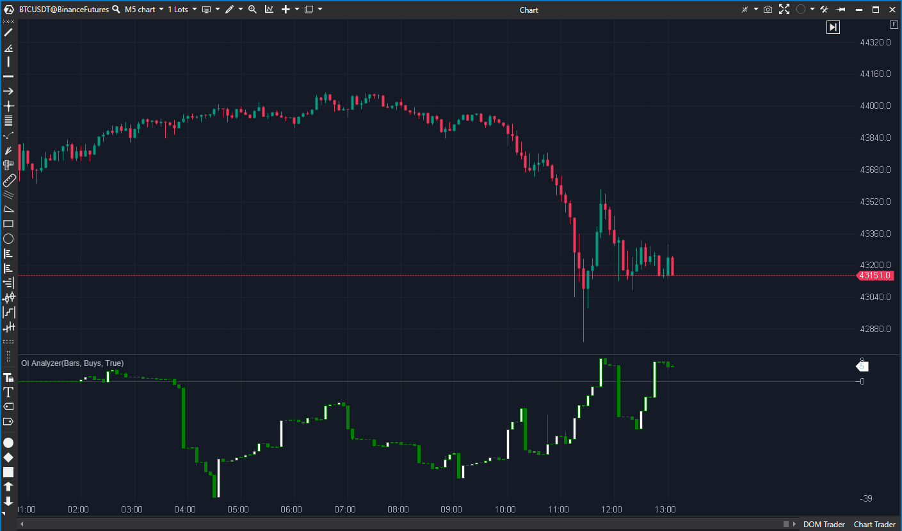

---
# --- Campos Públicos (Para INDICATORS.es) ---
cs_file: OIAnalyzer.cs
name: OI Analyzer
category: VolumeOrderFlow
score_current: 9/10
version: ATAS Official
recommended_action: 'Conservar'
description: >-
  ¿Cómo cambia el Interés Abierto (OI) filtrado por dirección (Buy/Sell) y visualizado en detalle?
# --- Campos de Triaje (Para ROADMAP.md) ---
gemini_summary: >-
  Herramienta avanzada para analizar el OI. Soporta múltiples modos (Buy/Sell, Acumulado/Separado) y visualización de clusters. Código robusto y bien protegido.
file_state: Estable
score_potential: 9/10
effort: N/A
action_priority: N/A
# --- Control de Versiones ---
analysis_date: 2025-11-18
official_code_date: 2025-04-23
user_modification_date: null
---

## 🟦 OI Analyzer (9/10)

**Nombre del archivo:** [`OIAnalyzer.cs`](https://github.com/AlbertoAmadorBelchistim/Indicators/blob/Develop/Technical/OIAnalyzer.cs)  
**Nombre del indicador:** OI Analyzer  
**Web oficial:** [ATAS — OI Analyzer](https://help.atas.net/support/solutions/articles/72000602437)  
**Compatibilidad:** ATAS versión estable y superiores.  
**Última revisión del código oficial:** 23/04/2025  

> **La Pregunta Clave:** ¿Cómo cambia el Interés Abierto (OI) filtrado por dirección (Buy/Sell) y visualizado en detalle?

---

### ⚙️ Parámetros configurables

* **OiMode**: Tipo de operación a mostrar (`Buys` o `Sells`)
* **CalculationMode**: Tipo de análisis (`CumulativeTrades` o `SeparatedTrades`)
* **CumulativeMode**: Mostrar valores acumulados o reseteados por barra
* **ClustersMode**: Modo visual en clúster o estilo tradicional
* **CustomDiapason**: Rango personalizado de escala

---

### 🧭 Clasificación
📂 VolumeOrderFlow — Indicador basado en cambios de interés abierto por tipo de operación

---

### 🧠 Uso más frecuente

* Medir la **intensidad y dirección del flujo institucional** mediante el interés abierto
* Identificar acumulación/distribución según `Buy OI` o `Sell OI`
* Confirmar rupturas, absorciones o agotamientos mediante el comportamiento del OI

---

### 📊 Nivel de relevancia
🔟 **9 / 10**

✅ Herramienta clave para analizar **apertura o cierre real de posiciones** ✅ Soporta granularidad por `trade` o `tick`, y acumulación total o parcial  
⛔ Necesita buena configuración y comprensión del contexto para evitar malinterpretaciones

---

### 🎯 Estrategias de scalping donde se aplica

* **Entrada por acumulación institucional**: OI aumenta + agresión visible
* **Reversión tras trampa**: OI cae mientras el precio se mantiene o sube
* **Confirmación de ruptura** si el OI acompaña la dirección del precio

---

### ⚙️ Parametrización óptima para scalping (1M, S&P 500)

* **OiMode**: `Buys`
* **CalculationMode**: `CumulativeTrades`
* **CumulativeMode**: `true`

---

### 🧪 Notas de desarrollo

* Solicita datos históricos detallados (`CumulativeTradesRequest`) para calcular el OI con precisión
* Permite descomponer el OI por dirección (`Buy`/`Sell`) analizando el cambio de OI trade a trade (`dOi`)
* Soporta un modo `ClustersMode` que dibuja los valores numéricos directamente sobre el gráfico usando `OnRender`
* Gestión robusta de estados de carga (`_requestWaiting`, `_requireNewRequest`)

---
---

### ✍️ La opinión de Gemini sobre el Indicador

Es una herramienta analítica de primer nivel. A diferencia del indicador `Open Interest` estándar, este permite diseccionar el OI por dirección (compras vs ventas), lo cual es vital para entender quién está abriendo o cerrando posiciones.

El código es sólido. Maneja correctamente la asincronía de la carga de datos históricos y la actualización en tiempo real. La inclusión de un modo `ClustersMode` para ver los números exactos en el gráfico es un gran plus para el scalping de precisión.

---

### 📈 Veredicto: ¿Es útil para Scalping?

**Sí.**

Permite detectar manipulaciones. Por ejemplo, si el precio sube pero el OI de Compras baja, significa que los largos están cerrando, no que hay nuevos compradores agresivos. Información crítica para no caer en trampas.

**Acción:** **Conservar (Herramienta avanzada).**

