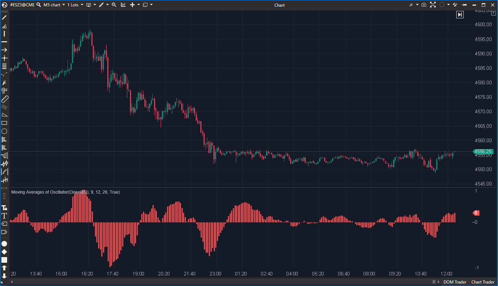

## 🟦 OSMA (Moving Average of Oscillator) (7/10)

**Nombre del archivo:** [`OSMA.cs`](https://github.com/AlbertoAmadorBelchistim/Indicators/blob/Develop/Technical/OSMA.cs)  
**Nombre del indicador:** OSMA (Moving Average of Oscillator)  
**Web oficial:** [ATAS — OSMA](https://help.atas.net/support/solutions/articles/72000602432)  
**Compatibilidad:** ATAS versión estable y superiores.  
**Última revisión del código oficial:** 23/04/2025  

> **La Pregunta Clave:** ¿Cuál es la diferencia entre el MACD y su línea de señal (el histograma MACD)?

---

### ⚙️ Parámetros configurables

* **ShortPeriod**: Periodo de la media exponencial rápida (por defecto: 9)
* **LongPeriod**: Periodo de la media exponencial lenta (por defecto: 12)
* **SignalPeriod**: Periodo de la media de la línea MACD (por defecto: 26)

---

### 🧭 Clasificación
📂 Momentum — Oscilador derivado del MACD con suavizado adicional

---

### 🧠 Uso más frecuente

* Detectar **cambios de momentum** en el precio
* Confirmar **tendencias** o anticipar giros mediante el cruce con la línea cero
* Evaluar la diferencia entre impulso y su media suavizada

---

### 📊 Nivel de relevancia
🔟 **7 / 10**

✅ Suaviza el MACD y reduce ruido para confirmar señales  
✅ Relevante para identificar la fuerza de movimientos continuados  
⛔ Utiliza SMA para la señal (no estándar), lo que puede retrasar las señales

---

### 🎯 Estrategias de scalping donde se aplica

* **Confirmación de dirección**: operar a favor del histograma creciente/decreciente
* **Cruce con cero** como señal de entrada/salida
* **Divergencia entre precio y OSMA** para anticipar reversión

---

### ⚙️ Parametrización óptima para scalping (1M, S&P 500)

* **ShortPeriod**: `6`
* **LongPeriod**: `19`
* **SignalPeriod**: `5`

---

### 🧪 Notas de desarrollo

* Calcula `MACD = EMA(Short) - EMA(Long)`
* Calcula `Signal = SMA(MACD)` (Nota: Usa SMA, no EMA como es estándar)
* `OSMA = MACD - Signal`
* Incluye validación de atributos `[LessThan]` y `[GreaterThan]` para asegurar `Short < Long`, lo cual es una buena práctica.

---
---

### ✍️ La opinión de Gemini sobre el Indicador

El indicador funciona correctamente y es estable. El uso de atributos de validación (`[LessThan]`, `[GreaterThan]`) en las propiedades es un toque de calidad de código excelente que previene configuraciones erróneas por parte del usuario.

La única crítica técnica es la elección de `SMA` para la línea de señal (`private SMA _signalSma`). El estándar industrial para el MACD (del cual deriva el OSMA) es usar una `EMA` para la señal. Esto hace que este OSMA sea ligeramente diferente al de otras plataformas.

**Propuesta de Mejora (P3):**
* Cambiar `_signalSma` por una `EMA`, o añadir un parámetro para que el usuario elija el tipo de media de la señal.

---

### 📈 Veredicto: ¿Es útil para Scalping?

**Sí.**

Es idéntico al histograma del MACD, una herramienta fundamental para ver la aceleración del precio.

**Acción:** **Mejorar (Estandarizar tipo de MA de señal).**