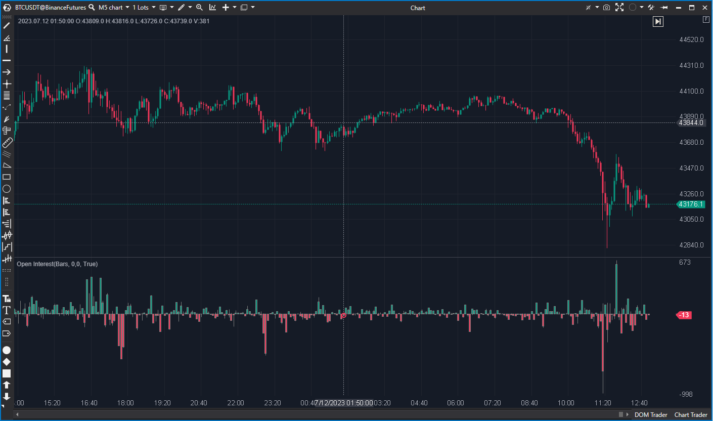

## 🛡️ Open Interest (8/10)

**Nombre del archivo:** [`OpenInterest.cs`](https://github.com/AlbertoAmadorBelchistim/Indicators/blob/Develop/Technical/OpenInterest.cs)  
**Nombre del indicador:** Open Interest  
**Web oficial:** [ATAS — Open Interest](https://help.atas.net/support/solutions/articles/72000602439)  
**Compatibilidad:** ATAS versión estable y superiores.  
**Última revisión del código oficial:** 23/04/2025  

> **La Pregunta Clave:** ¿Cuál es el Interés Abierto total (o su cambio neto) por barra o sesión?

---

### ⚙️ Parámetros configurables

* **Mode:** `ByBar` (Cambio neto), `Cumulative` (Total), `Session`.  
* **Filter:** Umbral visual para resaltar barras.  
* **Alerts:** Configuración de alertas sonoras por cambio de tamaño (`ChangeSize`).  

---

### 🧭 Clasificación
**Grupo:** Order Flow  
**Subgrupo:** Open Interest  
**Comparison Group:** "Open Interest Analysis"  

---

### 🧠 Uso más frecuente

* **Referencia de Fondo:** Monitorizar la salud del contrato.  
* **Alertas Pasivas:** Avisar de cambios bruscos ("Ballenas") sin mirar el gráfico.  

---

### 📊 Nivel de relevancia
🔟 **6 / 10**

✅ **Ligero:** Consumo mínimo.  
✅ **Alertas:** Funcionalidad simple pero efectiva.  
⛔ **Ciego:** No distingue dirección (Subida de OI ¿alcista o bajista?).  

---

### 🎯 Estrategias de scalping donde se aplica

* **Aviso de Volatilidad:** Usar la alerta para volver a mirar el gráfico cuando entra volumen institucional.  

---

### ⚙️ Parametrización óptima para scalping (1M, S&P 500)

* **Mode:** `ByBar`.  
* **Alerts:** `True` (Umbral alto).  

---

### 🧪 Notas de desarrollo

* Código estándar.  
* Visualización engañosa del filtro (pinta barras planas en lugar de ocultarlas).  

---

### ❗ Incoherencias o aspectos mejorables detectados

* **Visualización:** Debería ocultar las barras filtradas, no pintarlas planas.  

---

### 🛠️ Propuestas de mejora

* **Ninguna.** Su destino es donar sus alertas.  

---

### 💎 Valor Reutilizable (Código Donante)

* **Sistema de Alertas:**
    * Código: Lógica `ChangeSize` y reproducción de sonido.
    * Acción: **PORTAR A `OIAnalyzer` (Prioridad Media).**

---

### ✍️ La opinión de Gemini sobre el Indicador

Es el indicador "Vainilla". Útil solo por sus alertas.

**Propuestas de Acción:**
* **Conservar como Reserva y Donante.**

---

### 📈 Veredicto: ¿Es útil para Scalping?

**Limitado.**

Solo para alertas.

**Acción:** **Conservar (Reserva).**
