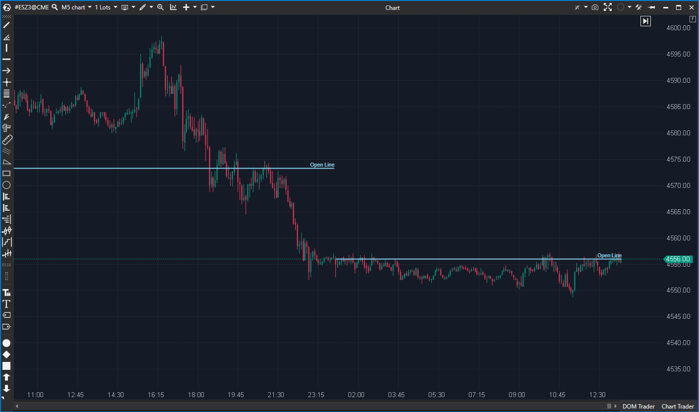

---
# --- Campos Públicos (Para INDICATORS.es) ---
cs_file: OpenLine.cs
name: Open Line
category: Level
score_current: 8/10
version: ATAS Official
recommended_action: 'Conservar'
description: >-
  ¿Dónde está el precio de apertura de la sesión actual (o personalizada) y ha sido tocado ya?
# --- Campos de Triaje (Para ROADMAP.md) ---
gemini_summary: >-
  Indicador de nivel de apertura simple y efectivo. Soporta horarios personalizados y la función "Till Touch" (cortar línea al toque). Código limpio.
file_state: Estable
score_potential: 8/10
effort: N/A
action_priority: N/A
# --- Control de Versiones ---
analysis_date: 2025-11-18
official_code_date: 2025-04-23
user_modification_date: null
---

## 🟦 Open Line (8/10)

**Nombre del archivo:** [`OpenLine.cs`](https://github.com/AlbertoAmadorBelchistim/Indicators/blob/Develop/Technical/OpenLine.cs)  
**Nombre del indicador:** Open Line  
**Web oficial:** [ATAS — Open Line](https://help.atas.net/support/solutions/articles/72000602440)  
**Compatibilidad:** ATAS versión estable y superiores.  
**Última revisión del código oficial:** 23/04/2025  

> **La Pregunta Clave:** ¿Dónde está el precio de apertura de la sesión actual (o personalizada) y ha sido tocado ya?

---

### ⚙️ Parámetros configurables

* **Days**: Número de sesiones a visualizar hacia atrás (por defecto: 5)
* **CustomSessionStartFilter**: Hora personalizada de inicio de sesión
* **ExtendLastLineToRight**: Extender línea de apertura de la última sesión hasta el borde del gráfico
* **TillTouch**: Terminar la línea si es tocada por el precio
* **OpenCandleText**: Texto a mostrar junto a la línea
* **FontSize / Offset**: Tamaño y posición del texto
* **LinePen**: Color y grosor de la línea de apertura

---

### 🧭 Clasificación
📂 Level — Niveles estructurales de apertura por sesión o segmento personalizado

---

### 🧠 Uso más frecuente

* Visualizar la **línea de apertura de cada sesión o bloque horario**
* Detectar **rejeciones o absorciones** en el nivel de apertura
* Confirmar estructuras o trampas en apertura (ej: falso breakout, recuperación)

---

### 📊 Nivel de relevancia
🔟 **8 / 10**

✅ Muy útil para contexto estructural y análisis de sesión  
✅ Compatible con sesiones personalizadas y scalping institucional  
⛔ Requiere configuración precisa si se trabaja con horarios no estándar

---

### 🎯 Estrategias de scalping donde se aplica

* **Venta en rechazo de la apertura** si hay absorción
* **Compra si el precio recupera apertura tras trampa bajista**
* **Filtro direccional**: operar solo si el precio se mantiene por encima/debajo de la apertura

---

### ⚙️ Parametrización óptima para scalping (1M, S&P 500)

* **Days**: `5`
* **CustomSessionStartFilter**: `09:30` (inicio sesión cash USA)
* **TillTouch**: `true`
* **ExtendLastLineToRight**: `true`
* **LinePen.Width**: `2`, color visible (ej: SkyBlue)

---

### 🧪 Notas de desarrollo

* Detecta inicio de sesión según sistema o filtro personalizado (`FilterTimeSpan`)
* Almacena objetos `Session` con la información de precio y estado (`Touched`)
* Dibuja líneas horizontales con `OnRender`
* La función `TillTouch` comprueba en cada vela si `High >= Open && Low <= Open` para marcar la sesión como tocada

---
---

### ✍️ La opinión de Gemini sobre el Indicador

Es un indicador simple pero esencial para la estructura de mercado intradía. El código en `OpenLine.cs` está bien escrito.

La característica más valiosa es la lógica `TillTouch`, que permite identificar rápidamente "aperturas desnudas" (naked opens) de días anteriores que aún no han sido testeadas y que actúan como imanes de precio. La implementación de sesiones personalizadas (`CustomSessionStartFilter`) también está bien hecha, permitiendo aislar la sesión RTH (Regular Trading Hours) incluso en futuros que cotizan 24h.

---

### 📈 Veredicto: ¿Es útil para Scalping?

**Sí.**

La apertura es el nivel más psicológico del día. Saber dónde está y si el precio está por encima o por debajo es el filtro direccional más básico y efectivo.

**Acción:** **Conservar (Utilidad estructural).**

