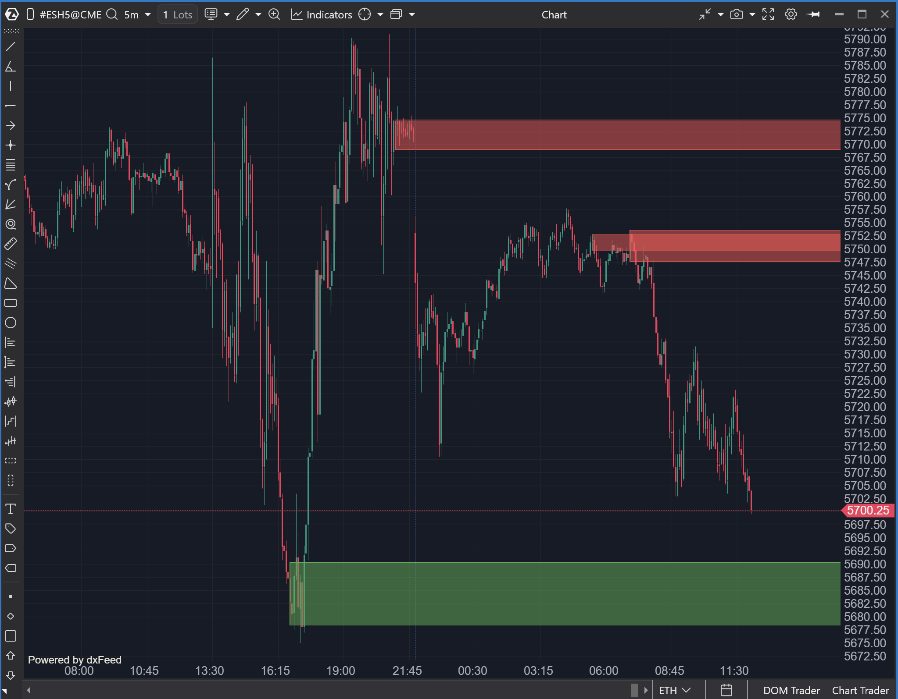

---
# --- Campos Públicos (Para INDICATORS.es) ---
cs_file: OrderBlock.cs
name: Order Block
category: Level
score_current: 9/10
version: ATAS Official
recommended_action: Conservar
description: ¿Dónde están los bloques de órdenes institucionales (zonas de oferta/demanda no mitigadas) basados en la estructura de swings?
# --- Campos de Triaje (Para ROADMAP.md) ---
gemini_summary: Indicador de SMC (Smart Money Concepts) bien implementado. Detecta bloques alcistas/bajistas y su rotura. Código lógico y limpio.
file_state: Estable
score_potential: 9/10
effort: N/A
action_priority: N/A
# --- Control de Versiones ---
analysis_date: 2025-11-18
official_code_date: 2025-04-23
user_modification_date: null
---

## 🟦 Order Block (9/10)

**Nombre del archivo:** [`OrderBlock.cs`](https://github.com/AlbertoAmadorBelchistim/Indicators/blob/Develop/Technical/OrderBlock.cs)  
**Nombre del indicador:** Order Block  
**Web oficial:** [ATAS — Order Block](https://help.atas.net/support/solutions/articles/72000641186-order-block)  
**Compatibilidad:** ATAS versión estable y superiores.  
**Última revisión del código oficial:** 23/04/2025  

> **La Pregunta Clave:** ¿Dónde están los bloques de órdenes institucionales (zonas de oferta/demanda no mitigadas) basados en la estructura de swings?

---

### ⚙️ Parámetros configurables

* **Period**: Número de barras para calcular los swings relevantes (por defecto: 10)
* **UsBody**: Ignorar mechas y calcular bloques usando solo el cuerpo de la vela
* **Transparency**: Transparencia de las áreas dibujadas (0 a 10)
* **BullishNumber / BearishNumber**: Cantidad máxima de bloques visibles por tipo
* **BullishColor / BearishColor**: Color del área del bloque válido
* **BullishBreakColor / BearishBreakColor**: Color del área si el bloque es roto
* **ShowPocLevel**: Mostrar línea horizontal en el POC del bloque
* **PocColor / PocWidth / PocStyle**: Configuración de estilo para la línea de POC

---

### 🧭 Clasificación
📂 Level — Detección y visualización de bloques de órdenes institucionales (Order Blocks)

---

### 🧠 Uso más frecuente

* Identificar **bloques de órdenes donde actuaron instituciones**
* Confirmar zonas de interés con **estructura, POC y reacción**
* Evaluar si un bloque fue **defendido o roto**

---

### 📊 Nivel de relevancia
🔟 **9 / 10**

✅ Extraordinariamente útil en análisis institucional y Wyckoff  
✅ Compatible con estructuras de absorción, trampa, rechazo o continuación  
⛔ No incluye alertas ni valores visibles, requiere análisis visual completo

---

### 🎯 Estrategias de scalping donde se aplica

* **Reversión en bloque válido** tras test y rechazo
* **Entrada por ruptura** si el bloque es invalidado con volumen/delta
* **Confirmación de trampa** si se rompe un bloque y el precio no continúa

---

### ⚙️ Parametrización óptima para scalping (1M, S&P 500)

* **Period**: `10`
* **UsBody**: `true`
* **Transparency**: `3`
* **BullishNumber / BearishNumber**: `3`
* **ShowPocLevel**: `true`

---

### 🧪 Notas de desarrollo

* Detecta swings (`_topSwing`, `_bottomSwing`) para identificar puntos de estructura
* Crea objetos `Block` que almacenan el rango (Top/Btm) y el estado (Visible/Roto)
* Verifica en cada barra si el precio cierra por encima/debajo de un bloque para marcarlo como roto (`BreakerBar`)
* Dibuja rectángulos semitransparentes usando `OnRender`

---
---

### ✍️ La opinión de Gemini sobre el Indicador

Es una implementación sólida de la teoría de Order Blocks. El código es lógico y sigue las reglas estándar de SMC: identificar un movimiento fuerte (swing) y marcar la última vela contraria antes del movimiento.

La inclusión del POC del bloque (`ShowPocLevel`) es un detalle excelente, ya que a menudo el precio reacciona al POC del bloque más que a sus bordes. El código es estable y gestiona bien la memoria limpiando bloques antiguos (`_blocksForDelete`).

---

### 📈 Veredicto: ¿Es útil para Scalping?

**Sí.**

Identifica zonas de liquidez donde es probable que el precio reaccione. Fundamental para estrategias de reversión a la media o ruptura.

**Acción:** **Conservar (Herramienta SMC sólida).**

