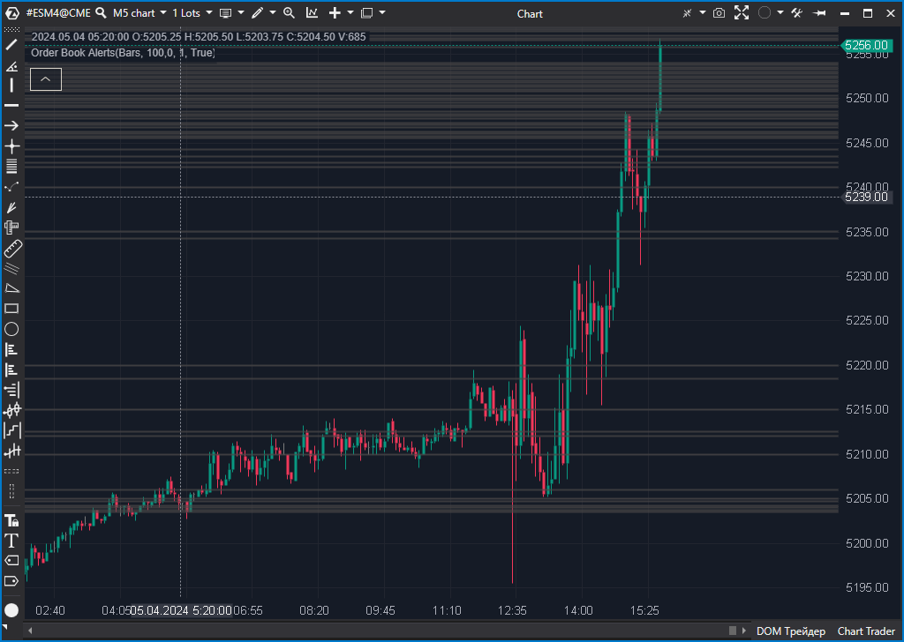

---
# --- Campos Públicos (Para INDICATORS.es) ---
cs_file: OrderBookAlerts.cs
name: Order Book Alerts
category: OrderBook
score_current: 9/10
version: ATAS Official
recommended_action: 'Conservar'
description: >-
  ¿Dónde hay muros de liquidez en el DOM que superan un cierto tamaño y persisten en el tiempo?
# --- Campos de Triaje (Para ROADMAP.md) ---
gemini_summary: >-
  Monitor de DOM eficaz. Alerta sobre niveles de liquidez grandes y persistentes. Código eficiente basado en eventos de profundidad de mercado.
file_state: Estable
score_potential: 9/10
effort: N/A
action_priority: N/A
# --- Control de Versiones ---
analysis_date: 2025-11-18
official_code_date: 2025-05-8
user_modification_date: null
---

## 🟦 Order Book Alerts (9/10)

**Nombre del archivo:** [`OrderBookAlerts.cs`](https://github.com/AlbertoAmadorBelchistim/Indicators/blob/Develop/Technical/OrderBookAlerts.cs)  
**Nombre del indicador:** Order Book Alerts  
**Web oficial:** [ATAS — Order Book Alerts](https://help.atas.net/support/solutions/articles/72000619055)  
**Compatibilidad:** ATAS versión estable y superiores.  
**Última revisión del código oficial:** 8/05/2025  

> **La Pregunta Clave:** ¿Dónde hay muros de liquidez en el DOM que superan un cierto tamaño y persisten en el tiempo?

---

### ⚙️ Parámetros configurables

* **Filter**: Volumen mínimo requerido para generar alerta (por defecto: 100)
* **TimeFilter**: Tiempo mínimo en segundos que el nivel debe mantenerse (opcional)
* **POMode**: Modo de offset desde el precio actual (`Percent` o `Ticks`)
* **PriceOffset**: Desplazamiento desde el último precio (en %) o en ticks
* **UseAlerts**: Activar alertas sonoras y visuales
* **AlertFile**: Archivo de sonido a reproducir
* **AlertForeColor / AlertBGColor**: Colores de texto y fondo de la alerta
* **ShowOnChart**: Mostrar los niveles detectados sobre el gráfico
* **CoolDownPeriod**: Tiempo mínimo entre alertas para un mismo nivel (segundos)

---

### 🧭 Clasificación
📂 OrderBook — Alertas dinámicas por profundidad de mercado (DOM)

---

### 🧠 Uso más frecuente

* Detectar **niveles relevantes en el libro de órdenes (DOM)**
* Activar alertas al aparecer **volumen significativo cerca del precio**
* Confirmar zonas de **absorción, spoofing o presión institucional**

---

### 📊 Nivel de relevancia
🔟 **9 / 10**

✅ Alertas dinámicas por aparición de volumen fuera de lo común  
✅ Visualización directa y configurable en el gráfico  
⛔ Requiere buena calibración de filtros para evitar exceso de ruido

---

### 🎯 Estrategias de scalping donde se aplica

* **Entrada por aparición de muro de órdenes** en zona de interés
* **Confirmación de soporte/resistencia** con alerta visual + volumen
* **Evitar trades en zonas con alta presión pasiva detectada**

---

### ⚙️ Parametrización óptima para scalping (1M, S&P 500)

* **Filter**: `150`
* **POMode**: `Ticks`
* **PriceOffset**: `10`
* **TimeFilter.Enabled**: `true`, `Value`: `1`
* **CoolDownPeriod**: `3`
* **ShowOnChart**: `true`

---

### 🧪 Notas de desarrollo

* Se suscribe a `MarketDepthChanged` para recibir actualizaciones del DOM
* Mantiene una lista interna `_priceInfos` con los niveles detectados
* Implementa lógica de `TimeFilter` (persistencia) y `CoolDownPeriod` (anti-spam)
* Dibuja rectángulos en el gráfico (`OnRender`) en los niveles de precio detectados

---
---

### ✍️ La opinión de Gemini sobre el Indicador

Es una herramienta excelente para traer la información del DOM al gráfico. Muchos scalpers no pueden mirar el DOM y el gráfico simultáneamente; este indicador resuelve eso alertando visualmente sobre la liquidez pasiva.

El código es eficiente y maneja bien la alta frecuencia de actualizaciones del DOM. La función `TimeFilter` es crucial para filtrar el "spoofing" (órdenes falsas que aparecen y desaparecen rápidamente).

---

### 📈 Veredicto: ¿Es útil para Scalping?

**Sí.**

La liquidez pasiva actúa como un imán o como una barrera. Saber dónde está sin tener que abrir el DOM es una gran ventaja.

**Acción:** **Conservar (Utilidad de DOM).**

