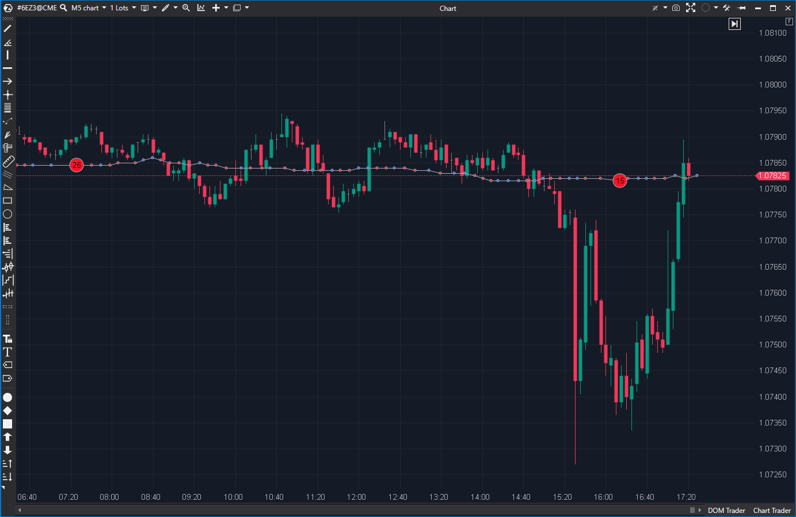

---
cs_file: OrderFlow.cs
name: Order Flow Indicator
group: Order Flow
subgroup: Volume
score_current: 9/10
version: Stable
recommended_action: Conservar (Reserva)
description: ¿Cómo se visualiza el flujo de órdenes (trades individuales) en el gráfico?
gemini_summary: "El visualizador clásico. Muestra el flujo de órdenes como bolas o cuadrados en el gráfico. Es menos potente filtrando que el TapePatterns, pero visualmente es más intuitivo y fácil de configurar para el seguimiento del flujo bruto."
comparison_group: "Tape Analysis"
competitor_notes: "Excelente alternativa visual al TapePatterns. Menos cerebro, más ojos."
reusable_code: null
file_state: Estable
score_potential: 9/10
effort: N/A
action_priority: N/A
analysis_date: 2025-11-21
official_code_date: 23/04/2025
---

## 🛡️ Order Flow Indicator (9/10)

**Nombre del archivo:** [`OrderFlow.cs`](https://github.com/AlbertoAmadorBelchistim/Indicators/blob/Develop/Technical/OrderFlow.cs)  
**Nombre del indicador:** Order Flow Indicator  
**Web oficial:** [ATAS — Order Flow Indicator](https://help.atas.net/support/solutions/articles/72000602441)  
**Compatibilidad:** ATAS versión estable y superiores.  
**Última revisión del código oficial:** 23/04/2025  

> **La Pregunta Clave:** ¿Cómo se visualiza el flujo de órdenes (trades individuales o acumulados) en el gráfico?

---

### ⚙️ Parámetros configurables

* **VisMode:** `Circles` (Bolas) o `Rectangles`.  
* **TradesMode:** `Cumulative` (Agrupado) o `Separated` (Tick a tick).  
* **Filter:** Volumen mínimo para mostrar la bola.  
* **CombineSmallTrades:** Agrupar trades pequeños en uno grande visualmente.  
* **SpeedInterval:** Control de tasa de refresco (rendimiento).  

---

### 🧭 Clasificación
**Grupo:** Order Flow  
**Subgrupo:** Volume  
**Comparison Group:** "Tape Analysis"  

---

### 🧠 Uso más frecuente

* **Seguimiento de Flujo:** Ver el "río" de órdenes entrando en tiempo real.  
* **Detección de Agresión:** Bolas grandes verdes/rojas empujando el precio.  

---

### 📊 Nivel de relevancia
🔟 **9 / 10**

✅ **Intuitivo:** La visualización de "bolas" que crecen con el volumen es universalmente entendida.  
✅ **Rendimiento Controlado:** Usa un temporizador (`SpeedInterval`) para no saturar el dibujado.  
⛔ **Menos Filtros:** No tiene los filtros temporales avanzados del `TapePatterns`.  

---

### 🎯 Estrategias de scalping donde se aplica

* **Impulso:** Entrar cuando el flujo de bolas se acelera y aumenta de tamaño en una dirección.  

---

### ⚙️ Parametrización óptima para scalping (1M, S&P 500)

* **VisMode:** `Circles`.  
* **TradesMode:** `Cumulative`.  
* **Filter:** `20` (Para ver flujo medio-alto).  

---

### 🧪 Notas de desarrollo

* Usa `OnTimerCall` para redibujar, separando la recepción de datos del renderizado gráfico. Buena práctica.  
* Renderizado manual en `OnRender` usando primitivas gráficas (`FillEllipse`).  

---

### ❗ Incoherencias o aspectos mejorables detectados

* **Ninguna crítica.** Cumple su función visual perfectamente.  

---

### 🛠️ Propuestas de mejora

* **Ninguna.** 
* 
* ---

### 💎 Valor Reutilizable (Código Donante)

* **Ninguno.** 
* 
* ---

### ✍️ La opinión de Gemini sobre el Indicador

Es la herramienta perfecta para quien quiere "ver" el mercado sin complicaciones. Mientras `TapePatterns` es para el analista forense, `OrderFlow` es para el trader de reacción rápida que quiere ver dónde está la acción.

**Propuestas de Acción:**
* **Conservar como Reserva de Lujo.**

---

### 📈 Veredicto: ¿Es útil para Scalping?

**Sí.**

Muy visual y directo.

**Acción:** **Conservar (Reserva).**
