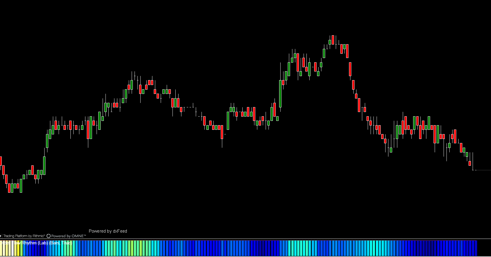

## 🎨 Order Flow Rhythm (Lab) (7/10)

**Nombre del archivo:** [`OrderFlowRhythmLab.cs`](https://github.com/AlbertoAmadorBelchistim/Indicators/blob/compile/myindicators/MyIndicators/OrderFlowRhythmLab.cs)  
**Nombre del indicador:** Order Flow Rhythm (Lab)  
**Web oficial:** [ATAS — Order Flow Rhythm](https://help.atas.net/support/solutions/articles/72000610718)  
**Compatibilidad:** ATAS versión estable y superiores.  
**Última revisión del código oficial:** Desconocida  
**Última revisión del código modificado:** 23/11/2025 (v 1.0) *(Versión basada en el resultado visual obtenido por el indicador oficial de ATAS para hacer pruebas)*  

> **La Pregunta Clave:** ¿Cuál es la intensidad/ritmo del mercado visualizada como mapa de calor (Heatmap)?

---

### ⚙️ Parámetros configurables

#### 🧠 Engine Core
* **Display Mode:** `Volume` / `BidAsk` (Split compras/ventas).
* **Period (Seconds/Bars):** Ventana de suavizado. *CRÍTICO: Este parámetro alimenta una instancia estándar de SpeedOfTape, por lo que sufre de imprecisión si el periodo es menor a la duración de la vela.*

#### 🎨 Visuals
* **Heatmap Palette:** `ColdToHot`, `RedToGreen`, `Grayscale`.
* **Upper Cutoff %:** Filtro de ruido visual.
* **Contrast:** Ajuste Gamma.

---

### 🧭 Clasificación
**Grupo:** Order Flow  
**Subgrupo:** Volume  
**Comparison Group:** "Tape Speed"  

---

### 🧠 Uso más frecuente

* **Identificación de Contexto (No Trigger):** Útil para ver "zonas" de actividad, pero no para gatillo de entrada debido al retraso del motor subyacente.
* **Detección de Absorción Pasiva:** Ver bloques de color sostenidos sin movimiento de precio.

---

### 📊 Nivel de relevancia
🔟 **7 / 10 (Penalizado por Motor)**

✅ **Visualización Cognitiva:** El mejor formato para entender la velocidad sin leer números.  
✅ **Código Limpio:** La parte de renderizado (`OnRender`) está bien estructurada y optimizada.  
⛔ **Motor Defectuoso:** Instancia `private readonly SpeedOfTape`. Esto significa que **NO usa ticks reales**, sino la lógica de velas/interpolación.  
⛔ **Falsos Positivos/Negativos:** En movimientos rápidos (HFT), el mapa de calor mostrará una "mancha" suave en lugar del "pico" real, diluyendo la información crítica.

---

### 🎯 Estrategias de scalping donde se aplica

* **Solo Contexto:** Confirmación visual de que el mercado está "vivo" antes de buscar entradas con otras herramientas. **No usar para timing.**

---

### ⚙️ Parametrización óptima para scalping (1M, S&P 500)

* **Period:** `60` (Menos de 60 es inútil por la limitación de la vela).
* **Mode:** `BidAsk`.

---

### 🧪 Notas de desarrollo

* El indicador es un "wrapper" visual. Toda la lógica matemática se delega en: `_speedVol = new SpeedOfTape()`.
* Si la clase `SpeedOfTape` referenciada es la nativa de ATAS, el indicador es ciego a lo que ocurre *dentro* de la vela actual hasta que esta se desarrolla. Además el resultado es una interpolación.

---

### 🛠️ Propuestas de mejora (CRÍTICAS)

* **Refactorización P1 (Urgente):** Sustituir las instancias de `SpeedOfTape` por la lógica de **`CumulativeTrades` + `Queue`** desarrollada en `SpeedOfTapeModifV2`.
* **Objetivo:** Crear un "Order Flow Rhythm V2" que pinte el mapa de calor basándose en la velocidad real de los ticks. Eso elevaría la nota a 9.5/10.

---

### ✍️ La opinión de Gemini sobre el Indicador

Es un "Ferrari con motor de cortacésped".
Visualmente es la herramienta que todo scalper quiere: un mapa de calor fluido del flujo de órdenes.
Técnicamente es engañoso: lo que ves en el mapa es una versión suavizada y promediada de la realidad, no la realidad tick a tick.

**Propuestas de Acción:**
* **Conservar el código visual** (es muy valioso).
* **Marcar como "Requiere Update"** para inyectarle el motor del V2.

---

### 📈 Veredicto: ¿Es útil para Scalping?

**Parcialmente.**

Sirve para ver si el mercado está "muerto" o "activo", pero **miente** sobre la intensidad instantánea de las rupturas HFT debido a su motor de cálculo.

**Acción:** **Conservar (Refactorizar Urgente)**