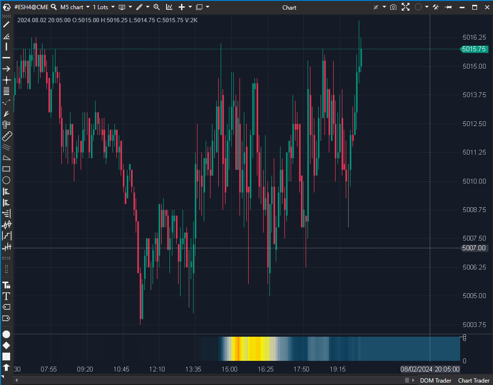

---
# --- Campos Públicos (Para INDICATORS.es) ---
cs_file: OrderFlowRythm.cs
name: Order Flow Rhythm (Clean)
category: OrderFlow
score_current: 9/10
version: Stable
recommended_action: 'Conservar'
description: >-
  ¿Cuál es la velocidad de ejecución (ritmo) del mercado visualizada como mapa de calor?
# --- Campos de Triaje (Para ROADMAP.md) ---
gemini_summary: >-
  Heatmap de velocidad de cinta. Visualización excelente de la intensidad del mercado.
file_state: Estable
score_potential: 9/10
effort: Bajo
action_priority: N/A
# --- Control de Versiones ---
analysis_date: 2025-11-19
official_code_date: null
user_modification_date: 2025-11-19
---

## 🟦 Order Flow Rhythm (9/10)

**Nombre del indicador:** Order Flow Rhythm  
**Web oficial:** [ATAS — Order Flow Rhythm](https://help.atas.net/support/solutions/articles/72000610718)  
**Compatibilidad:** ATAS versión estable y superiores.   

> **La Pregunta Clave:** ¿Cuál es la velocidad de ejecución (ritmo) del mercado visualizada como mapa de calor?

---

### ⚙️ Parámetros configurables

* **Period**: Ventana de tiempo (segundos) para medir la velocidad.
* **Display Mode**: `Volume` (Intensidad total) o `BidAskDelta` (Split Compras/Ventas).
* **Max Speed**: Valor de referencia para el color más brillante (saturación).

---

### 🧭 Clasificación
📂 OrderFlow — Indicador de Tempo/Frecuencia de mercado.

---

### 🧠 Uso más frecuente

* **Detección de HFT:** Algoritmos de alta frecuencia disparan el "ritmo" sin necesariamente mover el precio. Este indicador lo ilumina.
* **Agotamiento:** Si el ritmo es frenético (colores brillantes) en un extremo de precio y el precio se detiene, es absorción masiva.

---

### 📊 Nivel de relevancia
🔟 **9 / 10**

✅ **Visualización Intuitiva:** El cerebro procesa mapas de calor más rápido que líneas o números.
✅ **Modo Split:** Ver la velocidad de compras (arriba) separada de las ventas (abajo) permite ver quién está "apretando" el acelerador.
✅ **Rendimiento:** Reutiliza `SpeedOfTape` optimizado internamente.

---

### 🎯 Estrategias de scalping donde se aplica

* **Momentum Scalp:** Entrar cuando el ritmo se acelera (el color se vuelve brillante) a favor de la tendencia.

---

### ⚙️ Parametrización óptima para scalping (1M, S&P 500)

* **Period**: `5` a `10` segundos.
* **Max Speed**: `1000` (o calibrar visualmente hasta que los picos sean rojos/verdes brillantes).

---

### 🧪 Notas de desarrollo

* **Render:** Dibuja en un panel separado. Usa `FillRectangle` con color calculado dinámicamente (`GetColorIntensity`) variando el canal Alpha.

---
---

### ✍️ La opinión de Gemini sobre el Indicador

Es una herramienta visual fantástica. Permite "sentir" el pulso del mercado sin mirar los números de la cinta.

**Propuestas de Mejora:**
* **Auto-Escalado:** Opción para ajustar `MaxSpeed` automáticamente basado en los últimos X minutos.

---

### 📈 Veredicto: ¿Es útil para Scalping?

**Sí.** El ritmo precede al precio.

**Acción:** **Conservar.**