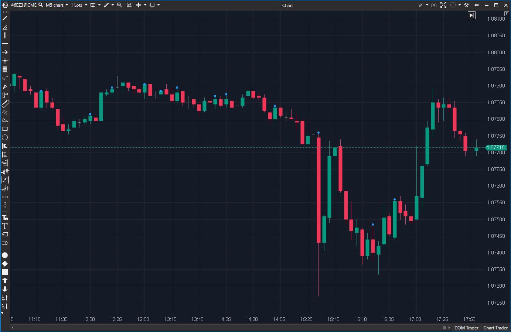

---
# --- Campos Públicos (Para INDICATORS.es) ---
cs_file: OutsideBar.cs
name: Outside Bar
category: PriceAction
score_current: 6/10
version: ATAS Official
recommended_action: Mejorar
description: ¿Es la barra actual una "Outside Bar" (engloba completamente a la anterior)?
# --- Campos de Triaje (Para ROADMAP.md) ---
gemini_summary: Detector de patrón simple y funcional. Visualización pobre (solo un punto en el High), debería distinguir entre Outside Bar alcista/bajista.
file_state: Mejorable
score_potential: 7/10
effort: Bajo
action_priority: P3
# --- Control de Versiones ---
analysis_date: 2025-11-18
official_code_date: 2025-04-23
user_modification_date: null
---

## 🟦 Outside Bar (6/10)

**Nombre del archivo:** [`OutsideBar.cs`](https://github.com/AlbertoAmadorBelchistim/Indicators/blob/Develop/Technical/OutsideBar.cs)  
**Nombre del indicador:** Outside Bar  
**Web oficial:** [ATAS — Outside Bar](https://help.atas.net/support/solutions/articles/72000602280)  
**Compatibilidad:** ATAS versión estable y superiores.  
**Última revisión del código oficial:** 23/04/2025  

> **La Pregunta Clave:** ¿Es la barra actual una "Outside Bar" (engloba completamente a la anterior)?

---

### ⚙️ Parámetros configurables

* **IncludeEqual**: Considerar o no los valores iguales en High/Low al comparar velas (por defecto: false)

---

### 🧭 Clasificación
📂 PriceAction — Detección de patrones de expansión de rango (barras externas)

---

### 🧠 Uso más frecuente

* Detectar **barras que engloban completamente la anterior** (expansión de rango)
* Confirmar **rupturas** o **trampas** si la barra exterior falla en continuar
* Usar como base para estrategias de **reversión o continuación estructural**

---

### 📊 Nivel de relevancia
🔟 **6 / 10**

✅ Identifica un patrón clásico de análisis técnico  
✅ Útil como disparador o filtro estructural  
⛔ Visualización muy limitada (solo un punto azul en el máximo)

---

### 🎯 Estrategias de scalping donde se aplica

* **Entrada por reversión** si la barra siguiente rechaza el extremo de una outside bar
* **Rompimiento estructural** si hay continuación con volumen tras una barra exterior
* **Estrategia de trampa**: esperar falsa ruptura seguida de vuelta dentro del rango previo

---

### ⚙️ Parametrización óptima para scalping (1M, S&P 500)

* **IncludeEqual**: `true`

---

### 🧪 Notas de desarrollo

* Lógica simple: `High > PrevHigh && Low < PrevLow` (o `>=` si `IncludeEqual` es true)
* Dibuja un punto en `_renderSeries` ubicado en el `High` de la vela
* No distingue visualmente la dirección de la vela (alcista/bajista)

---
---

### ✍️ La opinión de Gemini sobre el Indicador

El indicador cumple su función básica de detección. El código es correcto y eficiente.

Sin embargo, la visualización es perezosa. Dibuja siempre el mismo punto azul en el máximo de la vela. En Price Action, una Outside Bar alcista (cierre > apertura) tiene implicaciones muy diferentes a una bajista. El indicador debería reflejar esto, quizás pintando el fondo de la vela o usando flechas de diferente color/dirección.

**Propuesta de Mejora (P3):**
* Distinguir visualmente entre Outside Bar Alcista (Bullish Engulfing) y Bajista (Bearish Engulfing).
* Opción para pintar el fondo de la vela (`Paintbars`) en lugar de un simple punto.

---

### 📈 Veredicto: ¿Es útil para Scalping?

**Sí.**

Las Outside Bars en zonas de soporte/resistencia son señales de reversión muy potentes en scalping.

**Acción:** **Mejorar (Mejorar visualización).**

