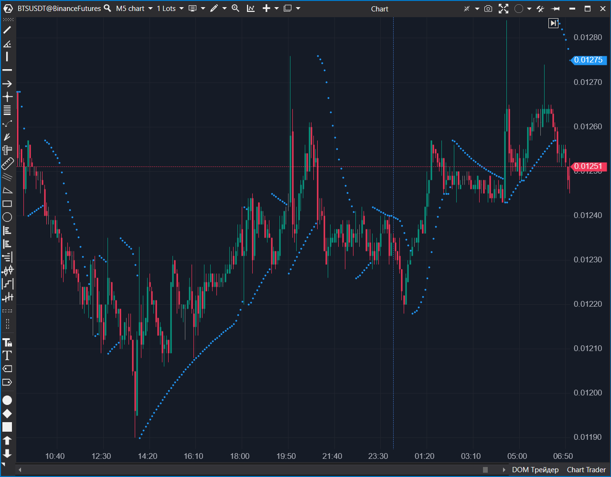

## 🟦 Parabolic SAR (8/10)

**Nombre del archivo:** [`ParabolicSAR.cs`](https://github.com/AlbertoAmadorBelchistim/Indicators/blob/Develop/Technical/ParabolicSAR.cs)  
**Nombre del indicador:** Parabolic SAR  
**Web oficial:** [ATAS — Parabolic SAR](https://help.atas.net/support/solutions/articles/72000602442)  
**Compatibilidad:** ATAS versión estable y superiores.  
**Última revisión del código oficial:** 23/04/2025  

> **La Pregunta Clave:** ¿Cuál es el nivel de stop dinámico (trailing stop) basado en precio y tiempo (aceleración)?

---

### ⚙️ Parámetros configurables

* **AccelStart**: Valor inicial del factor de aceleración (por defecto: 0.02)
* **AccelStep**: Incremento del factor de aceleración por nueva señal (por defecto: 0.02)
* **AccelMax**: Límite máximo del factor de aceleración (por defecto: 0.2)

---

### 🧭 Clasificación
📂 Trend — Indicador de seguimiento de tendencia con aceleración adaptativa

---

### 🧠 Uso más frecuente

* Identificar **cambios de dirección en la tendencia**
* Usar como **stop dinámico o trailing stop**
* Detectar fases de **aceleración y reversión** en el movimiento del precio

---

### 📊 Nivel de relevancia
🔟 **8 / 10**

✅ Muy útil como herramienta de seguimiento de tendencia  
✅ Visualmente claro y reactivo en tendencias establecidas  
⛔ No actualiza el giro en tiempo real dentro de la vela (defecto de implementación)

---

### 🎯 Estrategias de scalping donde se aplica

* **Trailing Stop** sobre la base del SAR en tendencia fuerte
* **Entrada tras reversión clara** cuando el SAR cambia de lado
* **Confirmación de dirección**: operar solo si SAR confirma el sesgo

---

### ⚙️ Parametrización óptima para scalping (1M, S&P 500)

* **AccelStart**: `0.02`
* **AccelStep**: `0.02`
* **AccelMax**: `0.2`

---

### 🧪 Notas de desarrollo

* Implementa la lógica clásica de Wilder con aceleración incremental
* Mantiene estado interno (`_sar`, `_acceleration`, `_isUptrend`)
* **Defecto:** `if (_lastBar == bar) return;` impide la actualización en tiempo real hasta que cierra la barra.

---
---

### ✍️ La opinión de Gemini sobre el Indicador

Es una implementación correcta de la fórmula matemática, pero con un defecto de usabilidad para trading en tiempo real.

La línea `if (_lastBar == bar) return;` al principio de `OnCalculate` hace que el indicador **solo se calcule una vez por barra** (al cierre/apertura de la siguiente). Esto significa que si el precio cruza el nivel SAR *durante* la formación de la vela, el punto no cambiará de lado hasta que la vela cierre. Para un scalper, ver el giro en el momento exacto que ocurre es vital.

**Propuesta de Mejora (P3):**
* Modificar la lógica para permitir el recálculo en la barra actual (`bar == CurrentBar - 1`), asegurando que el estado interno (`_sar`, `_acceleration`) no se corrompa por múltiples llamadas (usando variables temporales o restaurando estado).

---

### 📈 Veredicto: ¿Es útil para Scalping?

**Sí.**

Es uno de los mejores indicadores de trailing stop mecánico.

**Acción:** **Mejorar (Habilitar actualización en tiempo real).**

