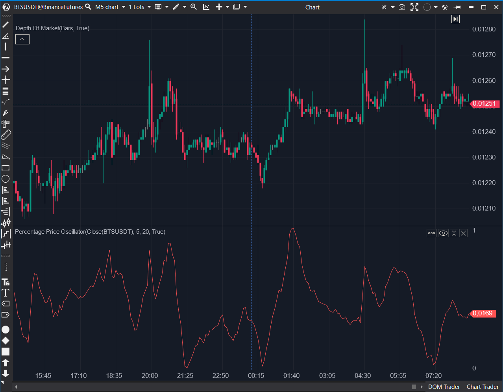

## 🟦 Percentage Price Oscillator (PPO) (7/10)

**Nombre del archivo:** [`PercentagePrice.cs`](https://github.com/AlbertoAmadorBelchistim/Indicators/blob/Develop/Technical/PercentagePrice.cs)  
**Nombre del indicador:** Percentage Price Oscillator  
**Web oficial:** [ATAS — Percentage Price Oscillator](https://help.atas.net/support/solutions/articles/72000602445)  
**Compatibilidad:** ATAS versión estable y superiores.  
**Última revisión del código oficial:** 23/04/2025  

> **La Pregunta Clave:** ¿Cuál es la diferencia porcentual entre dos medias móviles (MACD normalizado)?

---

### ⚙️ Parámetros configurables

* **ShortPeriod**: Periodo para la EMA corta (por defecto: 5)
* **LongPeriod**: Periodo para la EMA larga (por defecto: 20)

---

### 🧭 Clasificación
📂 Momentum — Oscilador de impulso basado en diferencia porcentual de dos EMAs

---

### 🧠 Uso más frecuente

* Medir la **fuerza del impulso** relativo en porcentaje
* Confirmar rupturas o cambios de dirección en función del sesgo porcentual
* Detectar condiciones de **divergencia o aceleración** frente al precio

---

### 📊 Nivel de relevancia
🔟 **7 / 10**

✅ Proporciona información de impulso normalizada (porcentaje)  
✅ Similar al MACD pero útil para comparar activos de precios muy diferentes  
⛔ Incompleto: le falta la línea de señal y el histograma

---

### 🎯 Estrategias de scalping donde se aplica

* **Confirmación de dirección** cuando el PPO cruza cero con pendiente clara
* **Entrada por divergencia** si el PPO muestra desaceleración mientras el precio sigue
* **Filtro direccional** en sistemas que requieren confirmación por impulso porcentual

---

### ⚙️ Parametrización óptima para scalping (1M, S&P 500)

* **ShortPeriod**: `6`
* **LongPeriod**: `21`

---

### 🧪 Notas de desarrollo

* Fórmula: `100 * (EMA_Short - EMA_Long) / EMA_Long`
* Protege contra división por cero (`_emaLong[bar] != 0`)
* Solo dibuja la línea principal PPO (`_renderSeries`)
* Falta validación `ShortPeriod < LongPeriod`

---
---

### ✍️ La opinión de Gemini sobre el Indicador

El PPO es un indicador excelente porque, al ser porcentual, permite comparar la volatilidad de momentum entre diferentes activos (algo que el MACD no permite). La implementación es matemáticamente correcta y segura.

Su gran defecto es que es **incompleto**. Un oscilador tipo MACD (como es el PPO) necesita tres componentes para ser plenamente operativo: la Línea Principal (PPO), la Línea de Señal (EMA del PPO) y el Histograma (Diferencia). Este indicador solo dibuja la línea principal, lo que elimina las señales de cruce y dificulta la lectura de divergencias.

**Propuesta de Mejora (P3):**
* Añadir cálculo y visualización de `Signal Line` e `Histograma`.

---

### 📈 Veredicto: ¿Es útil para Scalping?

**Sí.**

Especialmente para comparar la fuerza de tendencia entre varios activos correlacionados (ej. ES vs NQ).

**Acción:** **Mejorar (Añadir componentes faltantes).**

