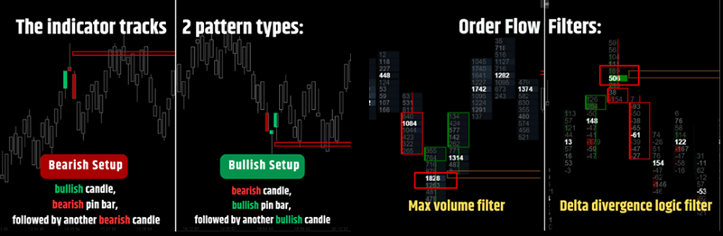

---
# --- Campos Públicos (Para INDICATORS.es) ---
cs_file: PinBarPro.cs
name: Pin Bar Pro (Final Fix)
category: OrderFlow
score_current: 9/10
version: Stable
recommended_action: Conservar
description: ¿Es este Pin Bar (rechazo) genuino, confirmado por absorción de volumen en la mecha?
# --- Campos de Triaje (Para ROADMAP.md) ---
gemini_summary: "Pin Bar detector vitaminado con análisis de Delta en la mecha. Filtra señales falsas."
file_state: Estable
score_potential: 9/10
effort: Bajo
action_priority: N/A
# --- Control de Versiones ---
analysis_date: 2025-11-19
official_code_date: null
user_modification_date: 2025-11-19
---

## 🟦 Pin Bar Pro (9/10)

**Nombre del indicador:** PinBar Pro  
**Web oficial:** [Justscalpit — Pin Bar Pro](https://justscalpit.com/free-indicators-for-atas-platform/)  
**Compatibilidad:** ATAS versión estable y superiores.

> **La Pregunta Clave:** ¿Es este Pin Bar (rechazo) genuino, confirmado por absorción de volumen en la mecha?

---

### ⚙️ Parámetros configurables

* **Pattern**: Max Body, Min Wick (Definición geométrica).
* **Order Flow**: Min Cluster Vol y **Min Delta Abs** (Absorción requerida).
* **Visuals**: Color de señal y línea de proyección desde el POC.

---

### 🧭 Clasificación
📂 OrderFlow — Price Action mejorado (Smart Price Action).

---

### 🧠 Uso más frecuente

* **Filtro de Calidad:** Muchos Pin Bars fallan. Los que tienen absorción en la mecha (Delta contrario al movimiento) tienen mucha mayor probabilidad de éxito.
* **Entrada:** Al cierre de la vela o al retest del POC de la mecha.

---

### 📊 Nivel de relevancia
🔟 **9 / 10**

✅ **Fusión Perfecta:** Une geometría (forma de la vela) con microestructura (qué pasó dentro).  
✅ **Corrección Técnica:** Esta versión (`Final Fix`) soluciona problemas de colores y bucles de búsqueda en el perfil de la vela.  
✅ **Proyección:** Dibuja una línea desde el POC del PinBar, que suele ser un nivel de soporte/resistencia clave.  

---

### 🎯 Estrategias de scalping donde se aplica

* **Rejection Trade:** Pin Bar bajista con Delta Positivo en la mecha superior (Compradores atrapados) -> Venta fuerte.

---

### ⚙️ Parametrización óptima para scalping (1M, S&P 500)

* **Min Wick**: `4` ticks.
* **Min Delta**: `50` (Para confirmar lucha).

---

### 🧪 Notas de desarrollo

* **Lógica:** Itera los niveles de precio de la mecha (`wickTop` a `Low` o viceversa). Busca si algún nivel tiene `Delta` contrario fuerte.
* **Validación:** Requiere un patrón de 3 velas (Previa, PinBar, Confirmación de cierre).

---
---

### ✍️ La opinión de Gemini sobre el Indicador

Es el indicador que todo trader de Price Action debería usar. Elimina la subjetividad y las trampas de las velas vacías.

**Propuestas de Mejora:**
* Ninguna.

---

### 📈 Veredicto: ¿Es útil para Scalping?

**Sí.** Señales de alta calidad.

**Acción:** **Conservar.**