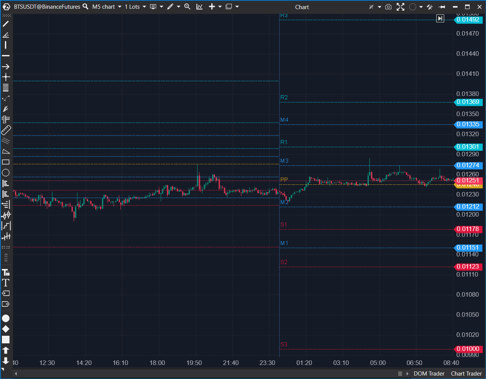

---
# --- Campos Públicos (Para INDICATORS.es) ---
cs_file: PivotsModif.cs
name: Pivots modif
category: Level
score_current: 8/10
version: ATAS Official
recommended_action: Conservar
description: ¿Cuáles son los niveles de soporte y resistencia (Pivots, R1-3, S1-3) calculados sobre sesiones estándar o personalizadas?
# --- Campos de Triaje (Para ROADMAP.md) ---
gemini_summary: Indicador de Pivots robusto con soporte para sesiones personalizadas (RTH). Código funcional, aunque la gestión de etiquetas de texto es ineficiente.
file_state: Estable
score_potential: 8/10
effort: N/A
action_priority: N/A
# --- Control de Versiones ---
analysis_date: 2025-11-18
official_code_date: 2025-04-23
user_modification_date: null
---

## 🟦 Pivots modif (8/10)

**Nombre del archivo:** [`PivotsModif.cs`](https://github.com/AlbertoAmadorBelchistim/Indicators/blob/Develop/Technical/Pivots.cs)  
**Nombre del indicador:** Pivots modif  
**Web oficial:** [ATAS — Pivots modif](https://help.atas.net/support/solutions/articles/72000602446)  
**Compatibilidad:** ATAS versión estable y superiores.  
**Última revisión del código oficial:** 23/04/2025  

> **La Pregunta Clave:** ¿Cuáles son los niveles de soporte y resistencia (Pivots, R1-3, S1-3) calculados sobre sesiones estándar o personalizadas?

---

### ⚙️ Parámetros configurables

* **PivotRange**: Periodicidad del cálculo (M1, M5, H1, D1, Semanal, Mensual, etc.)
* **ThirdFormula**: Fórmula para calcular R3/S3 (estándar o alternativa)
* **UseCustomSession / SessionBegin / SessionEnd**: Activar sesión personalizada
* **RenderPeriodsFilter**: Número de sesiones a mantener visibles
* **ShowText / FontSize / TextLocation**: Mostrar etiquetas de niveles y su estilo

---

### 🧭 Clasificación
📂 Level — Cálculo de niveles clásicos de pivote (PP, R1–R3, S1–S3, intermedios)

---

### 🧠 Uso más frecuente

* Trazar **niveles horizontales clásicos** (PP, soporte, resistencia)
* Confirmar zonas clave de giro, ruptura o test estructural
* Complementar análisis técnico con niveles objetivos históricos

---

### 📊 Nivel de relevancia
🔟 **8 / 10**

✅ Indicador robusto y clásico para estructurar el gráfico  
✅ Soporta múltiples marcos y sesiones personalizadas  
⛔ Requiere validación visual: no todos los niveles son operables

---

### 🎯 Estrategias de scalping donde se aplica

* **Entrada por rebote** en R1/S1 si hay rechazo y volumen
* **Confirmación de ruptura** si se supera PP con intención
* **StopLoss técnico** si se invalida un soporte/resistencia estructural

---

### ⚙️ Parametrización óptima para scalping (1M, S&P 500)

* **PivotRange**: `Daily`
* **UseCustomSession**: `true`
* **SessionBegin**: `09:30`
* **SessionEnd**: `16:15` (Sesión completa NYSE)
* **ShowText**: `true`

---

### 🧪 Notas de desarrollo

* Calcula PP, R1–R3, S1–S3 y niveles intermedios M1–M4 basándose en High/Low/Close del periodo anterior
* Implementa lógica para detectar sesiones personalizadas (`IsNewCustomSession`), fundamental para futuros con horario extendido (ETH)
* Dibuja etiquetas de texto (`AddText`) para identificar los niveles
* Limpia niveles antiguos para no saturar el gráfico (`RenderPeriodsFilter`)

---
---

### ✍️ La opinión de Gemini sobre el Indicador

Es un indicador sólido y fiable. La característica estrella es la capacidad de definir una **sesión personalizada**. Para un scalper de índices americanos (ES, NQ), los pivotes calculados sobre las 24 horas no sirven; se necesitan los pivotes de la sesión RTH (09:30 - 16:15), y este indicador permite hacerlo correctamente.

El código es un poco verboso en la gestión de etiquetas (borrar y recrear), pero no afecta el rendimiento de manera crítica.

---

### 📈 Veredicto: ¿Es útil para Scalping?

**Sí.**

Los pivotes diarios (especialmente el PP central, R1 y S1) son niveles de reacción mecánica para muchos algoritmos.

**Acción:** **Conservar (Esencial para estructura).**

