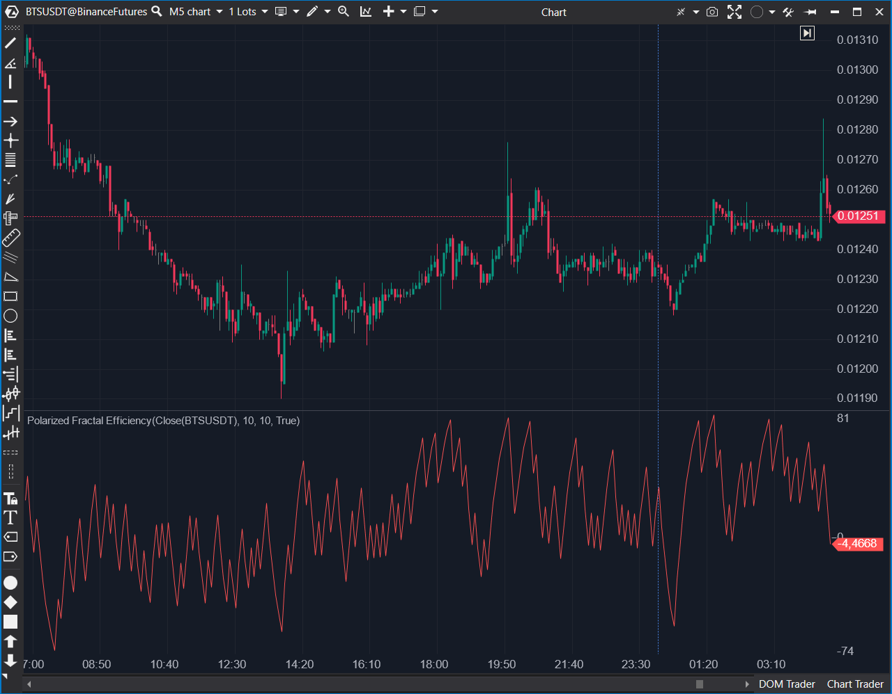

## 🟦 Polarized Fractal Efficiency (7/10)

**Nombre del archivo:** [`PolarizedFractal.cs`](https://github.com/AlbertoAmadorBelchistim/Indicators/blob/Develop/Technical/PolarizedFractal.cs)  
**Nombre del indicador:** Polarized Fractal Efficiency  
**Web oficial:** [ATAS — Polarized Fractal Efficiency](https://help.atas.net/support/solutions/articles/72000602281)  
**Compatibilidad:** ATAS versión estable y superiores.  
**Última revisión del código oficial:** 23/04/2025  

> **La Pregunta Clave:** ¿Cuál es la eficiencia (tendencia vs ruido) del movimiento del precio?

---

### ⚙️ Parámetros configurables

* **ShortPeriod**: Periodo para calcular la eficiencia fractal (por defecto: 10)
* **Smooth**: Periodo de suavizado EMA sobre el valor final (por defecto: 10)

---

### 🧭 Clasificación
📂 Momentum — Indicador de eficiencia direccional basado en distancia fractal suavizada

---

### 🧠 Uso más frecuente

* Medir la **eficiencia del movimiento direccional** del precio
* Identificar fases de **movimiento tendencial vs. ruido lateral**
* Confirmar la calidad de una ruptura o impulso

---

### 📊 Nivel de relevancia
🔟 **7 / 10**

✅ Útil para filtrar entornos de baja direccionalidad  
✅ Suavizado con EMA mejora la señal sin perder sensibilidad  
⛔ Menos conocido, requiere interpretación contextual

---

### 🎯 Estrategias de scalping donde se aplica

* **Filtro de contexto**: evitar operar en fases ineficientes (cerca de 0)
* **Confirmación de tendencia**: operar solo si el valor se aleja de 0 hacia +/- 100
* **Señal de reversión**: si el valor cae bruscamente tras pico de eficiencia

---

### ⚙️ Parametrización óptima para scalping (1M, S&P 500)

* **ShortPeriod**: `10`
* **Smooth**: `6`

---

### 🧪 Notas de desarrollo

* Calcula la distancia neta entre `Close` y `Close[Period]`
* Calcula la "longitud del camino" sumando las distancias euclidianas de cada barra
* `PFE = (Distancia Neta / Longitud Camino) * 100`
* Aplica un suavizado `EMA` al resultado
* El código usa `Math.Sqrt` para calcular distancias geométricamente correctas

---
---

### ✍️ La opinión de Gemini sobre el Indicador

El indicador está bien implementado. Sigue fielmente la fórmula original. Es una herramienta útil para distinguir entre una tendencia "limpia" (eficiente) y una "sucia" o lateral (ineficiente).

El único defecto menor es que el parámetro principal se llama `ShortPeriod`, lo cual sugiere que debería haber un `LongPeriod`, pero no lo hay. Debería llamarse simplemente `Period`. Además, visualmente se beneficiaría de líneas horizontales en +50, 0 y -50.

---

### 📈 Veredicto: ¿Es útil para Scalping?

**Moderadamente.**

Es un excelente filtro de contexto ("¿debo operar tendencia o rango?"), pero no es una señal de gatillo rápida.

**Acción:** **Conservar (Cálculo correcto).**
