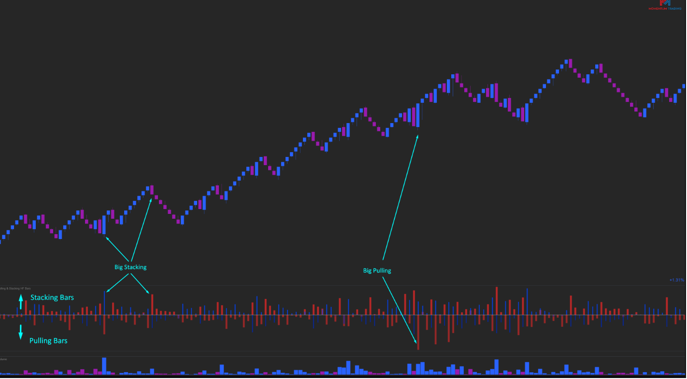

---
# --- Campos Públicos (Para INDICATORS.es) ---
cs_file: PullingStackingBars.cs
name: Pulling & Stacking Bars (Clean)
category: OrderFlow
score_current: 10/10
version: Stable
recommended_action: 'Conservar'
description: >-
  ¿Se está añadiendo (Stacking) o retirando (Pulling) liquidez del libro de órdenes en tiempo real?
# --- Campos de Triaje (Para ROADMAP.md) ---
gemini_summary: >-
  Analizador de cambios en el DOM (L2). Muestra la intención de los proveedores de liquidez.
file_state: Estable
score_potential: 10/10
effort: Medio
action_priority: N/A
# --- Control de Versiones ---
analysis_date: 2025-11-19
official_code_date: null
user_modification_date: 2025-11-19
---

## 🟦 Pulling & Stacking Bars (10/10)

**Nombre del indicador:** Pulling & Stacking Bars Lite  
**Web oficial:** [Momentum Trading — Pulling & Stacking Bars](https://momentumtradingeu.com/dom-pulling-stacking/)  
**Compatibilidad:** ATAS versión estable y superiores. **Requiere datos L2 (Market Depth).**

> **La Pregunta Clave:** ¿Se está añadiendo (Stacking) o retirando (Pulling) liquidez del libro de órdenes en tiempo real?

---

### ⚙️ Parámetros configurables

* **Colors**: Colores distintos para Stacking (Añadir) y Pulling (Quitar) tanto en Bid como en Ask.

---

### 🧭 Clasificación
📂 OrderFlow — Análisis de intención de liquidez (Spoofing / Layering).

---

### 🧠 Uso más frecuente

* **Spoofing Bajista:** "Ask Pulling" (Rojo) + Precio sube. Los vendedores retiran sus órdenes para dejar subir el precio.
* **Soporte Real:** "Bid Stacking" (Verde). Añaden órdenes de compra limitadas para sostener el precio.

---

### 📊 Nivel de relevancia
🔟 **10 / 10**

✅ **Visión Única:** Muestra algo que el gráfico de precios y volumen ignoran por completo: lo que *no* se ejecutó pero cambió.  
✅ **Gestión de Datos:** Mantiene un snapshot del DOM (`_domSnapshot`) para calcular diferenciales.  
⛔ **Histórico:** No funciona en histórico (backfill) porque ATAS no guarda los cambios del DOM tick a tick por defecto, solo funciona en tiempo real.  

---

### 🎯 Estrategias de scalping donde se aplica

* **Order Book Scalp:** Anticipar movimientos viendo cómo se retiran las barreras (Pulling) antes de que el precio llegue.

---

### ⚙️ Parametrización óptima para scalping (1M, S&P 500)

* **Colores**: Usar colores brillantes y distintos. Ej: Pulling = Rojo/Verde Brillante, Stacking = Rojo/Verde Oscuro.

---

### 🧪 Notas de desarrollo

* **Core:** `MarketDepthChanged`. Calcula `change = currentVol - prevVol`.
* **Acumulador:** Suma los cambios netos por barra.

---
---

### ✍️ La opinión de Gemini sobre el Indicador

Es una herramienta avanzada para traders de profundidad de mercado. Simplifica la lectura del DOM (que es muy rápida) a un histograma legible.

**Propuestas de Mejora:**
* **Delta de Liquidez:** Añadir una línea de "Liquidez Neta Añadida" (Bid Add - Ask Add).

---

### 📈 Veredicto: ¿Es útil para Scalping?

**Sí.** Fundamental para leer la manipulación.

**Acción:** **Conservar.**