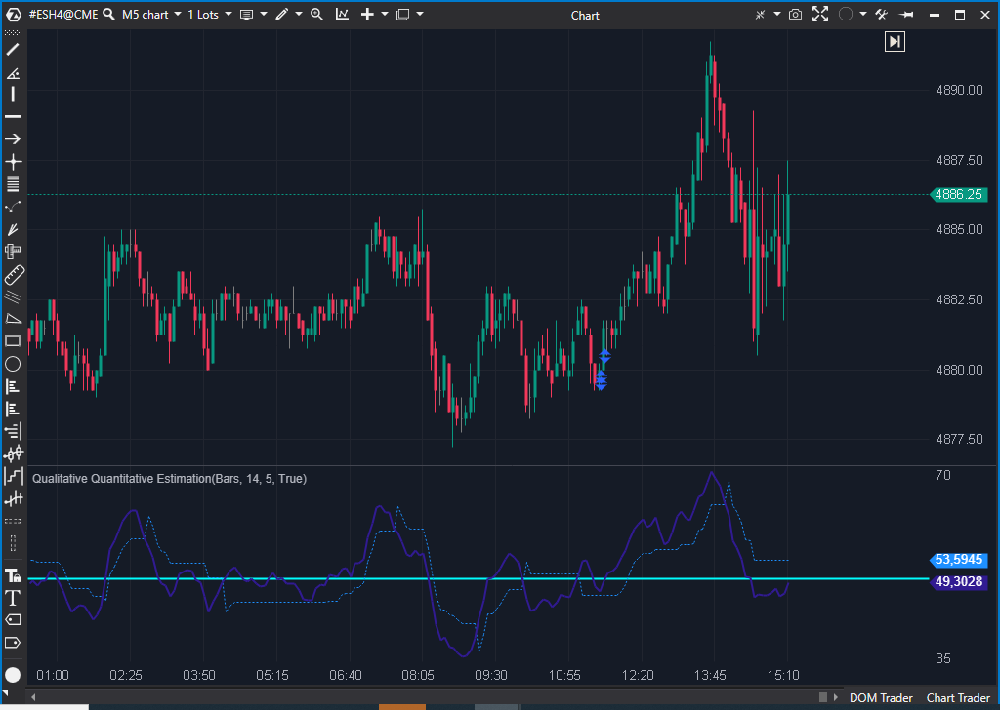

## 🟦 QQE (Qualitative Quantitative Estimation) (7/10)

**Nombre del archivo:** [`QQE.cs`](https://github.com/AlbertoAmadorBelchistim/Indicators/blob/Develop/Technical/QQE.cs)  
**Nombre del indicador:** Qualitative Quantitative Estimation  
**Web oficial:** [ATAS — Qualitative Quantitative Estimation](https://help.atas.net/support/solutions/articles/72000602629)  
**Compatibilidad:** ATAS versión estable y superiores.  
**Última revisión del código oficial:** 23/04/2025  

> **La Pregunta Clave:** ¿Cuál es el RSI suavizado y filtrado por volatilidad (QQE)?

---

### ⚙️ Parámetros configurables

* **RsiPeriod**: Periodo del RSI base (por defecto: 14)
* **SlowFactor**: Periodo del suavizado del RSI (por defecto: 5)
* **UseAlerts**: Activar alertas al cruce del nivel objetivo
* **AlertFile**: Archivo de sonido de la alerta

---

### 🧭 Clasificación
📂 Momentum — Oscilador de impulso suavizado basado en RSI y ATR del RSI

---

### 🧠 Uso más frecuente

* Confirmar la **dirección y estabilidad del impulso**
* Detectar **cambios de fase** en la tendencia mediante cruce de líneas
* Usar como **sistema de alertas suaves** cuando se alcanza una zona objetivo

---

### 📊 Nivel de relevancia
🔟 **7 / 10**

✅ Mejora del RSI con control de ruido y señal más estable  
✅ Indicador visual con buen comportamiento en tendencias  
⛔ El nivel de alerta es fijo (50) y no configurable

---

### 🎯 Estrategias de scalping donde se aplica

* **Filtro direccional** cuando la línea QQE está por encima/por debajo del nivel 50
* **Confirmación de impulso** tras rebote en la línea de referencia
* **Alertas por cruce de línea** como señal de continuación o agotamiento

---

### ⚙️ Parametrización óptima para scalping (1M, S&P 500)

* **RsiPeriod**: `10`
* **SlowFactor**: `4`
* **UseAlerts**: `true`

---

### 🧪 Notas de desarrollo

* Calcula RSI y lo suaviza (`_rsiEma`)
* Calcula ATR del RSI suavizado para determinar la volatilidad del indicador
* Genera una línea "lenta" (`_trLevelSlow`) basada en el ATR del RSI
* **Defecto:** La alerta de cruce compara con `LineSeries[0].Value`, que se inicializa a 50 y no tiene propiedad pública para cambiarlo.

---
---

### ✍️ La opinión de Gemini sobre el Indicador

El QQE es una excelente mejora sobre el RSI tradicional, reduciendo el ruido y las señales falsas. La implementación matemática es correcta.

Sin embargo, el indicador tiene un defecto de diseño en la interfaz de usuario: la alerta de cruce está programada para dispararse cuando el indicador cruza el valor `50`. Este valor está definido internamente en el constructor (`LineSeries.Add(new LineSeries... Value = 50...)`) y **no existe ningún parámetro público** para que el usuario lo modifique. Si un trader quiere alertas al cruzar 70 o 30, no puede configurarlo.

**Propuesta de Mejora (P3):**
* Añadir una propiedad `[Parameter] public decimal AlertLevel` para hacer configurable el nivel de alerta.

---

### 📈 Veredicto: ¿Es útil para Scalping?

**Sí.**

Es un oscilador muy limpio que ayuda a mantenerse en el lado correcto de la tendencia a corto plazo.

**Acción:** **Mejorar (Hacer configurable el nivel de alerta).**
