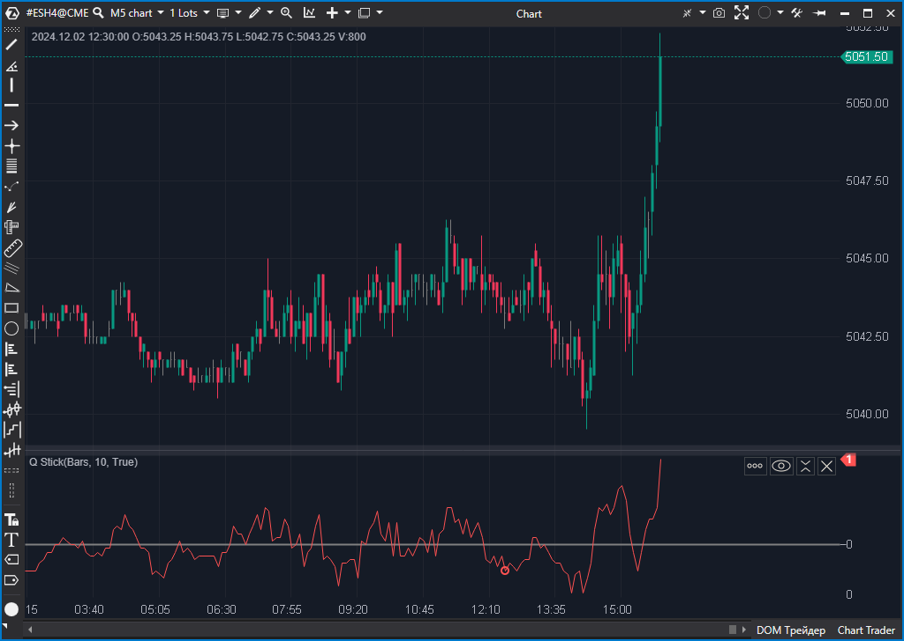

## 🟦 Q Stick (6/10)

**Nombre del archivo:** [`QStick.cs`](https://github.com/AlbertoAmadorBelchistim/Indicators/blob/Develop/Technical/QStick.cs)  
**Nombre del indicador:** Q Stick  
**Web oficial:** [ATAS — Q Stick](https://help.atas.net/support/solutions/articles/72000602451)  
**Compatibilidad:** ATAS versión estable y superiores.  
**Última revisión del código oficial:** 23/04/2025  

> **La Pregunta Clave:** ¿Cuál es el promedio móvil de la distancia entre apertura y cierre de las velas?

---

### ⚙️ Parámetros configurables

* **Period**: Número de barras para calcular la media de la diferencia Open–Close (por defecto: 10)

---

### 🧭 Clasificación
📂 Momentum — Media móvil de la diferencia entre cierre y apertura

---

### 🧠 Uso más frecuente

* Medir el **impulso direccional promedio** de las velas (cuerpos)
* Detectar **sesgos alcistas o bajistas acumulados**
* Confirmar rupturas o giros mediante persistencia del signo del QStick

---

### 📊 Nivel de relevancia
🔟 **6 / 10**

✅ Indicador simple, útil como filtro o confirmador direccional  
✅ Visualización clara de la "presión" de las velas  
⛔ Ignora completamente el volumen y las mechas

---

### 🎯 Estrategias de scalping donde se aplica

* **Confirmación de dirección**: operar solo si el QStick es positivo/negativo
* **Cruce con la línea cero** como gatillo de entrada o salida

---

### ⚙️ Parametrización óptima para scalping (1M, S&P 500)

* **Period**: `9`

---

### 🧪 Notas de desarrollo

* Calcula `_openCloseSeries[bar] = Close - Open`
* Calcula `_renderSeries[bar] = SMA(_openCloseSeries, Period)`
* Incluye una línea cero de referencia (`ZeroVal`)

---
---

### ✍️ La opinión de Gemini sobre el Indicador

El indicador es una implementación correcta de la idea de Tushar Chande. Es una forma matemática de cuantificar si las velas están cerrando consistentemente por encima de su apertura ("presión alcista interna") o por debajo.

Es un indicador "correcto" pero algo obsoleto en la era del Order Flow. El Delta Acumulado o el CVD ofrecen una información similar (presión de compra/venta) pero basada en datos reales de mercado, no solo en la geometría de la vela.

---

### 📈 Veredicto: ¿Es útil para Scalping?

**Ocasionalmente.**

Puede servir como un filtro de tendencia muy básico si no tienes datos de volumen.

**Acción:** **Conservar (Indicador técnico clásico).**

