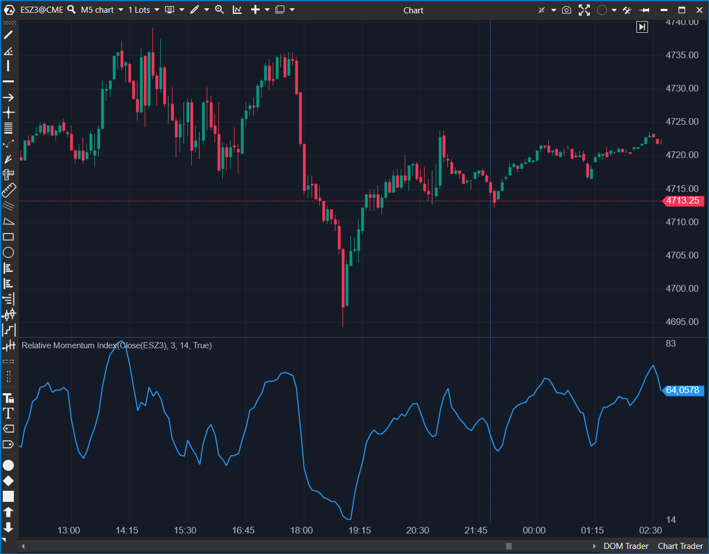

---
# --- Campos Públicos (Para INDICATORS.es) ---
cs_file: RMI.cs
name: Relative Momentum Index
category: Momentum
score_current: 7/10
version: ATAS Official
recommended_action: 'Mejorar'
description: >-
  ¿Cuál es la fuerza relativa del impulso (RSI suavizado con SMMA) en una ventana temporal?
# --- Campos de Triaje (Para ROADMAP.md) ---
gemini_summary: >-
  Variante del RSI que usa SMMA. Implementación matemática correcta y segura. Le faltan líneas de referencia (30/70) visuales por defecto.
file_state: Mejorable
score_potential: 7/10
effort: Bajo
action_priority: P3
# --- Control de Versiones ---
analysis_date: 2025-11-18
official_code_date: 2025-04-23
user_modification_date: null
---

## 🟦 Relative Momentum Index (7/10)

**Nombre del archivo:** [`RMI.cs`](https://github.com/AlbertoAmadorBelchistim/Indicators/blob/Develop/Technical/RMI.cs)  
**Nombre del indicador:** Relative Momentum Index  
**Web oficial:** [ATAS — Relative Momentum Index](https://help.atas.net/support/solutions/articles/72000602456)  
**Compatibilidad:** ATAS versión estable y superiores.  
**Última revisión del código oficial:** 23/04/2025  

> **La Pregunta Clave:** ¿Cuál es la fuerza relativa del impulso (RSI suavizado con SMMA) en una ventana temporal?

---

### ⚙️ Parámetros configurables

* **RmiLength**: Periodo de comparación del impulso (por defecto: 3)
* **RmiMaLength**: Periodo de la media suavizada (SMMA) sobre impulso alcista y bajista (por defecto: 14)

---

### 🧭 Clasificación
📂 Momentum — Oscilador basado en fuerza relativa del impulso con suavizado SMMA

---

### 🧠 Uso más frecuente

* Medir la **fuerza del impulso direccional** en una ventana temporal
* Confirmar señales de entrada mediante el **cruce de niveles clave (30/70)**
* Filtrar movimientos sin fuerza en consolidaciones o trampas

---

### 📊 Nivel de relevancia
🔟 **7 / 10**

✅ Indicador más robusto que el RSI para detectar tendencias persistentes  
✅ Menor ruido gracias al uso de SMMA  
⛔ Menos conocido y con comportamiento similar al RSI, puede parecer redundante

---

### 🎯 Estrategias de scalping donde se aplica

* **Compra en rebote desde nivel 30** si la pendiente es positiva
* **Venta tras cruce por debajo de nivel 70** si el impulso decae
* **Filtro direccional**: evitar operar si RMI está entre 45 y 55

---

### ⚙️ Parametrización óptima para scalping (1M, S&P 500)

* **RmiLength**: `3`
* **RmiMaLength**: `8`

---

### 🧪 Notas de desarrollo

* Calcula el cambio de precio respecto a hace `RmiLength` barras
* Aplica dos `SMMA` (Smoothed Moving Average) a los cambios positivos y negativos
* Fórmula RMI: `100 - 100 / (1 + upSma / downSma)`
* Protegido contra división por cero (`downSma == 0 ? 100`)

---
---

### ✍️ La opinión de Gemini sobre el Indicador

El RMI es una variación interesante del RSI que añade un componente de "momentum" al mirar hacia atrás `N` barras en lugar de 1. La implementación es correcta y segura.

Sin embargo, como oscilador acotado (0-100), es una omisión de usabilidad no incluir líneas de referencia horizontales en 30 y 70 (o configurables) por defecto. El usuario tiene que añadirlas manualmente cada vez.

**Propuesta de Mejora (P3):**
* Añadir `LineSeries` para los niveles de Sobrecompra y Sobreventa.

---

### 📈 Veredicto: ¿Es útil para Scalping?

**Sí.**

A menudo da señales de divergencia más limpias que el RSI estándar en marcos temporales muy cortos.

**Acción:** **Mejorar (Añadir líneas de referencia).**

