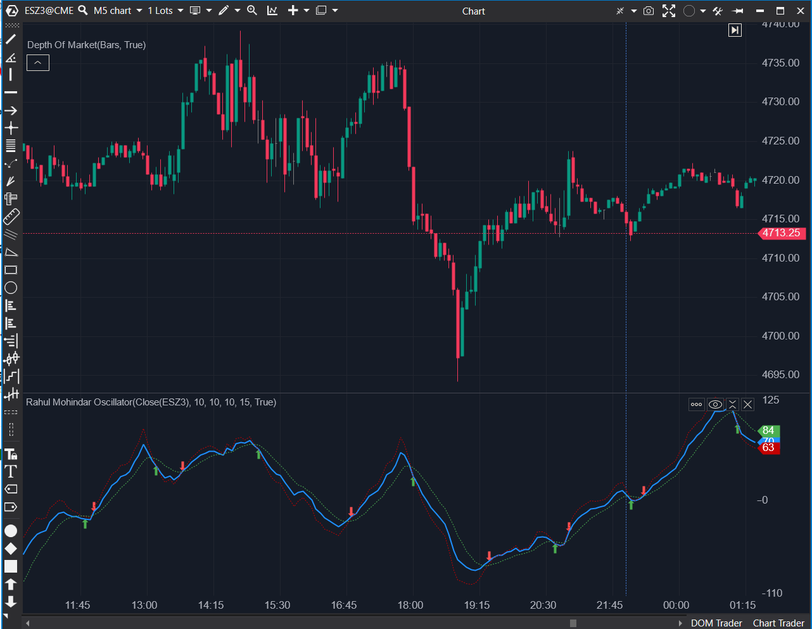

---
# --- Campos Públicos (Para INDICATORS.es) ---
cs_file: RMO.cs
name: Rahul Mohindar Oscillator
category: Momentum
score_current: 7/10
version: ATAS Official
recommended_action: 'Conservar'
description: >-
  ¿Cuál es la tendencia primaria y el impulso de corto plazo (basado en múltiples medias)?
# --- Campos de Triaje (Para ROADMAP.md) ---
gemini_summary: >-
  Indicador complejo con múltiples capas de medias móviles. Implementación correcta pero pesada (10 SMAs internas). Señales visuales fijas.
file_state: Estable
score_potential: 7/10
effort: N/A
action_priority: N/A
# --- Control de Versiones ---
analysis_date: 2025-11-18
official_code_date: 2025-04-23
user_modification_date: null
---

## 🟦 RMO (Rahul Mohindar Oscillator) (7/10)

**Nombre del archivo:** [`RMO.cs`](https://github.com/AlbertoAmadorBelchistim/Indicators/blob/Develop/Technical/RMO.cs)  
**Nombre del indicador:** Rahul Mohindar Oscillator  
**Web oficial:** [ATAS — Rahul Mohindar Oscillator](https://help.atas.net/support/solutions/articles/72000602452)  
**Compatibilidad:** ATAS versión estable y superiores.  
**Última revisión del código oficial:** 23/04/2025  

> **La Pregunta Clave:** ¿Cuál es la tendencia primaria y el impulso de corto plazo (basado en múltiples medias)?

---

### ⚙️ Parámetros configurables

* **Period**: Periodo para las medias móviles (por defecto: 10)
* **HighLow**: Periodo para calcular el rango entre máximos y mínimos (por defecto: 10)
* **EmaPeriod1**: Periodo de las EMAs internas (`_emaSt1`, `_emaSt2`) (por defecto: 10)
* **SignalPeriod**: Periodo de la señal principal (`_emaSignal`) (por defecto: 15)

---

### 🧭 Clasificación
📂 Momentum — Oscilador compuesto basado en SMA, EMA y rango dinámico

---

### 🧠 Uso más frecuente

* Medir la **fuerza de tendencia suavizada**
* Detectar **señales de compra/venta** mediante cruce de EMAs
* Evaluar cambios en el comportamiento direccional con estructura técnica

---

### 📊 Nivel de relevancia
🔟 **7 / 10**

✅ Suavizado multinivel con lógica basada en comportamiento estructural  
✅ Incluye señales visuales automáticas (flechas de compra/venta)  
⛔ Requiere configuración y conocimiento del sistema RMO original

---

### 🎯 Estrategias de scalping donde se aplica

* **Entrada por cruce de señal** con dirección sostenida
* **Confirmación de tendencia** si el valor del oscilador se mantiene con pendiente clara
* **Salida anticipada** si el cruce de EMAs se revierte en zona relevante

---

### ⚙️ Parametrización óptima para scalping (1M, S&P 500)

* **Period**: `9`
* **HighLow**: `9`
* **EmaPeriod1**: `6`
* **SignalPeriod**: `4`

---

### 🧪 Notas de desarrollo

* Crea y gestiona 10 instancias de `SMA` en cascada (`_smaTen`)
* Calcula `SwingTrade` normalizando el precio contra estas SMAs y el rango High-Low
* Genera señales de compra/venta (`VisualMode.UpArrow`/`DownArrow`) basadas en cruces de EMAs derivadas del SwingTrade

---
---

### ✍️ La opinión de Gemini sobre el Indicador

Es un sistema de trading completo encapsulado en un indicador. La implementación es fiel a la teoría de Rahul Mohindar.

Aunque el código es un poco "pesado" (calculando 10 SMAs por barra), en los ordenadores modernos esto es irrelevante. Es una herramienta "todo en uno" sólida para determinar la tendencia.

---

### 📈 Veredicto: ¿Es útil para Scalping?

**Sí.**

Especialmente para scalpers de tendencia que necesitan un filtro objetivo para mantenerse en el lado correcto del mercado.

**Acción:** **Conservar (Sistema de tendencia completo).**

