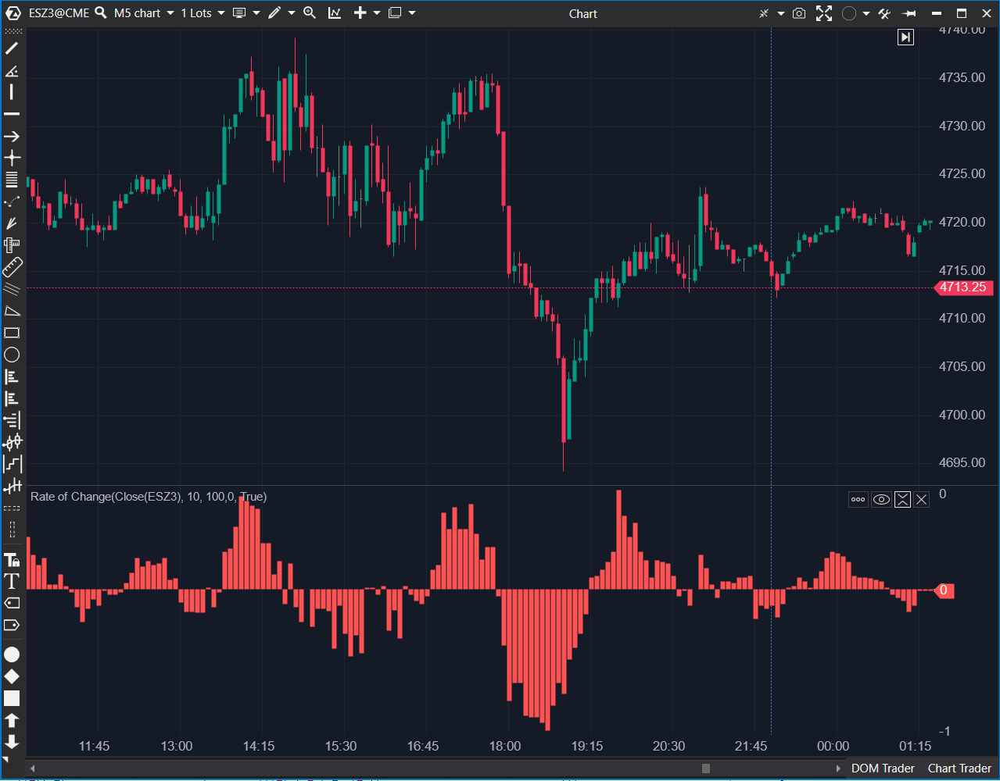

---
cs_file: ROC.cs
name: Rate of Change (ROC)
category: Oscillators
group: Oscillators
subgroup: Momentum
score_current: 6/10
version: Stable
recommended_action: Mejorar
description: ¿Cuál es la velocidad del cambio de precio comparado con 'n' barras atrás?
gemini_summary: "Funcional pero con UX confusa y riesgo de crash si TickSize=0."
comparison_group: "Momentum Trend"
competitor_notes: "El estándar de velocidad."
reusable_code: null
file_state: Mejorable
score_potential: 8/10
effort: Medio
action_priority: P3
analysis_date: 2025-11-18
official_code_date: 23/04/2025
---

## 🟦 Rate of Change (ROC) (6/10)

**Nombre del archivo:** [`ROC.cs`](https://github.com/AlbertoAmadorBelchistim/Indicators/blob/Develop/Technical/ROC.cs)  
**Nombre del indicador:** Rate of Change  
**Web oficial:** [ATAS — ROC](https://help.atas.net/support/solutions/articles/72000602454)  
**Compatibilidad:** ATAS versión estable y superiores.  
**Última revisión del código oficial:** 23/04/2025

> **La Pregunta Clave:** ¿Cuál es la velocidad del cambio de precio (en % o ticks) comparado con 'n' barras atrás?

---

### ⚙️ Parámetros configurables

* **CalcMode**: `Percent` (Porcentaje) o `Ticks` (Puntos mínimos).
* **Period**: Barras atrás para la comparación.
* **Multiplier**: Factor de multiplicación (¡Ojo! Solo afecta al modo `Percent`).

---

### 🧭 Clasificación
📂 Momentum — Indicador puro de velocidad sin suavizado.

---

### 🧠 Uso más frecuente

* **Detección de Momentum:** Si el ROC sube, la tendencia acelera. Si baja (aunque esté positivo), la tendencia desacelera.
* **Cruce de Línea Cero:** Señal de cambio de dirección a corto plazo.

---

### 📊 Nivel de relevancia
🔟 **6 / 10**

✅ Modo `Ticks` es muy útil para futuros (ver cuántos ticks movió realmente).  
⛔ **UX Confusa:** El parámetro `Multiplier` sigue visible y editable en modo `Ticks`, aunque no hace nada.  
⛔ **Fragilidad:** Divide por `TickSize` sin comprobar si es 0 (riesgo de crash en data feeds corruptos).  

---

### 🎯 Estrategias de scalping donde se aplica

* **Scalping de Impulso:** Entrar cuando el ROC cruza 0 con fuerza, indicando que el precio actual rompe el rango de las últimas N velas.
* **Salida:** Cerrar cuando el ROC se aplana o gira, anticipando el fin del impulso antes que el precio gire.

---

### ⚙️ Parametrización óptima para scalping (1M, S&P 500)

* **Period**: `5` a `9`. (Queremos medir la velocidad inmediata).
* **Mode**: `Ticks` (Más intuitivo para saber cuántos puntos estás moviendo).

---

### 🧪 Notas de desarrollo

* **Lógica Simple:** `(ValorActual - ValorHaceN)`. Simpleza es virtud aquí.
* **Visualización:** Usa `VisualType = VisualMode.Histogram`, adecuado para osciladores centrados en cero.
* **Incoherencia de UI:** En `OnCalculate`, el `switch` ignora `_multiplier` si está en modo `Ticks`. Debería ocultarse el atributo o aplicar el multiplicador también (aunque sea redundante) para consistencia.

---
---

### ✍️ La opinión de Gemini sobre el Indicador

Es una herramienta útil tratada con poco cariño en la implementación. El problema principal es la **Experiencia de Usuario (UX)**. Tener un control deslizante `Multiplier` que el usuario mueve pensando que ajustará algo, y ver que el gráfico no cambia (en modo Ticks), genera desconfianza ("¿Funciona esto?").

Técnicamente, la falta de validación de `InstrumentInfo.TickSize > 0` es un descuido común que separa el código amateur del profesional.

**Propuestas de Mejora:**
* **Validación:** Asegurar `TickSize > 0`.
* **Visibilidad de Parámetros:** Usar atributos o lógica para ocultar `Multiplier` cuando no es relevante, o renombrarlo a "Percent Multiplier".
* **Color:** Pintar el histograma de verde/rojo según esté por encima/debajo de cero automáticamente.

---

### 📈 Veredicto: ¿Es útil para Scalping?

**Moderadamente.**

Es bueno para ver la aceleración bruta, pero requiere las mejoras de usabilidad mencionadas para ser "grado profesional".

**Acción:** **Mejorar (UX y validaciones de seguridad).**

