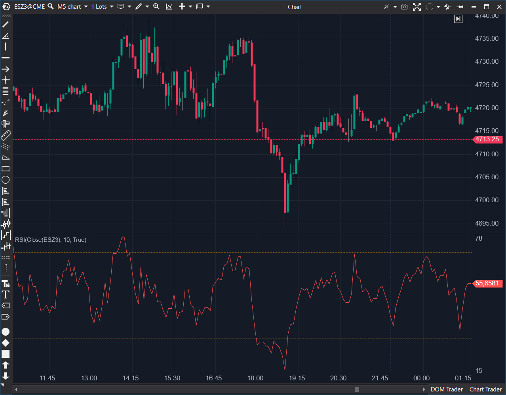

---
cs_file: RSI.cs
name: RSI (Relative Strength Index)
category: Oscillators
group: Oscillators
subgroup: RSI/Stochastic
score_current: 8/10
version: Stable
recommended_action: Conservar
description: ¿Está el precio sobreextendido en relación a su historial reciente?
gemini_summary: "Implementación sólida y estándar con SMMA. Buen sistema de alertas."
comparison_group: "RSI Variants"
competitor_notes: "El estándar."
reusable_code: null
file_state: Estable
score_potential: 9/10
effort: Bajo
action_priority: N/A
analysis_date: 2025-11-18
official_code_date: 23/04/2025
---

## 🟦 RSI (Relative Strength Index) (8/10)

**Nombre del archivo:** [`RSI.cs`](https://github.com/AlbertoAmadorBelchistim/Indicators/blob/Develop/Technical/RSI.cs)  
**Nombre del indicador:** RSI  
**Web oficial:** [ATAS — RSI](https://help.atas.net/support/solutions/articles/72000602531)  
**Compatibilidad:** ATAS versión estable y superiores.  
**Última revisión del código oficial:** 23/04/2025  

> **La Pregunta Clave:** ¿Está el precio sobreextendido (sobrecompra/sobreventa) en relación a su historial reciente?

---

### ⚙️ Parámetros configurables

* **Period**: Número de barras para el cálculo (Estándar: 14).
* **UpAlertFilter / DownAlertFilter**: Configuración avanzada de alertas (sonido, archivo) para cruces de niveles.
* **Overbought / Oversold**: Líneas visuales (por defecto 70/30).

---

### 🧭 Clasificación
📂 Momentum — Oscilador acotado (0-100) que mide la velocidad y el cambio de los movimientos de precios.

---

### 🧠 Uso más frecuente

* **Reversión a la media:** Buscar ventas sobre 70 y compras bajo 30.
* **Divergencias:** El precio hace un nuevo máximo, pero el RSI hace un máximo menor (posible giro).
* **Failure Swings:** Patrones de giro dentro del propio indicador.

---

### 📊 Nivel de relevancia
🔟 **8 / 10**

✅ Implementación canónica correcta (usa SMMA/Wilder).  
✅ Sistema de alertas granular (separado para Up y Down).  
✅ Código limpio y eficiente.  
⛔ Inicialización de variables ligeramente mejorable.  

---

### 🎯 Estrategias de scalping donde se aplica

* **RSI Scalp en Rangos:** En mercados laterales, vender en 70 y comprar en 30 es la estrategia base.
* **Trend Pullback:** En tendencia fuerte, el RSI no llega a 30/70, sino que rebota en 40/60. Usar esos niveles para entrar a favor de tendencia.

---

### ⚙️ Parametrización óptima para scalping (1M, S&P 500)

* **Period**: `7` o `9` (Más rápido que el estándar de 14 para reaccionar a giros cortos).
* **Niveles**: `80/20` (Para evitar falsas señales en alta volatilidad).

---

### 🧪 Notas de desarrollo

* **Suavizado Correcto:** Utiliza instancias de `SMMA` (`_positive` y `_negative`), lo cual es matemáticamente fiel al RSI original de Wilder. Muchos indicadores incorrectos usan SMA simple.
* **Gestión de Alertas:** Compara `_lastValue` con el valor actual para detectar el cruce exacto ("Crossover").
* **Inicialización:** En `bar==0`, fija el valor en 0. Correcto, aunque podría inicializar `_lastValue` explícitamente para evitar comparaciones "sucias" en la barra 1.

---
---

### ✍️ La opinión de Gemini sobre el Indicador

Es un indicador **sólido y fiable**. Cumple exactamente con lo que promete. La inclusión de `FilterString` para las alertas le da flexibilidad al usuario para cargar sonidos personalizados, lo cual es un buen toque de UX.

No hay "magia" oculta ni errores graves. Es una herramienta de trabajo estándar bien codificada.

**Propuestas de Mejora (Menores):**
* **Color Dinámico:** Colorear la línea del RSI (rojo/verde) cuando entra en zonas de sobrecompra/venta para mejorar la lectura visual rápida.

---

### 📈 Veredicto: ¿Es útil para Scalping?

**Sí.**

Es el oscilador más universal por una razón. Bien configurado (periodos cortos), es vital para detectar agotamiento en micro-tendencias.

**Acción:** **Conservar (Es el estándar de la industria).**

