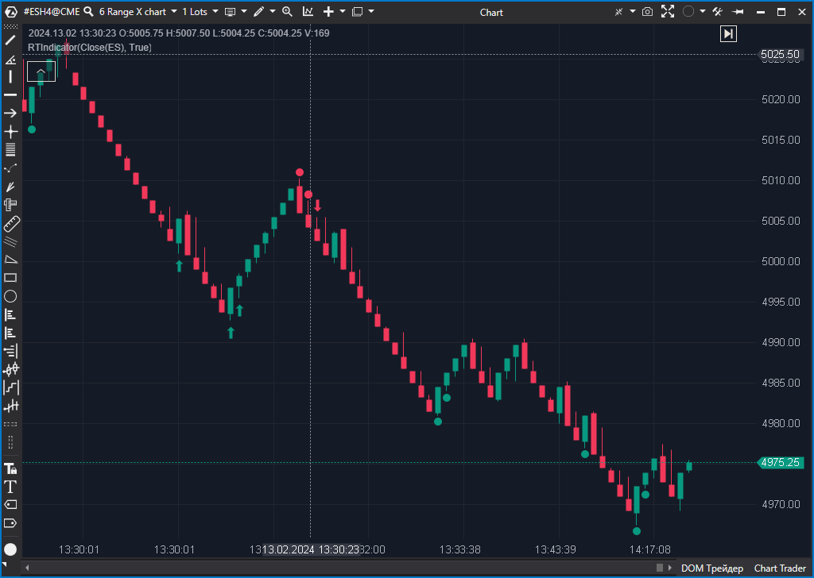

---
# --- Campos Públicos (Para INDICATORS.es) ---
cs_file: RTIndicator.cs
name: RT Indicator (Clean)
category: Trend
score_current: 8/10
version: Stable
recommended_action: 'Conservar'
description: >-
  ¿Está el precio acelerando su pendiente (Slope) con confirmación de momentum interno?
# --- Campos de Triaje (Para ROADMAP.md) ---
gemini_summary: >-
  Detector de pendiente (Slope) con filtro dinámico y confirmación de RSI. Estrategia completa.
file_state: Estable
score_potential: 8/10
effort: Medio
action_priority: N/A
# --- Control de Versiones ---
analysis_date: 2025-11-19
official_code_date: null
user_modification_date: 2025-11-19
---

## 🟦 RT Indicator (8/10)

**Nombre del indicador:** RT Indicator  
**Web oficial:** [ATAS — RT Indicator](https://help.atas.net/support/solutions/articles/72000602460)    
**Compatibilidad:** ATAS versión estable y superiores.

> **La Pregunta Clave:** ¿Está el precio acelerando su pendiente (Slope) con confirmación de momentum interno?

---

### ⚙️ Parámetros configurables

* **Slope Period**: Ventana para calcular la inclinación de la curva de precios.
* **Auto Filter**: Ajusta el umbral de señal basándose en la volatilidad reciente.
* **Visuals**: Flechas y puntos de señal.

---

### 🧭 Clasificación
📂 Trend — Estrategia de Momentum y Pendiente.

---

### 🧠 Uso más frecuente

* **Impulso:** Detecta el inicio de movimientos explosivos donde la pendiente se vuelve vertical.
* **Trend Pullback:** Señales "Strong" (Puntos) suelen marcar el fin de una corrección profunda.

---

### 📊 Nivel de relevancia
🔟 **8 / 10**

✅ **Filtro Dinámico:** La lógica `AutoFilter` es excelente. Evita señales falsas en rangos estrechos y se adapta a la expansión de volatilidad.  
✅ **Confirmación Interna:** No usa solo precio, usa un RSI derivado de un spread de medias (`smaFast - smaSlow`) para confirmar la calidad del movimiento.  

---

### 🎯 Estrategias de scalping donde se aplica

* **Scalping de Ruptura:** La señal suele aparecer justo cuando una vela rompe con fuerza (pendiente alta).

---

### ⚙️ Parametrización óptima para scalping (1M, S&P 500)

* **Slope Period**: `5` a `8`.
* **Auto Filter**: `True`.

---

### 🧪 Notas de desarrollo

* **Ingeniería:** Calcula `slope = (Price - PastPrice) / TickSize`. Normaliza la pendiente a ticks/barra.
* **Lógica de Señal:** `Slope > Threshold && RSI_Condition`.

---
---

### ✍️ La opinión de Gemini sobre el Indicador

Es un indicador sólido de "Gatillo". No te da contexto, pero te da el momento exacto de la aceleración.

**Propuestas de Mejora:**
* Ninguna importante.

---

### 📈 Veredicto: ¿Es útil para Scalping?

**Sí.** Para traders de momentum.

**Acción:** **Conservar.**