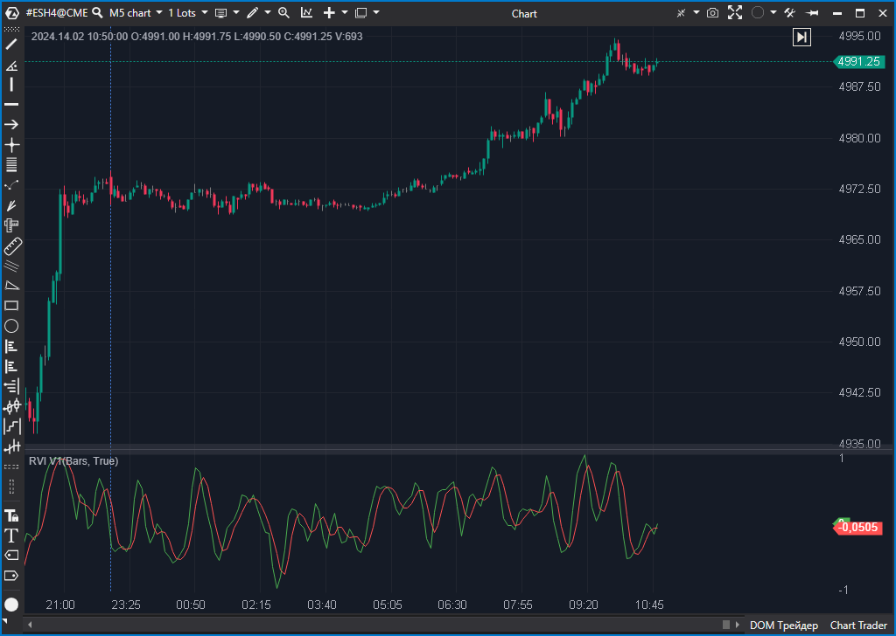

---
# --- Campos Públicos (Para INDICATORS.es) ---
cs_file: RVI.cs
name: RVI V1 (Relative Vigor Index)
category: Momentum
score_current: 4/10
version: Stable
recommended_action: 'Mejorar'
description: >-
  ¿Cierran las velas consistentemente en la parte alta o baja de su rango?
# --- Campos de Triaje (Para ROADMAP.md) ---
gemini_summary: >-
  Código extremadamente rígido (hardcoded 4 periodos) y con riesgo matemático de división por cero.
file_state: Buggy
score_potential: 7/10
effort: Bajo
action_priority: P2
# --- Control de Versiones ---
analysis_date: 2025-11-18
official_code_date: null
user_modification_date: null
---

## 🟦 RVI V1 (Relative Vigor Index) (4/10) 

**Nombre del archivo:** [`RVI.cs`](https://github.com/AlbertoAmadorBelchistim/Indicators/blob/Develop/Technical/RVI.cs)  
**Nombre del indicador:** RVI V1 (Relative Vigor Index)  
**Web oficial:** [ATAS — RVI V1](https://help.atas.net/support/solutions/articles/72000602461)  
**Compatibilidad:** ATAS versión estable y superiores.
**Última revisión del código oficial:** 23/04/2025

> **La Pregunta Clave:** ¿Cierran las velas consistentemente en la parte alta o baja de su rango?

---

### ⚙️ Parámetros configurables

* **Ninguno**: El indicador no expone ningún parámetro al usuario.

---

### 🧭 Clasificación
📂 Momentum — Oscilador de vigor relativo basado en la relación Cierre-Apertura vs Alto-Bajo.

---

### 🧠 Uso más frecuente

* **Confirmación de tendencia:** Si el precio sube pero el RVI baja (divergencia), la subida carece de "vigor" (cierres débiles).
* **Cruce de señal:** Cruce de la línea base con su propia media suavizada.

---

### 📊 Nivel de relevancia
🔟 **4 / 10**

✅ Conceptualmente útil para validar la calidad de la vela.  
⛔ **Extremadamente Rígido:** No permite cambiar el periodo de cálculo.  
⛔ **Riesgo de Crash:** Posible división por cero en activos planos.  
⛔ Sin alertas ni personalización visual avanzada.  

---

### 🎯 Estrategias de scalping donde se aplica

* **Filtrado de rupturas:** Si hay un breakout pero el RVI no acompaña con nuevos máximos, es probable que sea una trampa.

---

### ⚙️ Parametrización óptima para scalping (1M, S&P 500)

* **N/A**: No configurable. Esta es su mayor debilidad para scalping, ya que la lógica fija de 4 barras puede ser ruido puro en 1 minuto.

---

### 🧪 Notas de desarrollo

* **Lógica Hardcoded:** El método `OnCalculate` accede explícitamente a `bar-1`, `bar-2`, `bar-3`. Esto impide cualquier dinamismo.
* **Fórmula:** Usa un kernel de suavizado `(1*P0 + 2*P1 + 2*P2 + 1*P3) / 6`. Es un suavizado triangular fijo.
* **Bug Potencial:** `valueDenum` se calcula con `High - Low`. Si durante 4 barras el precio es plano (ej. falta de liquidez o pre-mercado estático), `valueDenum` es 0. El código hace `valueNum / valueDenum` sin verificar si `valueDenum` es 0 (solo verifica `!= 0` en la asignación, pero la lógica es frágil).

---
---

### ✍️ La opinión de Gemini sobre el Indicador

Este indicador es un ejemplo de **"caja negra" mal implementada**. Aunque la teoría del RVI es buena (similar al Estocástico pero usando vigor), la implementación en C# es perezosa.

Al no permitir ajustar el periodo, el trader está obligado a operar con una "media de 4 barras", le guste o no. En scalping, donde la volatilidad cambia, necesitas poder ajustar la sensibilidad (ej. a 10 o 14 periodos). Además, la falta de protección robusta contra división por cero es un riesgo técnico innecesario.

**Propuestas de Mejorar:**
* **Parametrizar:** Reemplazar la lógica fija por bucles que usen una variable `Period`.
* **Seguridad:** Añadir `Math.Max(valueDenum, TickSize)` o similar para evitar división por cero o valores infinitos.
* **Visualización:** Añadir línea cero y opción de histograma.

---

### 📈 Veredicto: ¿Es útil para Scalping?

**No (en su estado actual).**

Demasiado rígido y opaco. No puedes adaptarlo a tu activo o timeframe.

**Acción:** **Mejorar (Añadir parámetros de periodo y robustez).**

