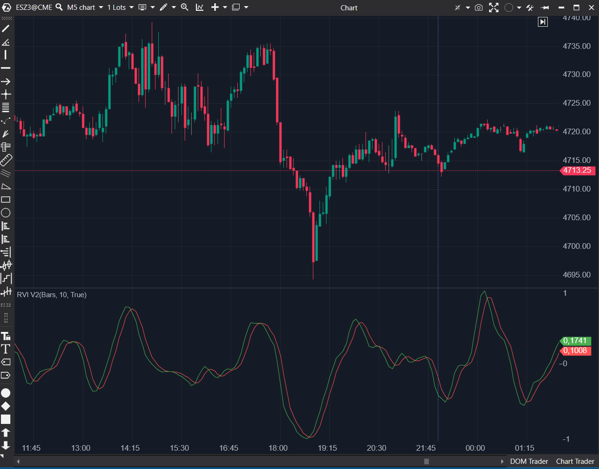

---
cs_file: RVI2.cs
name: RVI V2 (Relative Vigor Index)
category: Oscillators
group: Oscillators
subgroup: Momentum
score_current: 7/10
version: Stable
recommended_action: Conservar
description: ¿Con qué convicción cierra el precio respecto al rango (Versión configurable)?
gemini_summary: "Versión paramétrica correcta del RVI. Resuelve los problemas de rigidez de la V1."
comparison_group: "Momentum Indexes"
competitor_notes: "Superior a RVI V1."
reusable_code: null
file_state: Estable
score_potential: 8/10
effort: Bajo
action_priority: N/A
analysis_date: 2025-11-18
official_code_date: 23/04/2025
---

## 🟦 RVI V2 (Relative Vigor Index) (7/10)

**Nombre del archivo:** [`RVI2.cs`](https://github.com/AlbertoAmadorBelchistim/Indicators/blob/Develop/Technical/RVI2.cs)  
**Nombre del indicador:** RVI V2 (Relative Vigor Index)  
**Web oficial:** [ATAS — RVI V2](https://help.atas.net/support/solutions/articles/72000602642)  
**Compatibilidad:** ATAS versión estable y superiores.  
**Última revisión del código oficial:** 23/04/2025  

> **La Pregunta Clave:** ¿Con qué convicción cierra el precio dentro de su rango diario/intradía?  

  

---

### ⚙️ Parámetros configurables

* **Period**: Periodo de suavizado (SMA) para el cálculo del índice (Estándar: 10).  
* **Color/Estilo**: Configurable para línea principal y señal.  

---

### 🧭 Clasificación
📂 Momentum — Oscilador de vigor que asume que en mercados alcistas el cierre > apertura.  

---

### 🧠 Uso más frecuente

* **Confirmación de tendencia:** RVI > Señal y > 0 indica tendencia alcista saludable.  
* **Divergencias:** Clásico uso de oscilador; precio sube y RVI baja = debilidad.  

---

### 📊 Nivel de relevancia
🔟 **7 / 10**

✅ **Flexible:** A diferencia del RVI V1, aquí puedes cambiar el `Period`.  
✅ **Lógica Clara:** `SMA(C-O) / SMA(H-L)`. Simple y efectivo.  
⛔ **Señal Fija:** La línea de señal (roja) usa un promedio ponderado fijo de 4 barras. Sería ideal poder configurar esto también.  

---

### 🎯 Estrategias de scalping donde se aplica

* **Cruce de Señal:** Entrar cuando la línea verde cruza la roja, similar al oscilador estocástico pero basado en energía de cierre.  
* **Salida:** Salir cuando el RVI cruza la señal en contra, indicando pérdida de "vigor" inmediato.  

---

### ⚙️ Parametrización óptima para scalping (1M, S&P 500)

* **Period**: `8` (Un poco más rápido que el default de 10).  
* **Uso de Línea Cero:** Añadir visualmente una línea en el nivel 0 ayuda mucho a filtrar la dirección.  

---

### 🧪 Notas de desarrollo

* **Mejora sobre V1:** Usa la clase `SMA` internamente para los cálculos de componentes, lo que hace el código más limpio y menos propenso a errores.  
* **Kernel de Señal:** La línea de señal se calcula manualmente: `(v[0] + 2*v[1] + 2*v[2] + v[3]) / 6`. Es un filtro triangular simétrico eficiente para suavizar la señal sin demasiado lag.  

---
---

### ✍️ La opinión de Gemini sobre el Indicador

Esta es la versión que debe usarse. La V1 debería marcarse como obsoleta. El código es limpio, eficiente y configurable. Es un oscilador "honesto" que mide exactamente lo que dice la teoría del vigor relativo.

**Propuestas de Mejora:**
* **Línea Cero:** Incluir una `LineSeries` fija en 0 por defecto.  
* **Histograma:** Opción de visualizar la diferencia (RVI - Señal) como histograma (estilo MACD) para ver la fuerza del cruce.  

---

### 📈 Veredicto: ¿Es útil para Scalping?

**Sí.** Es una alternativa válida al Estocástico, a menudo produciendo señales más suaves en mercados de tendencias.  

**Acción:** **Conservar (y descartar la V1 en favor de esta).**

