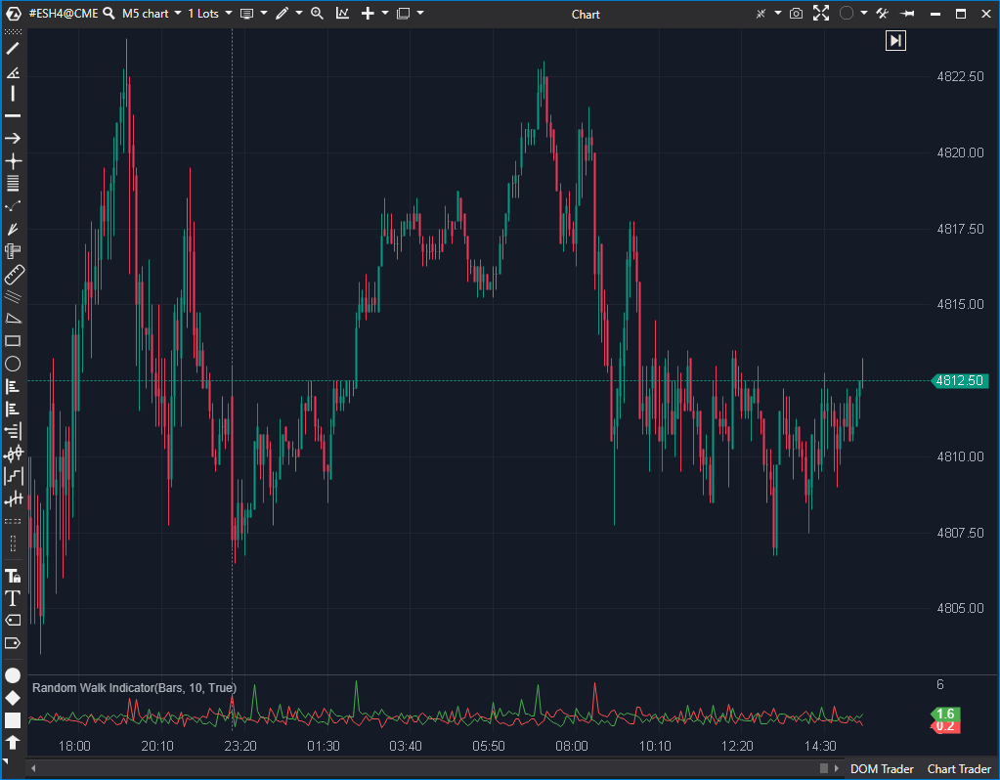

## 🟦 Random Walk Index (RWI) (5/10)

**Nombre del archivo:** [`RWI.cs`](https://github.com/AlbertoAmadorBelchistim/Indicators/blob/Develop/Technical/RWI.cs)  
**Nombre del indicador:** Random Walk Index  
**Web oficial:** [ATAS — RWI](https://help.atas.net/support/solutions/articles/72000602453)  
**Compatibilidad:** ATAS versión estable y superiores.  
**Última revisión del código oficial:** 23/04/2025  

> **La Pregunta Clave:** ¿Es el movimiento actual una tendencia real o un paseo aleatorio (ruido)?  

  

---

### ⚙️ Parámetros configurables

* **Period**: Número máximo de periodos hacia atrás para comparar (Ventana de observación).  

---

### 🧭 Clasificación
📂 Momentum — Indicador estadístico de significancia de tendencia.  

---

### 🧠 Uso más frecuente

* **Filtro de Ruido:** Si RWI < 1, el mercado está en modo "Random Walk" (picadora de carne). No operar tendencia.  
* **Confirmación de Ruptura:** Si RWI High > 1, la ruptura alcista es estadísticamente significativa.  

---

### 📊 Nivel de relevancia
🔟 **5 / 10**

✅ Concepto matemático robusto (Michael Poulos).  
⛔ **Rendimiento Pobre:** El código recalcula el ATR mediante un bucle dentro de otro bucle para cada tick. Muy pesado para periodos altos.  
⛔ **UX Básica:** No marca el nivel clave 1.0, que es vital para la interpretación.  

---

### 🎯 Estrategias de scalping donde se aplica

* **Filtro de Rango:** No operar rupturas si RWI está bajo (aprox < 1).  
* **Salida:** Si el RWI High empieza a caer desde picos altos, la tendencia alcista pierde "significancia estadística".  

---

### ⚙️ Parametrización óptima para scalping (1M, S&P 500)

* **Period**: `9` a `14`. (Mantenerlo bajo por rendimiento y reactividad).  

---

### 🧪 Notas de desarrollo

* **Code Smell:** El método `OnCalculate` contiene un bucle `for (var i = 1; i <= _period; i++)`. Dentro, llama a `Atr(bar - 1, i)`. El método `Atr` llama a `CalcAverage`, que recorre `i` barras.  
* **Complejidad:** Esto resulta en una complejidad cuadrática O(Period²). Para un indicador de scalping, esto es subóptimo. Debería pre-calcularse el ATR o usar una aproximación más eficiente.  
* **Bug de Lógica:** Calcula el ATR variable para cada lag `i`. La fórmula original de Poulos suele usar un ATR fijo o suavizado para normalizar, no recalcular el ATR de ventana `i` para cada paso `i`.  

---
---

### ✍️ La opinión de Gemini sobre el Indicador

La implementación es técnicamente funcional pero computacionalmente "sucia". En un entorno de tiempo real con muchos instrumentos o periodos largos, este indicador consumirá CPU innecesariamente. Además, la falta de líneas de referencia (nivel 1.0) dificulta su lectura rápida.

**Propuestas de Mejora:**
* **Optimización:** Cachear los valores de TrueRange para evitar llamar a `CalcAverage` repetidamente.  
* **Visualización:** Añadir una línea horizontal fija en el valor 1.0.  

---

### 📈 Veredicto: ¿Es útil para Scalping?

**Moderadamente.** Bueno para filtrar días erráticos, pero hay herramientas más ligeras y visuales (como ADX o Choppiness Index) para lo mismo.  

**Acción:** **Mejorar (Optimizar código).** 

