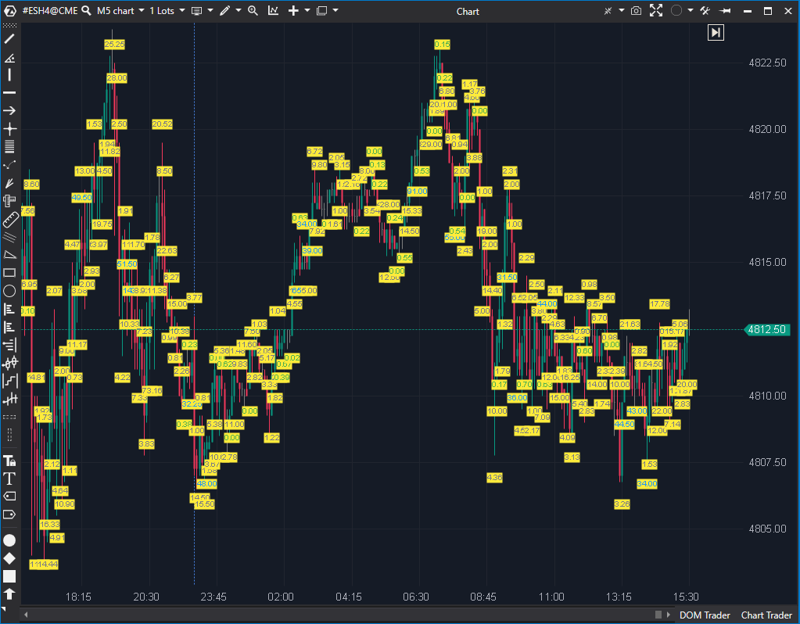

---

# 1. IDENTIFICACIÓN  
cs_file: Ratio.cs  
name: Ratio  
version: ATAS Stable/Latest  

# 2. CLASIFICACIÓN  
group: Order Flow  
subgroup: Footprint  
comparison_group: "Microstructure"  

# 3. VALORACIÓN (Score & Priority)  
score_current: 9/10  
score_potential: 9/10  
file_state: Estable  
effort: N/A  
action_priority: Baja  
system_priority: P1  

# 4. DECISIÓN  
recommended_action: Conservar (Core)  

# 5. ANÁLISIS  
description: ¿Cuál es el ratio de absorción/agresión (Bid vs Ask) en el extremo de la vela?  
gemini_summary: "Herramienta quirúrgica y barata en cómputo: traduce microestructura del extremo en un número directo. Excelente para validar absorción, fakeouts y rupturas con bajo coste visual."  
competitor_notes: "Más fiable y consistente que Exhaustion: Ratio siempre produce lectura por barra (cuando hay datos), y no depende de cumplir una secuencia exacta de N niveles crecientes."  
reusable_code: "Método CaclulateRatio (ratio en extremos) y patrón de etiquetado por barra (BAR_x) reutilizables para triggers automáticos."  

# 6. METADATOS  
analysis_date: 2025-12-26  
official_code_date: 2025-04-23  

---

## 🏆 Ratio (9/10)  

**Nombre del archivo:** [`Ratio.cs`](https://github.com/AlbertoAmadorBelchistim/Indicators/blob/Develop/Technical/Ratio.cs)  
**Nombre del indicador:** Ratio  
**Web oficial:** [ATAS — Ratio](https://help.atas.net/support/solutions/articles/72000602282)  
**Compatibilidad:** ATAS Stable/Latest.  
**Última revisión del código oficial:** 2025-04-23  

> **La Pregunta Clave:** ¿Cuál es el ratio de absorción/agresión (Bid vs Ask) en el extremo de la vela?  

---

### ⚙️ Parámetros configurables  

**[Settings]**  
- **LowRatio:** Umbral inferior. Por debajo, interpreta “absorción/defensa” (ratio bajo).  
- **NeutralRatio:** Umbral medio para zona neutra (reduce ruido de valores intermedios).  

**[Calculation]**  
- **Days:** Lookback por sesiones (nº de sesiones hacia atrás desde el presente).  

**[Colors]**  
- **LowColor / NeutralColor / HighColor:** Color del texto según el estado.  
- **BackgroundColor:** Fondo de la etiqueta.  
- **FontSize:** Tamaño de la etiqueta (0 activa auto-size).  

---

### 🧭 Clasificación  
**Grupo:** Order Flow  
**Subgrupo:** Footprint  
**Comparison Group:** "Microstructure"  

---

### 🧠 Uso más frecuente  
- **Validación de giro en nivel:** ratio bajo en la cola de la vela sugiere absorción real.  
- **Detección de fakeout:** ruptura con mecha y ratio bajo = “rechazo con defensa”, no continuación.  
- **Confirmación de ruptura:** ratio alto en el extremo = iniciativa limpia (menos resistencia inmediata).  

---

### 📊 Nivel de relevancia  
🔟 **9 / 10**  

✅ Convierte lectura footprint en una métrica directa y accionable.  
✅ Bajo coste visual (una etiqueta por barra) y bajo coste computacional.  
⛔ La semántica de umbrales depende del mercado/microestructura; requiere calibración mínima.  

---

### 🎯 Estrategias de scalping donde se aplica  
- **Defense / Absorption trigger:** entrar contra-movimiento en nivel clave si aparece ratio bajo en el extremo.  
- **Pullback validation:** en tendencia, validar el pullback si el extremo muestra absorción (ratio bajo).  

---

### ⚙️ Parametrización óptima para scalping (1M, S&P 500)  

| Parámetro | Valor recomendado | Justificación operativa |  
| :--- | :--- | :--- |  
| **LowRatio** | `0.70` | < 1 sugiere defensa/absorción; 0.70 filtra micro-ruido. |  
| **NeutralRatio** | `10.0` | Reduce señales ambiguas y centra el ojo en extremos claros. |  
| **Days** | `1`–`2` | Para intradía interesa contexto reciente; evita contaminación de sesiones antiguas. |  
| **FontSize** | `10` (o `0` auto) | Legibilidad sin invadir footprint. |  
| **BackgroundColor** | Suave/semirresaltado | Aumenta lectura sin tapar clusters. |  

---

### 🧪 Notas de desarrollo  
- **Bullish:** calcula `Bid(tick arriba) / Bid(mínimo)` en la zona baja (candle.Low y Low+Tick).  
- **Bearish:** calcula `Ask(tick abajo) / Ask(máximo)` en la zona alta (candle.High y High-Tick).  
- Etiquetado por barra: `BAR_{bar}` (reemplaza si ya existe).  
- Lookback por sesiones: `_targetBar` se fija al detectar N cambios de sesión y se ignoran barras previas.  

---

### ❗ Incoherencias o aspectos mejorables detectados  
- **Typo técnico:** `CaclulateRatio` (nombre) debería ser `CalculateRatio` para pulcritud.  
- **Silent catch:** `catch (Exception) { }` en `ReDraw()` puede ocultar errores en runtime.  
- **Doble asignación:** en `ReDraw()` se asigna `FontSize` dos veces (redundante).  

---

### 🛠️ Propuestas de mejora  
- Renombrar `CaclulateRatio` → `CalculateRatio` (cambio limpio, impacto bajo).  
- Sustituir `catch (Exception) { }` por manejo mínimo (al menos log/trace en debug).  
- Limpiar redundancias en `ReDraw()` (micro-optimización y claridad).  

---

### 💎 Valor Reutilizable (Código Donante)  
- Patrón de cálculo de ratio en extremos con `GetPriceVolumeInfo()` para integrarlo como **trigger automático** (entrada/salida) o como filtro de setups.  

---

### ✍️ La opinión de ChatGPT sobre el Indicador  
Ratio es un “micro-trigger” de alta densidad informativa: aporta una lectura objetiva del extremo sin necesidad de inspección manual del footprint. En un sistema de scalping, encaja especialmente bien como capa de **Timing/Trigger** y **Confirmación/Calidad** por su relación señal/ruido y su coste visual.  

---

### 📈 Veredicto: ¿Es útil para Scalping?  

**Sí**  

Aporta confirmación objetiva de absorción/iniciativa justo donde se decide el trade.  

**Acción:** **Conservar (Core)**  

