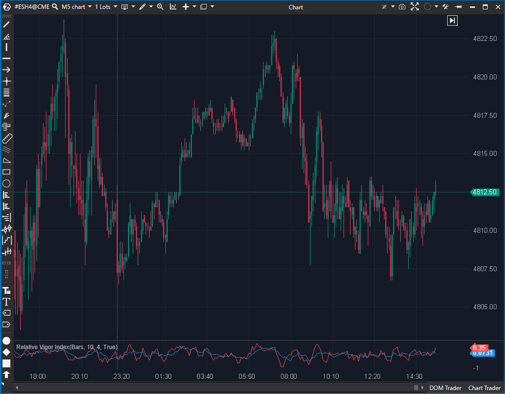

## 🟦 Relative Vigor Index (6/10)

**Nombre del archivo:** [`RelativeVigorIndex.cs`](https://github.com/AlbertoAmadorBelchistim/Indicators/blob/Develop/Technical/RelativeVigorIndex.cs)  
**Nombre del indicador:** Relative Vigor Index  
**Web oficial:** [ATAS — Relative Vigor Index](https://help.atas.net/support/solutions/articles/72000619101)  
**Compatibilidad:** ATAS versión estable y superiores.  
**Última revisión del código oficial:** 23/04/2025  

> **La Pregunta Clave:** ¿Cuál es la convicción del cierre (Close vs Open) relativa al rango (High vs Low)?

---

### ⚙️ Parámetros configurables

* **Period**: Periodo para suavizar la línea de señal (por defecto: 10)
* **SmaPeriod**: Periodo del suavizado principal del RVI (por defecto: 4)

---

### 🧭 Clasificación
📂 Momentum — Indicador de impulso basado en la relación entre cierre y rango de la vela

---

### 🧠 Uso más frecuente

* Confirmar la **dirección del impulso actual**
* Detectar **cruces de señal** como puntos de entrada o salida
* Evaluar la **intensidad del movimiento** en función de la pendiente

---

### 📊 Nivel de relevancia
🔟 **6 / 10**

✅ Suavizado y visualmente estable en comparación con RSI o Momentum  
✅ Proporciona señales claras con su línea de señal  
⛔ Puede retrasarse en fases de alta volatilidad

---

### 🎯 Estrategias de scalping donde se aplica

* **Cruce con línea de señal** como disparador de entrada
* **Confirmación direccional** si el RVI se mantiene por encima de la señal
* **Reversión anticipada** si el RVI cambia de pendiente y cruza a la baja

---

### ⚙️ Parametrización óptima para scalping (1M, S&P 500)

* **Period**: `6`
* **SmaPeriod**: `3`

---

### 🧪 Notas de desarrollo

* Calcula `rvi = (Close - Open) / (High - Low)`
* Suaviza `rvi` con una SMA para obtener la línea principal (`_rviSeries`)
* Suaviza el `rvi` crudo (no la línea principal) con otra SMA para la señal (`_signalSeries`)
* **Riesgo:** `if (candle.High - candle.Low != 0)` protege contra división por cero, pero si es 0, `rvi` es 0, lo cual es un valor "neutro" aceptable pero brusco.

---
---

### ✍️ La opinión de Gemini sobre el Indicador

El RVI es un indicador clásico basado en la idea de que en un mercado alcista el cierre suele ser mayor que la apertura.

El código tiene una implementación curiosa: calcula la señal (`_signalSeries`) basándose en el valor crudo del RVI, no en la línea RVI suavizada (`_rviSeries`). Esto es matemáticamente válido (son dos SMAs paralelas sobre el mismo dato), pero difiere de la construcción típica de osciladores donde la señal es una media de la línea principal.

El control de división por cero (`if (candle.High - candle.Low != 0)`) existe y es correcto, asignando 0 en ese caso.

**Propuesta de Mejora (P3):**
* Añadir línea cero visual.

---

### 📈 Veredicto: ¿Es útil para Scalping?

**Moderadamente.**

Es similar al Estocástico pero sin límites fijos. Útil para ver ciclos de corto plazo.

**Acción:** **Mejorar (Añadir línea cero).**

