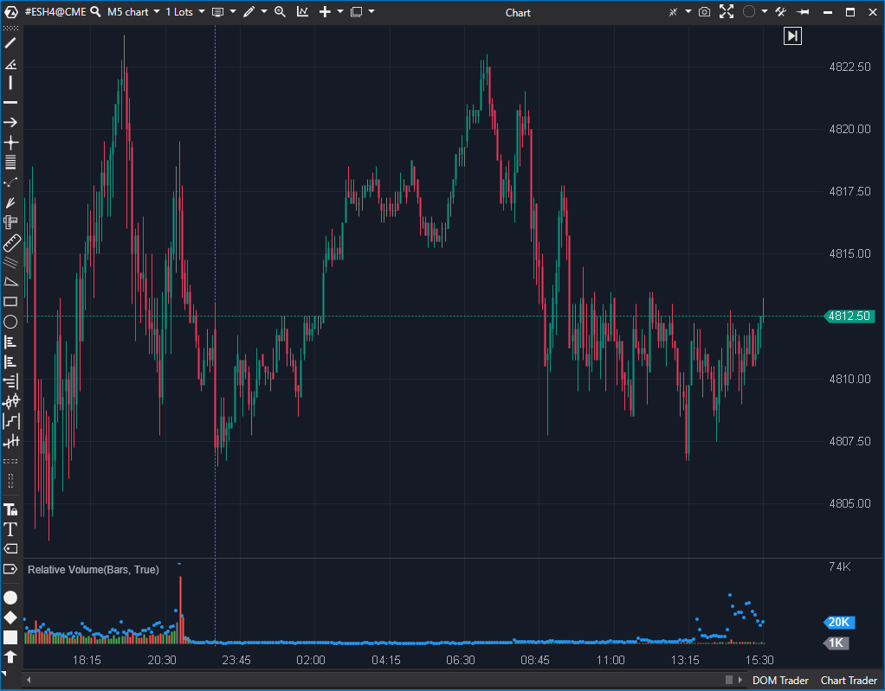

## 🟦 Relative Volume (7/10)

**Nombre del archivo:** [`RelativeVolume.cs`](https://github.com/AlbertoAmadorBelchistim/Indicators/blob/Develop/Technical/RelativeVolume.cs)  
**Nombre del indicador:** Relative Volume  
**Web oficial:** [ATAS — Relative Volume](https://help.atas.net/support/solutions/articles/72000602457)  
**Compatibilidad:** ATAS versión estable y superiores.  
**Última revisión del código oficial:** 23/04/2025  

> **La Pregunta Clave:** ¿Es el volumen actual anómalamente alto o bajo comparado con el promedio histórico para esta misma hora?

---

### ⚙️ Parámetros configurables

* **LookBack**: Número de sesiones para calcular el promedio horario (por defecto: 20)
* **DeltaColored**: Activar coloreado según el delta en lugar del cuerpo de la vela
* **PosColor / NegColor / NeutralColor**: Colores para barras con delta positivo, negativo o neutro

---

### 🧭 Clasificación
📂 Volume — Comparativa entre el volumen actual y su media en ese mismo horario

---

### 🧠 Uso más frecuente

* Detectar si el **volumen de una vela es significativamente mayor o menor al promedio histórico**
* Confirmar entradas si el volumen relativo es alto en una ruptura o zona relevante
* Medir **momentos de alta o baja participación relativa** a nivel horario

---

### 📊 Nivel de relevancia
🔟 **7 / 10**

✅ Útil para filtrar señales según contexto de participación relativa  
✅ Resalta automáticamente barras anómalas en comparación al histórico  
⛔ Solo funciona correctamente en gráficos basados en tiempo

---

### 🎯 Estrategias de scalping donde se aplica

* **Validación de ruptura**: volumen relativo alto confirma movimiento
* **Filtro direccional**: evitar operar en condiciones de volumen débil
* **Detección de absorción** si hay delta bajo pero volumen alto relativo

---

### ⚙️ Parametrización óptima para scalping (1M, S&P 500)

* **LookBack**: `20`
* **DeltaColored**: `true`

---

### 🧪 Notas de desarrollo

* Almacena promedios históricos en un diccionario `Dictionary<TimeSpan, AvgBar>` indexado por la hora del día
* Solo funciona en gráficos de Tiempo o Segundos (`_isSupportedTimeFrame`)
* **Defecto:** El promedio mostrado en la barra actual no incluye el dato de la sesión más reciente hasta que se cierra, lo que puede generar un pequeño lag en la adaptación del promedio.

---
---

### ✍️ La opinión de Gemini sobre el Indicador

Es una herramienta de contexto vital para saber si "hay gente" en el mercado. La implementación es ingeniosa (usar un diccionario para guardar el historial de cada franja horaria).

El principal defecto es su limitación a gráficos temporales. En un gráfico de Range o Renko, el concepto de "hora del día" es menos relevante o directamente inaplicable, y el indicador simplemente deja de calcular el promedio. Debería mostrar un aviso al usuario en esos casos.

**Propuesta de Mejora (P3):**
* Añadir una etiqueta o aviso visual si se usa en un TimeFrame no soportado.
* Corregir el orden de actualización del promedio para que sea más reactivo.

---

### 📈 Veredicto: ¿Es útil para Scalping?

**Sí.**

Saber si el volumen de ruptura es "real" (superior al promedio) o "falso" (inferior al promedio) es clave.

**Acción:** **Mejorar (Validación de TimeFrame y lógica de actualización).**

