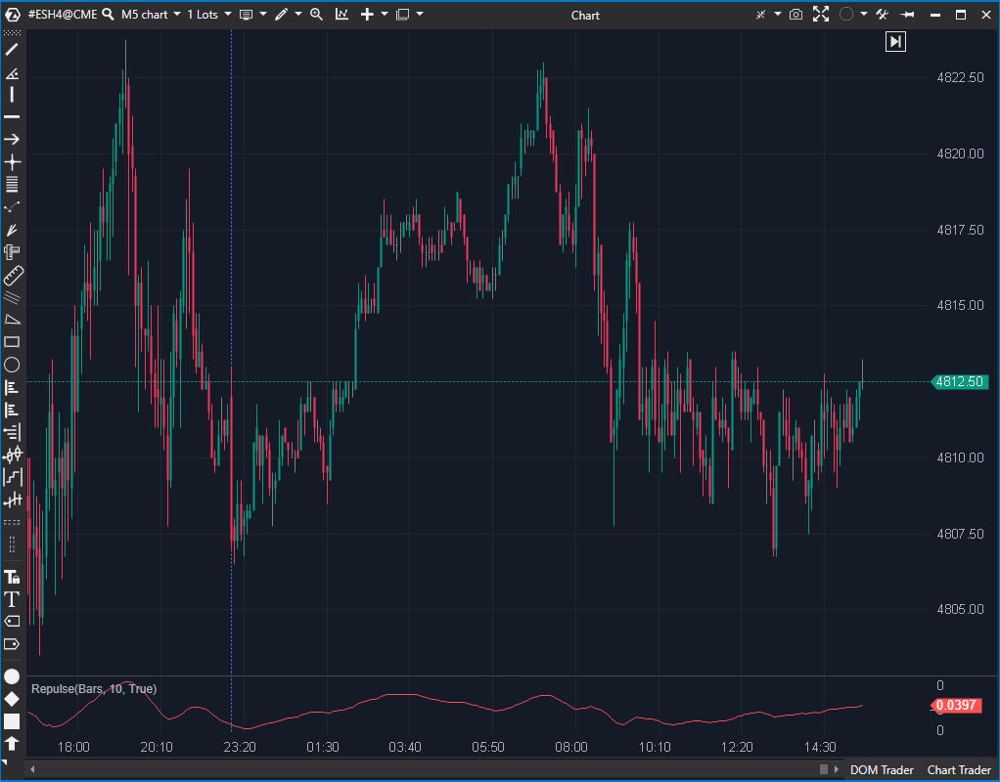

## 🟦 Repulse (6/10)

**Nombre del archivo:** [`Repulse.cs`](https://github.com/AlbertoAmadorBelchistim/Indicators/blob/Develop/Technical/Repulse.cs)  
**Nombre del indicador:** Repulse  
**Web oficial:** [ATAS — Repulse](https://help.atas.net/support/solutions/articles/72000602283)  
**Compatibilidad:** ATAS versión estable y superiores.  
**Última revisión del código oficial:** 23/04/2025  

> **La Pregunta Clave:** ¿Cuál es la "presión de repulsión" (fuerza de compra/venta interna) suavizada de las velas?

---

### ⚙️ Parámetros configurables

* **Period**: Número de barras para el cálculo principal (por defecto: 10)

---

### 🧭 Clasificación
📂 Momentum — Indicador de presión compradora vs. vendedora suavizada mediante EMAs

---

### 🧠 Uso más frecuente

* Medir la **intensidad comparada entre fuerzas alcistas y bajistas**
* Confirmar fases de impulso o debilidad
* Filtrar movimientos sin intención en estructuras laterales

---

### 📊 Nivel de relevancia
🔟 **6 / 10**

✅ Indicador poco común pero útil como filtro de fuerza estructural  
✅ Suavizado interno reduce el ruido y facilita la lectura  
⛔ Interpretación más abstracta que otros osciladores clásicos

---

### 🎯 Estrategias de scalping donde se aplica

* **Confirmación de dirección** si la línea se mantiene claramente positiva o negativa
* **Detección de giro** si cambia de pendiente bruscamente
* **Filtro de contexto** para evitar operar en zonas sin presión dominante

---

### ⚙️ Parametrización óptima para scalping (1M, S&P 500)

* **Period**: `8`

---

### 🧪 Notas de desarrollo

* Calcula componentes de presión alcista y bajista basados en la posición del cierre relativo a máximos/mínimos y apertura
* Usa dos EMAs (`_emaHigh`, `_emaLow`) con un periodo fijo de `Period * 5` (No configurable)
* Inicialización dependiente de `GetCandle(0)`

---
---

### ✍️ La opinión de Gemini sobre el Indicador

Es un indicador esotérico. La implementación parece seguir la fórmula original, pero tiene decisiones de diseño cuestionables.

El hecho de que el período de las EMAs sea `Period * 5` y no sea configurable es una limitación innecesaria. Además, la lógica de inicialización basada en la vela 0 es frágil.

**Propuesta de Mejora (P3):**
* Hacer configurable el multiplicador de suavizado (actualmente 5).

---

### 📈 Veredicto: ¿Es útil para Scalping?

**Ocasionalmente.**

Puede servir para ver la "intención" interna de las velas, pero el Delta Acumulado suele ser superior.

**Acción:** **Mejorar (Hacer configurables los parámetros internos).**

