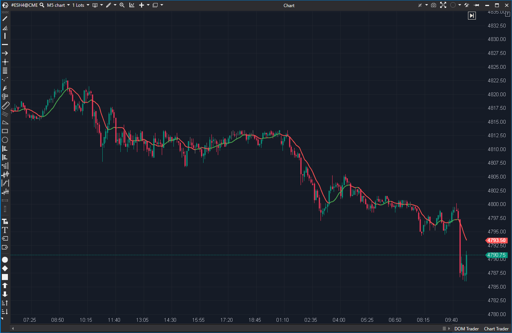

---
# --- Campos Públicos (Para INDICATORS.es) ---
cs_file: SMA.cs
name: SMA (Simple Moving Average)
category: Trend
score_current: 9/10
version: Stable
recommended_action: 'Conservar'
description: >-
  Media Móvil Simple optimizada con alertas de precio y cambio de color por tendencia.
# --- Campos de Triaje (Para ROADMAP.md) ---
gemini_summary: >-
  Implementación de referencia. Algoritmo optimizado (sliding window sum), alertas y UX completa.
file_state: Estable
score_potential: 9/10
effort: Bajo
action_priority: N/A
# --- Control de Versiones ---
analysis_date: 2025-11-18
official_code_date: 28/07/2025
user_modification_date: null
---

## 🟦 SMA (9/10)

**Nombre del archivo:** [`SMA.cs`](https://github.com/AlbertoAmadorBelchistim/Indicators/blob/Develop/Technical/SMA.cs)  
**Nombre del indicador:** SMA  
**Web oficial:** [ATAS — SMA](https://help.atas.net/support/solutions/articles/72000602468)  
**Compatibilidad:** ATAS versión estable y superiores.  
**Última revisión del código oficial:** 28/07/2025  

> **La Pregunta Clave:** ¿Cuál es el precio promedio de las últimas N barras y hacia dónde se dirige?  

  

---

### ⚙️ Parámetros configurables

* **Period**: Número de barras (ej. 20, 50, 200).  
* **ColoredDirection**: Cambia el color de la línea si sube (Verde) o baja (Rojo).  
* **Alerts**: Configuración completa para avisar si el precio toca o se acerca a la media (`Sensitivity`).  

---

### 🧭 Clasificación
📂 Trend — El indicador de seguimiento de tendencia más fundamental.  

---

### 🧠 Uso más frecuente

* **Soporte/Resistencia Dinámico:** El precio rebota en la SMA 20 o 50.  
* **Filtro de Tendencia:** Si precio > SMA 200, solo compras.  
* **Cruce:** Cruce de precio con SMA (agresivo).  

---

### 📊 Nivel de relevancia
🔟 **9 / 10**

✅ **Código Optimizado:** Usa suma acumulativa (`_sum`) en lugar de recalcular todo el promedio en cada tick. Eficiencia O(1).  
✅ **UX Superior:** La función `ColoredDirection` da información visual instantánea de la pendiente.  
✅ **Alertas Útiles:** Permite definir una "zona de proximidad" (Sensitivity) para la alerta, no solo cruce exacto.  

---

### 🎯 Estrategias de scalping donde se aplica

* **Pullback a la 20:** Estrategia clásica. Esperar retroceso a la SMA 20 con color alcista y comprar.  
* **Rubber Band:** Si el precio se aleja mucho de la SMA, buscar reversión a la media.  

---

### ⚙️ Parametrización óptima para scalping (1M, S&P 500)

* **Period**: `20` (Tendencia corto plazo) o `200` (Tendencia sesión).  
* **ColoredDirection**: `true`.  
* **AlertSensitivity**: `2` (ticks).  

---

### 🧪 Notas de desarrollo

* **Algoritmo:** `_sum += new - old`. Esto es vital para el rendimiento. Un bucle `for` sumando 200 valores en cada tick es ineficiente; este código lo evita elegantemente.  
* **Tipado:** Usa `decimal` para `_sum`, lo cual evita los errores de coma flotante (drift) que ocurren con `double` al sumar/restar indefinidamente. Muy bien hecho.  

---
---

### ✍️ La opinión de Gemini sobre el Indicador

Es un ejemplo de cómo un indicador "básico" puede implementarse de forma "profesional". No se limita a dibujar la línea, sino que añade valor con los colores y las alertas de proximidad, todo ello manteniendo una eficiencia algorítmica máxima.

**Propuestas de Mejora:**
* Ninguna crítica. Es el estándar.

---

### 📈 Veredicto: ¿Es útil para Scalping?

**Sí.** Imprescindible. La SMA 20 o VWAP son las líneas de vida del scalper.  

**Acción:** **Conservar.** 