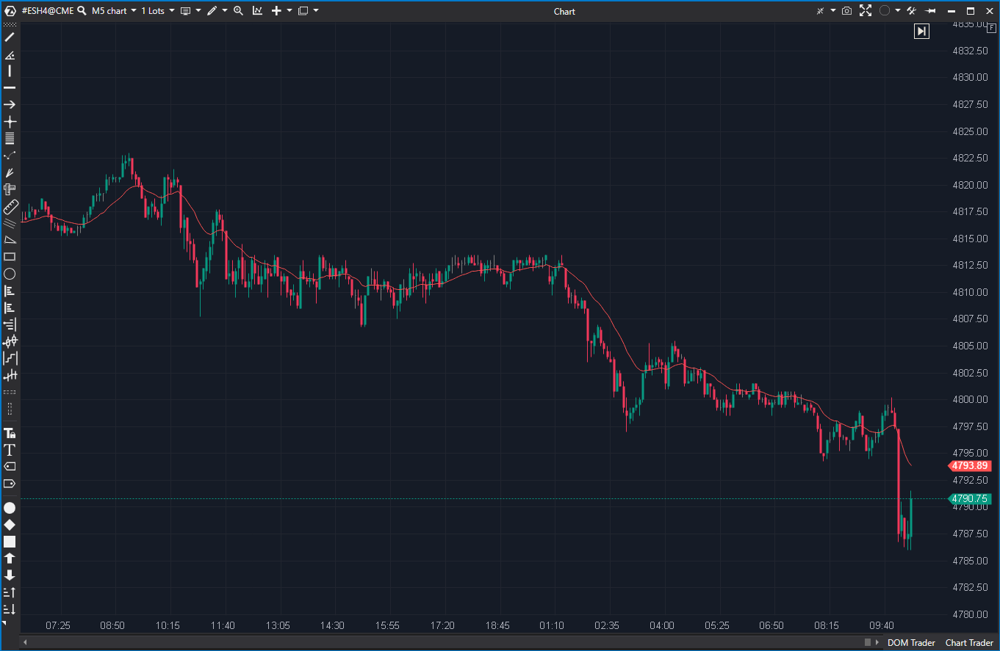

## 🟦 SMMA (7/10)

**Nombre del archivo:** [`SMMA.cs`](https://github.com/AlbertoAmadorBelchistim/Indicators/blob/Develop/Technical/SMMA.cs)  
**Nombre del indicador:** SMMA  
**Web oficial:** [ATAS — SMMA](https://help.atas.net/support/solutions/articles/72000602532)  
**Compatibilidad:** ATAS versión estable y superiores.  
**Última revisión del código oficial:** 23/04/2025  

> **La Pregunta Clave:** ¿Cuál es la tendencia de largo plazo eliminando el ruido de la volatilidad reciente?

---

### ⚙️ Parámetros configurables

* **Period**: Número de barras para el cálculo del suavizado.

---

### 🧭 Clasificación
📂 Trend — Variante de media móvil que jamás olvida datos antiguos del todo (decaimiento lento).

---

### 🧠 Uso más frecuente

* **Soporte/Resistencia Dinámico:** Al ser más estable que la EMA, suele funcionar bien como "suelo" en tendencias fuertes.  
* **Cruce de Medias:** Usada como la línea "lenta" en cruces conservadores.  

---

### 📊 Nivel de relevancia
🔟 **7 / 10**

✅ **Estabilidad:** No "baila" tanto como una EMA en mercados laterales.  
✅ **Código Limpio:** Implementación recursiva eficiente.  
⛔ **Lag:** Tiene más retraso que una SMA o EMA del mismo periodo.  

---

### 🎯 Estrategias de scalping donde se aplica

* **Alligator de Williams:** La SMMA es la base para construir las líneas del Alligator (Lips, Teeth, Jaws).  
* **Tendencia de Fondo:** Usar una SMMA 50 en 1 minuto para definir si solo se buscan largos o cortos.  

---

### ⚙️ Parametrización óptima para scalping (1M, S&P 500)

* **Period**: `13` (Número Fibonacci clásico para SMMA).

---

### 🧪 Notas de desarrollo

* **Algoritmo:** Usa la fórmula recursiva `PrevSum - SMMA_Prev + Close`. En el código se simplifica algebraicamente como `(Prev * (N-1) + Val) / N`.  
* **Eficiencia:** O(1) por tick. Óptimo.

---
---

### ✍️ La opinión de Gemini sobre el Indicador

Es un componente básico. No tiene "fuegos artificiales", pero es el ladrillo con el que se construyen sistemas complejos como el de Bill Williams. El código es correcto y robusto.

**Propuestas de Mejora:**
* Añadir opción de **Color Change** según pendiente (como la SMA analizada antes) para modernizarla.

---

### 📈 Veredicto: ¿Es útil para Scalping?

**Sí.** Pero raramente sola; casi siempre como parte de una estrategia de múltiples medias.

**Acción:** **Conservar.**
