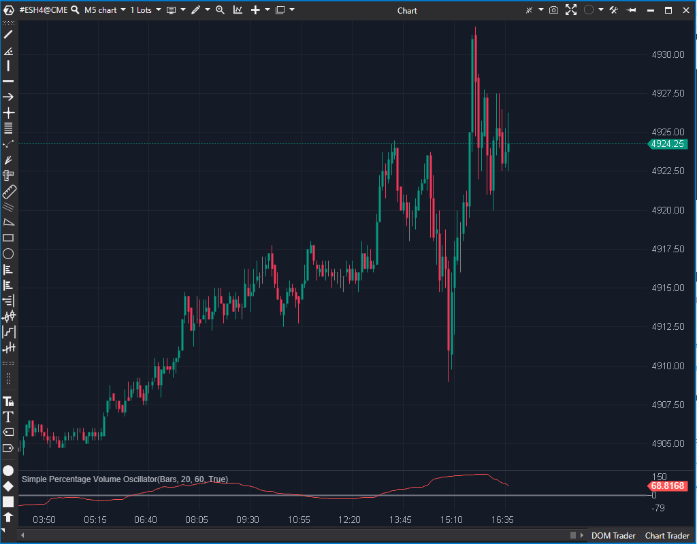

## 🟦 Simple Percentage Volume Oscillator (SPVO) (8/10)

**Nombre del archivo:** [`SPVO.cs`](https://github.com/AlbertoAmadorBelchistim/Indicators/blob/Develop/Technical/SPVO.cs)  
**Nombre del indicador:** Simple Percentage Volume Oscillator  
**Web oficial:** [ATAS — SPVO](https://help.atas.net/support/solutions/articles/72000602263)  
**Compatibilidad:** ATAS versión estable y superiores.  
**Última revisión del código oficial:** 23/04/2025  

> **La Pregunta Clave:** ¿Está entrando un volumen inusualmente alto (o bajo) comparado con el promedio reciente?

---

### ⚙️ Parámetros configurables

* **ShortPeriod**: Media rápida de volumen (ej. 20).  
* **LongPeriod**: Media lenta de volumen (ej. 60).  

---

### 🧭 Clasificación
📂 Volume — Oscilador normalizado de actividad.

---

### 🧠 Uso más frecuente

* **Detección de Rupturas:** Una ruptura de precio acompañada de un SPVO disparándose confirma la validez del movimiento.  
* **Agotamiento:** Precio subiendo pero SPVO bajando (divergencia) sugiere falta de interés profesional.  

---

### 📊 Nivel de relevancia
🔟 **8 / 10**

✅ **Normalizado:** Al ser porcentual, permite comparar activos distintos o momentos históricos diferentes.  
✅ **Seguro:** Código protegido contra errores matemáticos básicos.  
⛔ **Simpleza:** No distingue entre volumen de compra/venta (es volumen total).  

---

### 🎯 Estrategias de scalping donde se aplica

* **Breakout Confirmation:** Si el precio rompe nivel y SPVO > 10%, entrar. Si SPVO < 0%, es probable falsa ruptura.  
* **Volume Spike Fade:** Picos extremos en SPVO a menudo marcan el final de un movimiento climático.  

---

### ⚙️ Parametrización óptima para scalping (1M, S&P 500)

* **ShortPeriod**: `5` (Muy reactivo).  
* **LongPeriod**: `20` (Promedio de la última media hora aprox).  

---

### 🧪 Notas de desarrollo

* **Cálculo:** `100 * (Short - Long) / Long`.  
* **Seguridad:** Verifica `_longSma[bar] != 0` antes de dividir. Esto previene el crash clásico en la barra 0 o en activos sin liquidez inicial.  

---
---

### ✍️ La opinión de Gemini sobre el Indicador

Es una herramienta de confirmación sólida. A diferencia del volumen bruto (barras), el SPVO te dice *cuánto* más volumen hay en términos relativos, lo cual es información procesable al instante.

**Propuestas de Mejora:**
* **Coloreado:** Pintar el histograma de verde/rojo si el oscilador sube/baja respecto a la barra anterior.
* **Niveles:** Añadir líneas horizontales configurables para marcar niveles de "Volumen Extremo" (ej. +50%).

---

### 📈 Veredicto: ¿Es útil para Scalping?

**Sí.** Vital para filtrar rupturas falsas en segundos.

**Acción:** **Conservar.**