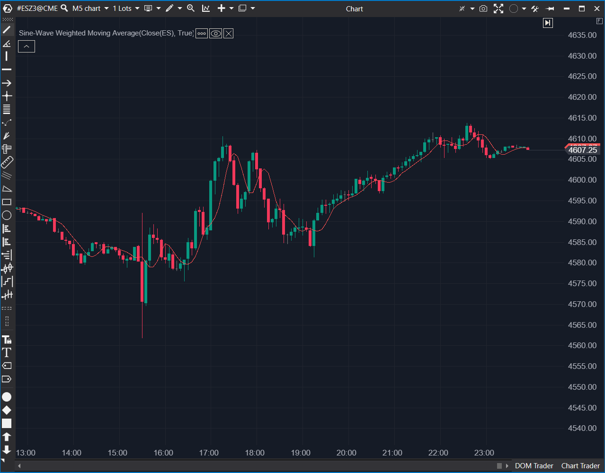

---
# --- Campos Públicos (Para INDICATORS.es) ---
cs_file: SWWMA.cs
name: Sine-Wave Weighted Moving Average
category: Trend
score_current: 5/10
version: Stable
recommended_action: 'Mejorar'
description: >-
  ¿Cuál es la tendencia suavizada usando una ponderación sinusoidal fija de 5 periodos?
# --- Campos de Triaje (Para ROADMAP.md) ---
gemini_summary: >-
  Indicador rígido sin parámetros. Usa un kernel fijo de 5 barras con pesos seno.
file_state: Estable
score_potential: 7/10
effort: Bajo
action_priority: P3
# --- Control de Versiones ---
analysis_date: 2025-11-18
official_code_date: 2025-04-23
user_modification_date: null
---

## 🟦 Sine-Wave Weighted Moving Average (SWWMA) (5/10)

**Nombre del archivo:** [`SWWMA.cs`](https://github.com/AlbertoAmadorBelchistim/Indicators/blob/Develop/Technical/SWWMA.cs)  
**Nombre del indicador:** Sine-Wave Weighted Moving Average  
**Web oficial:** [ATAS — SWWMA](https://help.atas.net/support/solutions/articles/72000602467)  
**Compatibilidad:** ATAS versión estable y superiores.  
**Última revisión del código oficial:** 23/04/2025  

> **La Pregunta Clave:** ¿Cuál es la tendencia suavizada usando una ponderación sinusoidal fija de 5 periodos?

---

### ⚙️ Parámetros configurables

* **Ninguno**: El indicador no tiene parámetros ajustables.

---

### 🧭 Clasificación
📂 Trend — Filtro FIR (Finite Impulse Response) con coeficientes sinusoidales.

---

### 🧠 Uso más frecuente

* **Suavizado Rápido:** Al usar solo 5 periodos y pesos seno (que dan más importancia al centro de la ventana), intenta suavizar el ruido cíclico de alta frecuencia.  

---

### 📊 Nivel de relevancia
🔟 **5 / 10**

✅ **Concepto Matemático:** La ponderación sinusoidal es teóricamente buena para capturar ciclos.  
⛔ **Rigidez Total:** No se puede cambiar el periodo. Estás atado a una ventana de 5 barras. Esto lo hace inútil para tendencias de largo plazo.  
⛔ **Caja Negra:** El usuario no sabe qué está calculando realmente al no ver parámetros.  

---

### 🎯 Estrategias de scalping donde se aplica

* **Signal Line:** Usarlo como "Trigger" rápido para cruces con una media más lenta.  

---

### ⚙️ Parametrización óptima para scalping (1M, S&P 500)

* **N/A**: No configurable.

---

### 🧪 Notas de desarrollo

* **Hardcoded:** El bucle `for (var i = 1; i <= 5; i++)` y la constante `_sinSum` están fijos.
* **Matemática:** $\sum \sin(i \cdot 30^\circ)$. Los pesos son simétricos o crecientes según la fase.

---
---

### ✍️ La opinión de Gemini sobre el Indicador

Es un experimento académico convertido en indicador. Sin la capacidad de ajustar el periodo, su utilidad profesional es marginal.

**Propuestas de Mejora:**
* **Parametrizar:** Permitir al usuario elegir el periodo y recalcular los pesos sinusoidales dinámicamente en `OnRecalculate`.

---

### 📈 Veredicto: ¿Es útil para Scalping?

**Poco.** Demasiado rígido para adaptarse a la volatilidad cambiante.

**Acción:** **Mejorar (Añadir parámetro Period).**