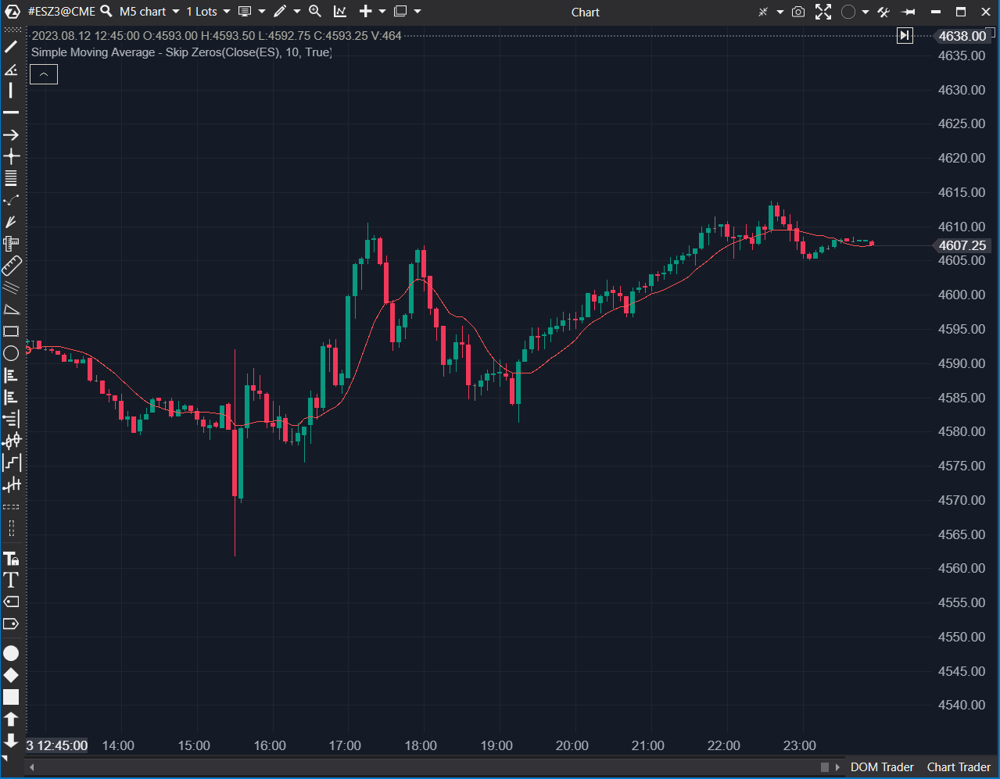

---
cs_file: SZMA.cs
name: Simple Moving Average - Skip Zeros
category: Trend
group: Trend
subgroup: Moving Average
score_current: 7/10
version: Stable
recommended_action: Conservar
description: ¿Cuál es el promedio real ignorando los valores cero?
gemini_summary: "Media móvil especializada que filtra ceros. Útil para datos dispersos (sparse data)."
comparison_group: "Advanced MA"
competitor_notes: "Útil para volumen bajo."
reusable_code: null
file_state: Estable
score_potential: 7/10
effort: Bajo
action_priority: N/A
analysis_date: 2025-11-18
official_code_date: 23/04/2025
---

## 🟦 Simple Moving Average - Skip Zeros (SZMA) (7/10)

**Nombre del archivo:** [`SZMA.cs`](https://github.com/AlbertoAmadorBelchistim/Indicators/blob/Develop/Technical/SZMA.cs)  
**Nombre del indicador:** Simple Moving Average - Skip Zeros  
**Web oficial:** [ATAS — SZMA](https://help.atas.net/support/solutions/articles/72000602237)  
**Compatibilidad:** ATAS versión estable y superiores.  
**Última revisión del código oficial:** 23/04/2025  

> **La Pregunta Clave:** ¿Cuál es el promedio real de una serie de datos ignorando los valores vacíos o ceros?

---

### ⚙️ Parámetros configurables

* **Period**: Ventana de observación.

---

### 🧭 Clasificación
📂 Trend — Media móvil condicionada.

---

### 🧠 Uso más frecuente

* **Volumen/Delta:** En mercados ilíquidos o sesiones nocturnas, muchas barras tienen volumen 0. Una SMA normal caería a casi 0. La SZMA mantiene el promedio de las barras "activas".  
* **Indicadores Personalizados:** Suavizar resultados de otros indicadores que devuelven 0 cuando no hay señal.  

---

### 📊 Nivel de relevancia
🔟 **7 / 10**

✅ **Soluciona un Problema Real:** Evita que los datos nulos "contaminen" el promedio.  
✅ **Código Seguro:** Evita división por cero si todos los valores son 0.  
⛔ **Rendimiento:** Recorre el bucle `for` completo en cada tick (no optimizada como la SMA normal), aunque necesario por su naturaleza condicional.  

---

### 🎯 Estrategias de scalping donde se aplica

* **Filtro de Volumen Relativo:** Comparar el volumen actual solo con velas que tuvieron actividad real previa.  

---

### ⚙️ Parametrización óptima para scalping (1M, S&P 500)

* **Period**: `20`.

---

### 🧪 Notas de desarrollo

* **Algoritmo:** `if (Source[i] == 0) continue;`. Simple y efectivo.
* **Complejidad:** O(Period) por tick.

---
---

### ✍️ La opinión de Gemini sobre el Indicador

Es una herramienta de "fontanería". No la usas para operar el precio directamente (el precio nunca es 0), sino para suavizar otros datos auxiliares.

**Propuestas de Mejora:**
* Ninguna. Hace lo que debe.

---

### 📈 Veredicto: ¿Es útil para Scalping?

**Sí (Indirectamente).** Para limpiar datos de entrada de volumen.

**Acción:** **Conservar.**