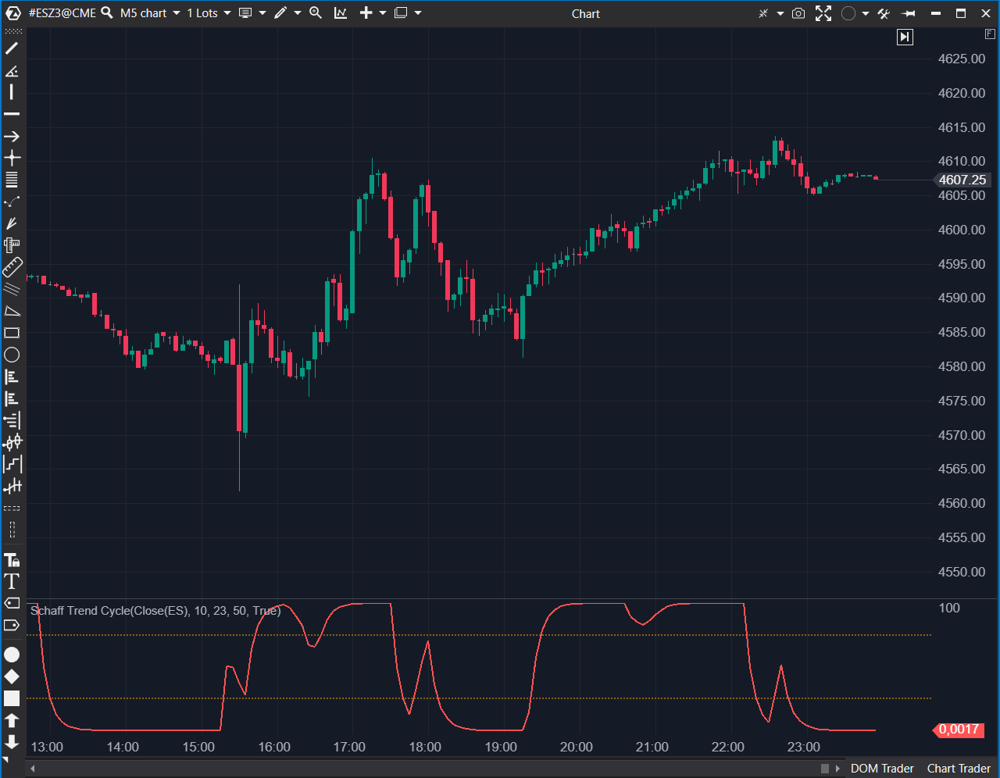

## 🟦 Schaff Trend Cycle (7/10)

**Nombre del archivo:** [`SchaffTrendCycle.cs`](https://github.com/AlbertoAmadorBelchistim/Indicators/blob/Develop/Technical/SchaffTrendCycle.cs)  
**Nombre del indicador:** Schaff Trend Cycle  
**Web oficial:** [ATAS — Schaff Trend Cycle](https://help.atas.net/support/solutions/articles/72000602464)  
**Compatibilidad:** ATAS versión estable y superiores.  
**Última revisión del código oficial:** 23/04/2025  

> **La Pregunta Clave:** ¿Está el ciclo del mercado en fase de aceleración (compra) o desaceleración (venta) con alta sensibilidad?  

  

---

### ⚙️ Parámetros configurables

* **Period**: Longitud del ciclo estocástico (Estándar: 10).  
* **ShortPeriod / LongPeriod**: Configuración del MACD subyacente (Estándar: 23/50).  
* **DrawLines**: Muestra u oculta las líneas de nivel de sobrecompra/venta.  
* **UpLine / DownLine**: Niveles de referencia (75 y 25 por defecto).  

---

### 🧭 Clasificación
📂 Momentum — Híbrido que aplica la lógica estocástica (0-100) sobre un MACD.  

---

### 🧠 Uso más frecuente

* **Detección temprana de giros:** El STC reacciona antes que el MACD gracias al doble suavizado estocástico.  
* **Zonas Muertas:** Cuando el indicador se pega a 0 o 100, indica tendencia fuerte; no buscar contra-tendencia hasta que salga de la zona.  

---

### 📊 Nivel de relevancia
🔟 **7 / 10**

✅ **Alta Reactividad:** Reduce el lag del MACD significativamente.  
✅ **Visualmente Claro:** Oscila entre 0 y 100, eliminando la ambigüedad de los valores absolutos del MACD.  
⛔ **Factor Fijo:** Usa un factor de suavizado de 0.5 hardcoded, impidiendo ajustar la "velocidad" del ciclo.  
⛔ **Serie Intermedia:** Calcula y expone series intermedias no necesarias visualmente.  

---

### 🎯 Estrategias de scalping donde se aplica

* **Entrada de Ciclo:** Comprar cuando el STC cruza 25 hacia arriba (salida de sobreventa) a favor de tendencia mayor.  
* **Scalping de Reversión:** En rangos laterales, vender el cruce de 75 hacia abajo.  

---

### ⚙️ Parametrización óptima para scalping (1M, S&P 500)

* **ShortPeriod**: `23`  
* **LongPeriod**: `50`  
* **Period**: `10`  
* **Niveles**: `80 / 20` (Para filtrar ruido en 1 minuto).  

---

### 🧪 Notas de desarrollo

* **Fórmula:** Implementa correctamente la recursividad del STC: `PF = OldPF + 0.5 * (F1 - OldPF)`.  
* **Inicialización:** Usa variables `_lastPf` que dependen de valores previos. La lógica de reinicio en `OnCalculate` podría ser más robusta, pero funciona.  
* **Series Ocultas:** Declara `_f1Series`, `_f2Series`, `_pfSeries` como `ValueDataSeries`, lo que ocupa memoria en el gráfico aunque no se pinten todas. Podrían ser arrays privados.  

---
---

### ✍️ La opinión de Gemini sobre el Indicador

Es una buena herramienta para scalpers que encuentran el MACD demasiado lento y el Estocástico demasiado nervioso. El STC es el "punto medio". El código es correcto, aunque podría optimizarse el uso de memoria privatizando las series intermedias que el usuario no ve.

**Propuestas de Mejora:**
* **Factor Configurable:** Exponer el factor de suavizado (actualmente 0.5) como parámetro `CycleFactor`.  
* **Alertas:** Añadir alertas al cruzar niveles 25/75.  

---

### 📈 Veredicto: ¿Es útil para Scalping?

**Sí.** Excelente para medir el timing exacto de entrada en un pullback.  

**Acción:** **Conservar.** ```

