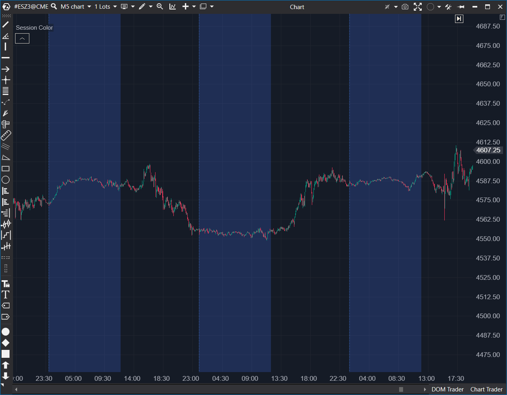

## 🟦 Session Color (6/10)

**Nombre del archivo:** [`SessionColor.cs`](https://github.com/AlbertoAmadorBelchistim/Indicators/blob/Develop/Technical/SessionColor.cs)  
**Nombre del indicador:** Session Color  
**Web oficial:** [ATAS — Session Color](https://help.atas.net/support/solutions/articles/72000602465)  
**Compatibilidad:** ATAS versión estable y superiores.  
**Última revisión del código oficial:** 23/04/2025  

> **La Pregunta Clave:** ¿En qué momento de la sesión de trading (Apertura, Cierre, Rango Específico) estoy visualmente?  

  

---

### ⚙️ Parámetros configurables

* **StartTime / EndTime**: Hora de inicio y fin de la zona a colorear.  
* **AreaColor**: Color de fondo (con transparencia) o de las líneas.  
* **ShowArea**: Rellenar el fondo (`true`) o solo líneas verticales (`false`).  
* **Alertas**: Sonidos personalizables al inicio y fin de la sesión.  

---

### 🧭 Clasificación
📂 Visualization — Herramienta de marcado de tiempo (Time Marker).  

---

### 🧠 Uso más frecuente

* **Apertura Americana:** Marcar de 15:30 a 16:30 (CET) para visualizar la hora de máxima volatilidad.  
* **Zona de "No Trading":** Marcar la hora del almuerzo o pre-cierre para evitar operar.  

---

### 📊 Nivel de relevancia
🔟 **6 / 10**

✅ Cumple su función básica de resaltar franjas horarias.  
✅ Sistema de alertas integrado.  
⛔ **Complejidad Innecesaria:** El código usa bloqueos de hilos (`lock`) y una gestión de objetos `Session` compleja para algo visualmente simple.  
⛔ **Rendimiento:** Inserta elementos al principio de una lista (`Insert(0, ...)`) frecuentemente, lo que puede degradar rendimiento en históricos muy largos.  

---

### 🎯 Estrategias de scalping donde se aplica

* **Breakout de Sesión:** Marcar la sesión asiática y operar la ruptura de su rango en la sesión europea.  
* **Filtro de Tiempo:** "Solo opero si el fondo es Azul (Sesión NY)".  

---

### ⚙️ Parametrización óptima para scalping (1M, S&P 500)

* **StartTime**: `15:30:00`  
* **EndTime**: `22:00:00`  
* **AreaColor**: Azul muy transparente (Alpha < 20).  

---

### 🧪 Notas de desarrollo

* **Renderizado:** Usa `OnRender` y `DrawingLayouts.Historical`, lo que asegura que el color quede "detrás" de las velas (correcto).  
* **Gestión de Tiempo:** Convierte `InstrumentInfo.TimeZone` manualmente. Esto puede ser problemático si el usuario cambia la zona horaria del gráfico en caliente.  
* **Estructura:** Define una clase anidada `Session` para guardar el estado de cada franja. Es limpio (OOP), pero quizás excesivo para un indicador visual simple.  

---
---

### ✍️ La opinión de Gemini sobre el Indicador

El código parece haber sido escrito pensando en un entorno multihilo complejo (`lock (_syncRoot)`), lo cual es innecesario para la arquitectura de indicadores de ATAS y añade ruido. Funcionalmente está bien, pero la implementación podría simplificarse enormemente.

**Propuestas de Mejora:**
* **Simplificación:** Eliminar los `locks` y optimizar la colección de sesiones.  
* **Múltiples Sesiones:** Permitir definir hasta 3 sesiones distintas en el mismo indicador (ej. Asia, Londres, NY) sin tener que añadir el indicador 3 veces.  

---

### 📈 Veredicto: ¿Es útil para Scalping?

**Sí.** El contexto temporal es vital. Saber visualmente cuándo acaba la sesión ayuda a cerrar posiciones a tiempo.  

**Acción:** **Mejorar (Simplificar código y permitir múltiples rangos).**