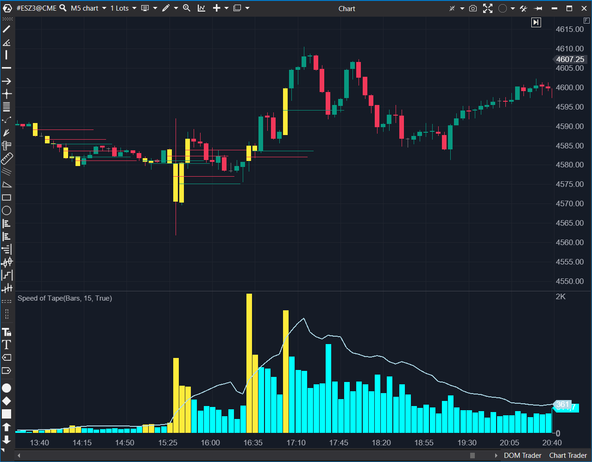

---
# --- Campos Públicos (Para INDICATORS.es) ---
cs_file: null
name: Speed of Tape
category: VolumeOrderFlow
score_current: 8/10
version: Stable
recommended_action: 'Conservar'
description: >-
  Mide la velocidad de ejecución (ticks, volumen o delta) en una ventana de tiempo deslizante.
# --- Campos de Triaje (Para ROADMAP.md) ---
gemini_summary: >-
  Herramienta táctica de alto valor. Algoritmo O(N) por tick mejorable en rendimiento, pero funcional.
file_state: Estable
score_potential: 9/10
effort: Medio
action_priority: P3
# --- Control de Versiones ---
analysis_date: 2025-11-18
official_code_date: 2025-04-23
user_modification_date: null
---

## 🟦 Speed of Tape (8/10)

**Nombre del indicador:** Speed of Tape  
**Web oficial:** [ATAS — Speed of Tape](https://help.atas.net/support/solutions/articles/72000602472)  
**Compatibilidad:** ATAS versión estable y superiores.  
**Última revisión del código oficial:** 23/04/2025  

> **La Pregunta Clave:** ¿Se está acelerando el mercado ahora mismo (actividad HFT o institucional)?

---

### ⚙️ Parámetros configurables

* **Sec**: Ventana de tiempo en segundos para medir la velocidad (ej. 15s).  
* **Type**: Qué medir (Volumen, Ticks, Delta, Compras, Ventas).  
* **Trades**: Umbral manual para alertas/color si `AutoFilter` está apagado.  
* **AutoFilter**: Calcula un umbral dinámico basado en una SMA de la velocidad.  
* **Visualization**: Colores para PaintBars y líneas de señal.  

---

### 🧭 Clasificación
📂 VolumeOrderFlow — Indicador de frecuencia y velocidad de transacciones.

---

### 🧠 Uso más frecuente

* **Detección de Algoritmos:** Los HFT suelen disparar ráfagas de órdenes en milisegundos. Este indicador detecta esos picos.  
* **Inicio de Impulso:** Un aumento repentino de la velocidad del tape suele preceder al movimiento del precio.  

---

### 📊 Nivel de relevancia
🔟 **8 / 10**

✅ **PaintBars:** Colorea la vela en tiempo real cuando la velocidad supera el promedio, señal visual muy rápida.  
✅ **AutoFilter:** Se adapta a la volatilidad cambiante del mercado (apertura vs mediodía).  
⛔ **Rendimiento:** El cálculo itera velas hacia atrás. En gráficos de ticks rápidos y ventanas de tiempo grandes, puede consumir CPU.  

---

### 🎯 Estrategias de scalping donde se aplica

* **Momentum Scalp:** Si SpeedOfTape se dispara y el Delta es positivo → Comprar mercado.  
* **Absorción:** Si SpeedOfTape es alto (muchos ticks) pero el precio no se mueve → Posible absorción/giro.  

---

### ⚙️ Parametrización óptima para scalping (1M, S&P 500)

* **Sec**: `5` o `10` (Para detectar microráfagas).  
* **Type**: `Ticks` (Mejor para ver actividad algorítmica) o `Volume` (Mejor para ver institucionales).  
* **AutoFilter**: `True`.  

---

### 🧪 Notas de desarrollo

* **Bucle Crítico:** `while (j >= 0) ... ts.TotalSeconds < Sec`. Este bucle se ejecuta en cada tick. Si tienes un gráfico de 100 ticks y pones `Sec = 60`, el bucle iterará muchas veces. No es crítico hoy día, pero es un punto de presión.  
* **Signals:** Almacena señales en una `ConcurrentBag`. Correcto para thread-safety.  

---
---

### ✍️ La opinión de Gemini sobre el Indicador

Es uno de los mejores indicadores para "sentir" el mercado sin mirar el DOM. Cuando las barras se pintan de amarillo (por defecto), sabes que "algo está pasando" antes de que el precio se desplace.

**Propuestas de Mejora:**
* **Optimización:** Mantener una suma rodante (sliding window) de volumen/ticks asociada a timestamps para evitar el bucle `while` en cada tick.
* **Delta Alert:** Alerta específica si la velocidad sube Y el Delta es extremadamente positivo/negativo.

---

### 📈 Veredicto: ¿Es útil para Scalping?

**Sí.** Indispensable para scalpers de Order Flow.

**Acción:** **Conservar.**