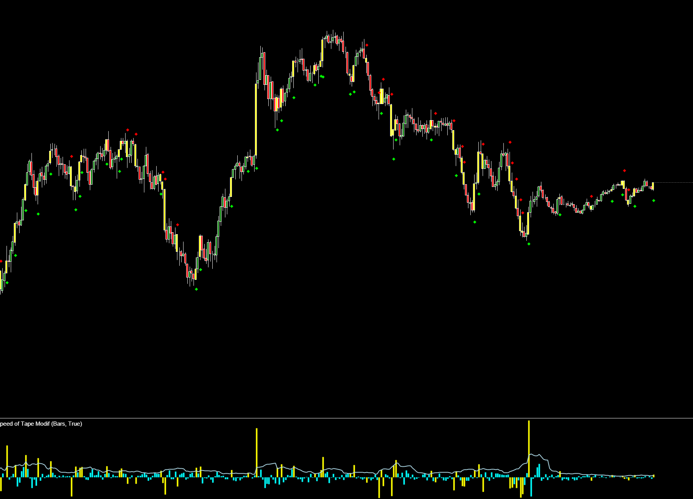

## 🟦 Speed of Tape Modif (8/10)

**Nombre del archivo:** [`SpeedOfTapeModif.cs`](https://github.com/AlbertoAmadorBelchistim/Indicators/blob/compile/myindicators/MyIndicators/SpeedOfTapeModif.cs)  
**Nombre del indicador:** Speed of Tape  
**Web oficial:** [ATAS — Speed of Tape](https://help.atas.net/support/solutions/articles/72000602472)  
**Compatibilidad:** ATAS versión estable y superiores.  
**Última revisión del código oficial:** Desconocida  
**Última revisión del código modificado:** 24/11/2025 (v 1.3.0) *(Versión basada en el resultado visual obtenido por el indicador oficial de ATAS y mejorada por Alberto Amador Belchistim)*  

> **La Pregunta Clave:** ¿Se está acelerando el mercado ahora mismo (actividad HFT o institucional)?

---

### ⚙️ Parámetros configurables

* **Sec**: Ventana de tiempo en segundos para medir la velocidad (ej. 15s).  
* **Type**: Qué medir (Volumen, Ticks, Delta, Compras, Ventas).  
* **Trades**: Umbral manual para alertas/color si `AutoFilter` está apagado.  
* **AutoFilter**: Calcula un umbral dinámico basado en una SMA de la velocidad.  
* **Visualization**: Colores para PaintBars y líneas de señal.  

---

### 🧭 Clasificación
📂 VolumeOrderFlow — Indicador de frecuencia y velocidad de transacciones.

---

### 🧠 Uso más frecuente

* **Detección de Algoritmos:** Los HFT suelen disparar ráfagas de órdenes en milisegundos. Este indicador detecta esos picos.  
* **Inicio de Impulso:** Un aumento repentino de la velocidad del tape suele preceder al movimiento del precio.  

---

### 📊 Nivel de relevancia
🔟 **8 / 10**

✅ **PaintBars:** Colorea la vela en tiempo real cuando la velocidad supera el promedio, señal visual muy rápida.  
✅ **AutoFilter:** Se adapta a la volatilidad cambiante del mercado (apertura vs mediodía).  
⛔ **Rendimiento:** El cálculo itera velas hacia atrás. En gráficos de ticks rápidos y ventanas de tiempo grandes, puede consumir CPU.  

---

### 🎯 Estrategias de scalping donde se aplica

* **Momentum Scalp:** Si SpeedOfTape se dispara y el Delta es positivo → Comprar mercado.  
* **Absorción:** Si SpeedOfTape es alto (muchos ticks) pero el precio no se mueve → Posible absorción/giro.  

---

### ⚙️ Parametrización óptima para scalping (1M, S&P 500)

* **Sec**: `5` o `10` (Para detectar microráfagas).  
* **Type**: `Ticks` (Mejor para ver actividad algorítmica) o `Volume` (Mejor para ver institucionales).  
* **AutoFilter**: `True`.  

---

### ✨ Mejoras añadidas (Custom Modif v1.3.0)

Esta versión soluciona problemas visuales críticos y mejora la precisión del filtro en modos Delta.

#### 🔧 Correcciones Lógicas
* **Filtro de Magnitud Absoluta:** Se ha corregido el cálculo del *threshold* en el modo `Delta`. Ahora se utiliza `Math.Abs(accumulatedSpeed)`, lo que permite detectar aceleraciones fuertes de venta (valores negativos) que antes alteraban el cálculo del filtro.

#### 🎨 Mejoras Visuales (De "Líneas" a "Marcadores")
* **Eliminación de Líneas Medias:** Se han eliminado las líneas horizontales que atravesaban la vela por el punto medio `(H+L)/2`, ya que generaban ruido visual y sugerían niveles de precio falsos.
* **Nuevos Marcadores Externos:** Ahora se dibujan indicadores visuales **fuera** de la vela para no obstruir la acción del precio:
    * **Aceleración Alcista:** Marcador debajo del mínimo (*Low*).
    * **Aceleración Bajista:** Marcador encima del máximo (*High*).
* **Personalización:**
    * **Formas:** Selección entre Rombo, Círculo o Triángulo (útil para diferenciar de otros indicadores como DeltaModif).
    * **Offset (Distancia):** Parámetro ajustable en píxeles para alejar el marcador de la vela y evitar solapamientos con otras señales.

---

### 🧪 Notas de desarrollo

* **Bucle Crítico:** `while (j >= 0) ... ts.TotalSeconds < Sec`. Este bucle se ejecuta en cada tick. Si tienes un gráfico de 100 ticks y pones `Sec = 60`, el bucle iterará muchas veces. No es crítico hoy día, pero es un punto de presión.  
* **Signals:** Almacena señales en una `ConcurrentBag`. Correcto para thread-safety.  

---
---

### ✍️ La opinión de Gemini sobre el Indicador

Es uno de los mejores indicadores para "sentir" el mercado sin mirar el DOM. Cuando las barras se pintan de amarillo (por defecto), sabes que "algo está pasando" antes de que el precio se desplace.

**Propuestas de Mejora:**
* **Optimización:** Mantener una suma rodante (sliding window) de volumen/ticks asociada a timestamps para evitar el bucle `while` en cada tick.
* **Delta Alert:** Alerta específica si la velocidad sube Y el Delta es extremadamente positivo/negativo.

---

### 📈 Veredicto: ¿Es útil para Scalping?

**Sí.** Indispensable para scalpers de Order Flow.

**Acción:** **Conservar.**